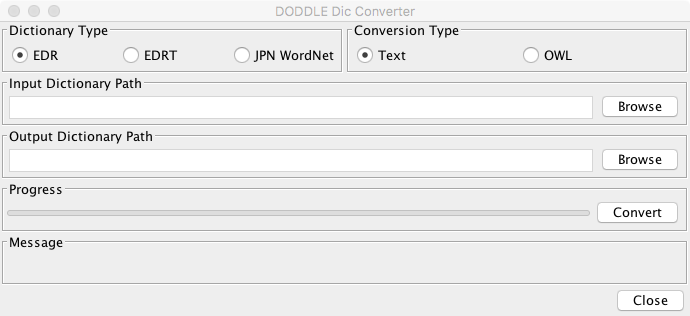

===============
Installation
===============

.. contents:: Contents
   :depth: 3

Requirements
==================
The following are software and hardware requirements for DODDLE-OWL.

* JRE (Java Runtime Environment) 8 or later
* OS: Operating System running Java
* CPU: Pentium4 2GHz or higher
* Memory: 1GB or higher
* HDD: 1GB or higher
* Display Resolution: XGA(1024×768)

We have tested the following environment.

* JDK 8 
* OS: macOS Sierra
* CPU: Intel Core i7 4GHz
* Memory: 32GB
* Display Resolution: WUXGA (1920x1200)

Acknowledgements
====================================
DODDLE-OWL uses the following libraries. Since these libraries are included in DODDLE-OWL, users don't have to get the libraries.

* `Apache Jena <http://jena.apache.org/>`_

  * A library for RDF, RDFS, and OWL
  * License: `Jena – License and Copyright <http://www.apache.org/licenses/LICENSE-2.0>`_

* `Lucene-Gosen <https://github.com/lucene-gosen/lucene-gosen>`_

  * Japanese analysis for Apache Lucene/Solr
  * License: `LGPL (Lesser General Public License) <http://www.gnu.org/licenses/lgpl.html>`_

* `extJWNL <http://extjwnl.sourceforge.net/>`_

  * A Java API for creating, reading and updating dictionaries in WordNet format
  * License: `BSD <http://extjwnl.sourceforge.net/license.txt>`_

* `GNU getopt – javaport 1.0.13 <http://www.urbanophile.com/arenn/hacking/download.html>`_

  *  A Java library function used to parse command-line options
  * License: LGPL(Lesser General Public License)

* `Apache POI <http://poi.apache.org/>`_
  
  * The Java API for Microsoft Documents
  * License: Apache

* `Apache PDFBox <https://pdfbox.apache.org/>`_

  * An open source Java tool for working with PDF documents
  * License: BSD

* `Lombok <http://projectlombok.org/>`_

  * A java library that automatically plugs into your editor and build tools, spicing up your java
  * License： `The MIT License <http://opensource.org/licenses/mit-license.php>`_

* `InfoNode Docking Windows <http://www.infonode.net/index.html?idw>`_

  * A pure Java Swing based docking windows framework
  * License: GPL (GNU General Public License)

* `MySQL Connector/J 5.1.7 <http://dev.mysql.com/downloads/>`_

  * JDBC Driver for MySQL
  * License: GPL (GNU General Public License)

* `SQLiteJDBC <https://bitbucket.org/xerial/sqlite-jdbc>`_

  * JDBC Driver for SQLite
  * License: Apache License version 2.0

* `Stanford Parser <http://nlp.stanford.edu/software/lex-parser.shtml>`_

  * A statistical parser
  * License： GPL (GNU General Public License)

* `Silk Icons <http://www.famfamfam.com/>`_

  * Free icon set
  * License: `Creative Commons Attribution 2.5 License <http://creativecommons.org/licenses/by/2.5/>`_.

Optional Software
=======================================
DODDLE-OWL uses the following software optionally.

* `ChaSen <http://chasen-legacy.osdn.jp/>`_
* `MeCab <http://mecab.googlecode.com/svn/trunk/mecab/doc/index.html>`_
* `CaboCha <http://taku910.github.io/cabocha/>`_
* `ActivePerl <http://www.activestate.com/activeperl?mp=1>`_
* `TermExtract <http://gensen.dl.itc.u-tokyo.ac.jp/termextract.html>`_

.. warning::
	* Beta6からは，ChaSen, MeCab, CaboChaは，UTF-8のみに対応しています．

	  * ChaSenでUTF-8を利用する方法は，ChaSen’s Wiki FAQを参照してください．
	  * MeCabおよびCaboChaは，2008年11月現在の最新版は，UTF-8に対応しています．（Windows版ではインストール時に辞書の文字コードとして「UTF-8」を選択します．Unix，Macでは，configureのオプションとして「–with-charset=utf8」を指定します．）

	* In order to extract Japanese compound words, Perl, Chasen (or MeCab), and CaboCha are required.
	* In order to extract English compound words, Perl is required.
	* In order to use EDR dictionary (EDR general vocaburary dictionary or EDR technical terminology dictionary) as general ontologies, EDR are required. You need to change EDR into a format for DODDLE using EDR2DODDLE_DIC_Converter.  EDR電子化辞書から領域オントロジーを構築したい場合には，EDR電子化辞書の概念体系辞書(必須)，日本語単語辞書(必須)，英語単語辞書(オプション)，概念記述辞書(オプション)が必要です．

Reference Ontologies
===============================

English General Ontology
------------------------------
* `WordNet <http://wordnet.princeton.edu/>`_

Japanese General Ontologies
-------------------------------------
* `EDR Electronic Dictionary <http://www2.nict.go.jp/ipp/EDR/ENG/indexTop.html>`_
* `Japanese WordNet <http://compling.hss.ntu.edu.sg/wnja/>`_
* `Japanese Wikipedia Ontology <https://osdn.jp/projects/wikipedia-ont/>`_

How to install
=====================================

Windows
----------
Download DODDLE-OWL_1.0RC2_win.zip from `the download page <http://doddle-owl.org/download-ja.html>`_ and extract the file to any directory.

macOS
----------
Download DODDLE-OWL_1.0RC2_mac.zip from `the download page <http://doddle-owl.org/download-ja.html>`_ and extract the file to any directory.

How to uninstall
========================================
Remove the extracted folder.

How to execute
=====================
Execute DODDLE-OWL.exe or DODDLE-OWL.app file.

Configurations
====================
Configurations can be set in the Option Dialog in DODDLE-OWL.

Option Dialog: Basic Tab
--------------------------------------------------

* Language

  * enまたはjaを指定することで，英語または日本語メニューを表示することができます．

* Base prefix

  * ユーザが定義した概念の接頭辞を設定します．

* Base URI

  * オントロジー保存時のベースURIを設定します．

Option Dialog: Folder Tab
-----------------------------------------------------------

* Project folder

  * Default path: C:/DODDLE-OWL/DODDLEProject
  * プロジェクトファイルを保存するフォルダを設定します．プロジェクトを保存・復元する際に このフォルダが基点となります．
      
* Stop word list

  * Default path: C:/DODDLE-OWL/stop_word_list.txt
  * 用語抽出時に無視する単語リストが保存されたファイルを設定します．

* EDR dic folder

  * Default path: C:/DODDLE-OWL/EDR_DIC
  * EDR一般辞書のテキストデータをDODDLE用に変換したファイルを置いたフォルダを設定します．

* EDRT dic folder

  * Default path: C:/DODDLE-OWL/EDRT_DIC
  * EDR専門辞書のテキストデータをDODDLE用に変換したファイルを置いたフォルダを設定します．

* 日本語形態素解析器

  * Default path: C:/Program Files/ChaSen/chasen.exe
  * 複合語抽出モジュール言選を利用する場合に必要です．（chasen21は不可）

* 日本語係り受け解析器

  * Default path: C:/Program Files/CaboCha/bin/cabocha.exe
  * 複合語抽出する場合に必要です．

* perl.exe

  * Default path: C:/Perl/bin/perl.exe
  * 言選(TermExtract)を利用する場合に必要です．

* Upper concept list

  * Default path: C:/DODDLE-OWL/upperConceptList.txt
  * 上位概念のリストを設定します．ある単語がEDR上の指定した概念の下位にあるかどうかを提示するために利用します．

How to use EDR dictionary as general ontologies
=========================================================
DODDLE-OWLでEDR電子化辞書を汎用オントロジーとして参照するためには，EDR電子化辞書のテキストデータをDODDLE-OWLで参照する形式に変換する必要があります．
以下では，その変換手順について説明します．

CPU: Intel Core i7 4GHz，メモリ: 32GBのiMacを用いてEDR一般辞書とEDR専門辞書をDODDLE-OWLで参照する形式に変換するためにかかる時間は以下の通りです．

* EDR general vocaburary dictionary: about 3 minutes
* EDR technical terminology dictionary: about 40 seconds

Requirements
-----------------
* More than 1GB of RAM (Recommendation 2GB) 
* EDR general vocaburary dictionary or EDR technical terminology dictionary

EDR general vocaburary dictionary
-------------------------------------------------
#. Copy CPC.DIC, CPH.DIC, CPT.DIC, EWD.DIC, and JWD.DIC to any directory (e.g. C:/EDR_Text/). 
#. Select "DODDLE Dic Converter" sub menu in Tool menu. Then, a dialog is shown. (:numref:`doddle-dic-converter`)
#. Select “EDR” as Dictionary Type. Check “Text” as Conversion Type.
#. Set path for Input Dictionary Path and Output Dictionary Path (EDR Dic Folder).
#. Click Convert Button. Then, concept.data, relation.data, tree.data, word.data, concept.index, relation.index, tree.index, and word.index are generated in EDR Dic Folder.
#. Set path for EDR Dic Folder in the Option Dialog.

EDR technical terminology dictionary
-------------------------------------------
#. Copy TCPC.DIC, TCPH.DIC, TEWD.DIC, and TJWD.DIC to any directory (e.g. C:/EDRT_Text/). 
#. Select "DODDLE Dic Converter" sub menu in Tool menu. Then, a dialog is shown. (:numref:`doddle-dic-converter`)
#. Select “EDRT” as Dictionary Type. Check “Text” as Conversion Type.
#. Set path for Input Dictionary Path and Output Dictionary Path (EDRT Dic Folder).
#. Click Convert Button. Then, concept.data, tree.data, word.data, concept.index, tree.index, and word.index are generated in EDRT Dic Folder.
#. Set path for EDRT Dic Folder using Option Dialog.

.. _doddle-dic-converter:

   DODDLE_Dic_Converter
