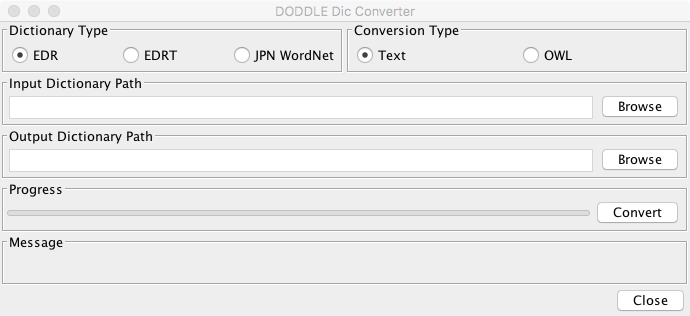

===============
Installation
===============

.. contents:: Contents
   :depth: 3

Requirements
==================
The following are software and hardware requirements for DODDLE-OWL.

* OS: Operating System running Java
* Memory: 1GB or higher
* HDD: 1GB or higher
* Display Resolution: XGA(1024×768)

Acknowledgements
====================================
DODDLE-OWL uses the following libraries. Since these libraries are included in DODDLE-OWL, users don't have to get the libraries.

* `FlatLaf <https://www.formdev.com/flatlaf/>`_
  * A modern open-source cross-platform Look and Feel for Java Swing desktop applications.
  * License: `Apache License 2.0 <https://www.apache.org/licenses/LICENSE-2.0>`_

* `Apache Jena <https://jena.apache.org/>`_

  * A library for RDF, RDFS, and OWL
  * License: `Apache License 2.0`_

* `Kuromoji <https://github.com/atilika/kuromoji>`_

  * An easy to use and self-contained Japanese morphological analyzer.
  * License: `Apache License 2.0`_

* `extJWNL <http://extjwnl.sourceforge.net/>`_

  * A Java API for creating, reading and updating dictionaries in WordNet format.
  * License: `BSD <http://extjwnl.sourceforge.net/license.txt>`_

* `Apache Commons CLI <https://commons.apache.org/proper/commons-cli/>`_

  * An API for parsing command-line options passed to an application.
  * License: `Apache License 2.0`_

* `Apache POI <http://poi.apache.org/>`_
  
  * The Java API for Microsoft Documents. 
  * License: `Apache License 2.0`_

* `Apache PDFBox <https://pdfbox.apache.org/>`_

  * An open source Java tool for working with PDF documents.
  * License: `Apache License 2.0`_

* `Lombok <http://projectlombok.org/>`_

  * A java library that automatically plugs into your editor and build tools, spicing up your java
  * License： `The MIT License <http://opensource.org/licenses/mit-license.php>`_

* `SQLiteJDBC <https://github.com/xerial/sqlite-jdbc>`_

  * JDBC Driver for SQLite
  * License: `Apache License 2.0`_

* `Stanford Parser <http://nlp.stanford.edu/software/lex-parser.shtml>`_

  * A statistical parser
  * License： `GPL (GNU General Public License) <http://www.gnu.org/licenses/gpl-2.0.html>`_

* `Material Design icons by Google <https://github.com/google/material-design-icons>`_

  * Free icon set
  * License: `Apache License 2.0`_.

Optional Software
=======================================
DODDLE-OWL uses the following software optionally.

* `MeCab <https://github.com/taku910/mecab>`_
* `CaboCha <http://taku910.github.io/cabocha/>`_
* `TermExtract <http://gensen.dl.itc.u-tokyo.ac.jp/termextract.html>`_

.. warning::
	* Since Beta 6, MeCab and CaboCha only support UTF-8.

	  * As of November 2008, the latest versions of MeCab and CaboCha support UTF-8. (For Windows, select "UTF-8" as the dictionary character code during installation. For Unix and Mac, specify --with-charset=utf8 as a configure option.)

	* In order to extract Japanese compound words, Perl, Chasen (or MeCab), and CaboCha are required.
	* In order to extract English compound words, Perl is required.
	* In order to use EDR dictionary (EDR general vocaburary dictionary or EDR technical terminology dictionary) as general ontologies, EDR are required. You need to change EDR into a format for DODDLE using EDR2DODDLE_DIC_Converter.  

Reference Ontologies
===============================

English General Ontology
------------------------------
* `WordNet <https://wordnet.princeton.edu/>`_

Japanese General Ontologies
-------------------------------------
* `EDR Electronic Dictionary <https://www2.nict.go.jp/ipp/EDR/ENG/indexTop.html>`_
* `Japanese WordNet <https://bond-lab.github.io/wnja/>`_

How to install
=====================================

Windows
----------
Download doddle-owl-26.5.1.msi from `the download page <https://github.com/doddle-owl/doddle-owl/releases>`_ and execute the file.

macOS
----------
Download doddle-owl-26.5.1.dmg from `the download page <https://github.com/doddle-owl/doddle-owl/releases>`_ and extract the file to any directory.

How to uninstall
========================================
Remove the extracted folder.

How to execute
=====================
Execute DODDLE-OWL.exe or DODDLE-OWL.app file.

Configurations
====================
Configurations can be set in the Option Dialog in DODDLE-OWL.

Option Dialog: Basic Tab
--------------------------------------------------

* Language

  * You can display the menu in English or Japanese by specifying “en” or “ja”.

* Base prefix

  * You can set the prefix for concepts defined by the user.
* Base URI

  * You can set the base URI for the ontology when saving it.

Option Dialog: Folder Tab
-----------------------------------------------------------

* Project folder

  * Default path: C:/DODDLE-OWL/DODDLEProject
  * You can set the folder where project files are saved. This folder will be the starting point when saving or restoring projects.
      
* Stop word list

  * Default path: C:/DODDLE-OWL/stop_word_list.txt
  * You can set the file that contains the list of words to be ignored during term extraction.

* EDR dic folder

  * Default path: C:/DODDLE-OWL/EDR_DIC
  * You can set the folder where the text data of the EDR general dictionary converted for DODDLE is stored.

* EDRT dic folder

  * Default path: C:/DODDLE-OWL/EDRT_DIC
  * You can set the folder where the text data of the EDR technical dictionary converted for DODDLE is stored.

* Japanese morphological analyzer

  * Default path: C:/Program Files/ChaSen/chasen.exe
  * This is required when using the compound word extraction module. (chasen21 is not supported)

* Japanese dependency parser

  * Default path: C:/Program Files/CaboCha/bin/cabocha.exe
  * This is required when extracting compound words.

* perl.exe

  * Default path: C:/Perl/bin/perl.exe
  * This is required when using TermExtract.

* Upper concept list

  * Default path: C:/DODDLE-OWL/upperConceptList.txt
  * You can set the list of upper concepts. This is used to check if a word is a subclass of a specified concept in the EDR.

How to use EDR dictionary as general ontologies
=========================================================
To refer to the EDR Electronic Dictionary as a general-purpose ontology in DODDLE-OWL, the text data of the dictionary must be converted into a format compatible with DODDLE-OWL.
The following section describes the procedure for this conversion.

The time required to convert the EDR General Dictionary and EDR Technical Dictionary into a format compatible with DODDLE-OWL, using an iMac with a 4GHz Intel Core i7 processor and 32GB of RAM, is as follows:

* EDR general vocaburary dictionary: about 3 minutes
* EDR technical terminology dictionary: about 40 seconds

Requirements
-----------------
* More than 1GB of RAM (Recommendation 2GB) 
* EDR general vocaburary dictionary or EDR technical terminology dictionary

EDR general vocaburary dictionary
-------------------------------------------------
#. Copy CPC.DIC, CPH.DIC, CPT.DIC, EWD.DIC, and JWD.DIC to any directory (e.g. C:/EDR_Text/). 
#. Select "DODDLE Dic Converter" sub menu in Tool menu. Then, a dialog is shown. (:numref:`doddle-dic-converter`)
#. Select “EDR” as Dictionary Type. Check “Text” as Conversion Type.
#. Set path for Input Dictionary Path and Output Dictionary Path (EDR Dic Folder).
#. Click Convert Button. Then, concept.data, relation.data, tree.data, word.data, concept.index, relation.index, tree.index, and word.index are generated in EDR Dic Folder.
#. Set path for EDR Dic Folder in the Option Dialog.

EDR technical terminology dictionary
-------------------------------------------
#. Copy TCPC.DIC, TCPH.DIC, TEWD.DIC, and TJWD.DIC to any directory (e.g. C:/EDRT_Text/). 
#. Select "DODDLE Dic Converter" sub menu in Tool menu. Then, a dialog is shown. (:numref:`doddle-dic-converter`)
#. Select “EDRT” as Dictionary Type. Check “Text” as Conversion Type.
#. Set path for Input Dictionary Path and Output Dictionary Path (EDRT Dic Folder).
#. Click Convert Button. Then, concept.data, tree.data, word.data, concept.index, tree.index, and word.index are generated in EDRT Dic Folder.
#. Set path for EDRT Dic Folder using Option Dialog.

.. _doddle-dic-converter:

   DODDLE_Dic_Converter
