===========================
Module list
===========================

.. contents:: Contents
   :depth: 3

.. |MR3| replace:: MR\ :sup:`3` \

System Overview
==========================
:numref:`system_flow` shows the system overview of DODDLE-OWL. DODDLE-OWL has the following six main modules: Ontology Selection Module, Input Module, Construction Module, Refinement Module, Visualization Module, and Translation Module. 

Hierarchy Construction Module and Hierarchy Refinement Module were included in DODDLE-I  [Yamaguchi99]_ to support the user construct taxonomic relationships. Relationship Construction Module and Relationship Refinement Module, both added on to DODDLE-II [Kurematsu04]_ , support the construction of taxonomic and other rela- tionships. Ontology Selection Module, Input Module, Visualization Module, and Translation Module were additionally integrated in DODDLE-OWL to make possible an interactive domain ontology development environment.

Here, we assume that there are one or more domain specific documents, and we also assume that the users can select important terms that are needed to construct a domain ontology.

First, as input of DODDLE-OWL, the users select several concepts in Input Module. In Construction Module, DODDLE-OWL generates the basis of an ontology, an initial concept hierarchy and set of concept pairs, by referring to reference ontologies and documents. In Refinement Module, the initial ontology generated by Construction Module is refined by the users through interactive support by DODDLE-OWL. The ontology constructed by DODDLE-OWL can be exported with the representation of OWL. Finally, Visualization Module (|MR3| [Morita06]_ ) is connected with DODDLE-OWL and works with an graphical editor.

.. _system_flow:
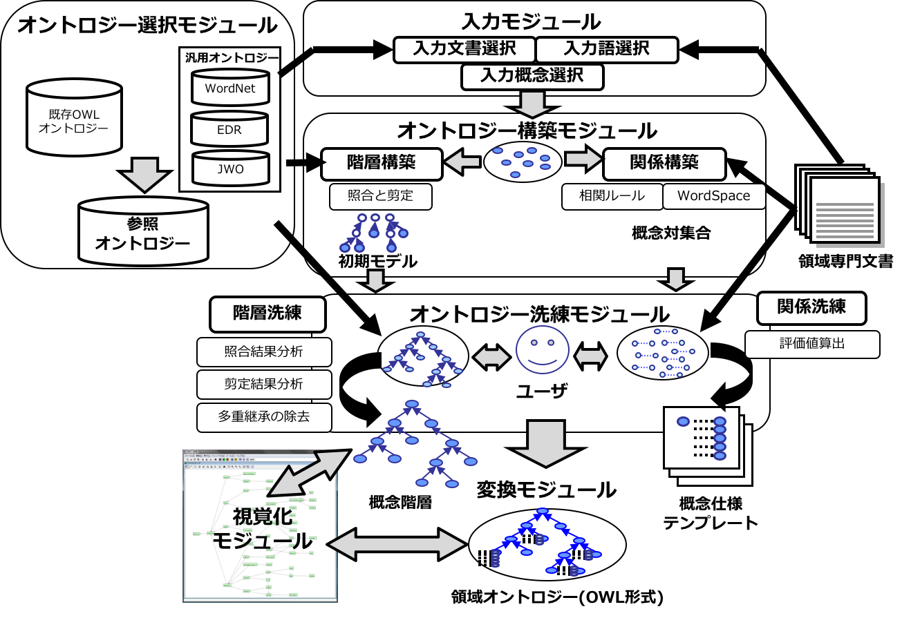

   System overview of DODDLE-OWL

Ontology Selection Module
=======================================
In the ontology selection module, the user selects a reference ontology. A reference ontology serves as the foundation for building a domain ontology and is referenced by each module within DODDLE-OWL. DODDLE-OWL supports several reference ontologies, including WordNet [Miller95]_, Japanese WordNet [Isahara08]_, EDR [Yokoi95]_, and the Japanese Wikipedia Ontology (JWO) [Tamagawa10]_. Furthermore, existing ontologies described in OWL (Web Ontology Language) format can also be utilized as reference ontologies.

General ontologies such as WordNet and EDR provide broad and exhaustive definitions. Consequently, when applying them to domain ontology construction, they require refinement into a domain-specific structure, involving tasks such as modifying hierarchical relationships and removing irrelevant concepts. This process imposes a significant burden on the user. On the other hand, if a domain ontology related to the target domain already exists, reusing it can reduce the cost of refinement compared to using a general ontology. Since ontologies constructed via DODDLE-OWL are exported in OWL format, they can also be reused as reference ontologies. Therefore, in DODDLE-OWL, general ontologies are utilized when no existing domain ontology is available or when existing ones do not sufficiently cover the target domain. Conversely, if a relevant domain ontology exists, using it as a reference ontology enables more efficient support for constructing the target domain ontology.

To facilitate the reuse of existing ontologies available on the Web, the ontology selection module is equipped with a domain ontology acquisition function that utilizes ontology search engines. The following sections provide a brief overview of general ontologies, followed by a description of the methodology for acquiring existing domain ontologies using ontology search engines.

.. note::
   Since `the Swoogle ontology search engine discontinued its service on May 1, 2010 <https://ebiquity.umbc.edu/project/html/id/53/Swoogle>`_, the domain ontology acquisition function utilizing Swoogle is currently unavailable.

General Ontologies
----------------------------
DODDLE-OWL supports several general ontologies, including WordNet, Japanese WordNet, the EDR Electronic Dictionary (comprising both general and specialized dictionaries), and the Japanese Wikipedia Ontology (JWO). The following sections provide an overview of each of these ontologies.

WordNet
~~~~~~~~~~~~~~~~~~~~~~~~~~~
WordNet [Miller95]_ is an English thesaurus (general ontology) developed at Princeton University. It is composed of separate dictionaries for nouns, verbs, adjectives, and adverbs, as well as an index file (index of headwords), collectively containing approximately 100,000 lexical items.

The index of headwords consists of the headword itself, a Concept ID (Synset offset) serving as semantic information, lexicographer information, and part-of-speech (POS) tags. The Concept ID functions as a link connecting the headword index to the respective syntactic category dictionaries.

The noun and verb dictionaries consist of Concept IDs, lexicographer information, and a list of corresponding headwords. These concepts are organized into a hierarchical structure (taxonomy). Furthermore, specific Concept IDs are associated with relations such as Antonyms, as well as meronymous relations including part-of, member-of, and substance-of.
While the adjective and adverb dictionaries also contain Concept IDs, lexicographer information, and corresponding headword lists, they do not possess a hierarchical structure.

Japanese WordNet
~~~~~~~~~~~~~~~~~~~~~~~~~~~
Japanese WordNet [Isahara08]_ is the Japanese counterpart of WordNet.

EDR Electric Dictionary
~~~~~~~~~~~~~~~~~~~~~~~~~~~
The EDR Electronic Dictionary [Yokoi95]_ is a general ontology provided by the National Institute of Information and Communications Technology (NICT). The EDR Electronic Dictionary is a comprehensive resource consisting of the following components: Japanese Word Dictionary, English Word Dictionary, Headconcept Dictionary, Japanese-English Bilingual Dictionary, English-Japanese Bilingual Dictionary, Japanese Co-occurrence Dictionary, English Co-occurrence Dictionary, Japanese Corpus, English Corpus, and the Technical Terminology Dictionary (Information Processing). Among these resources, DODDLE-OWL specifically utilizes the Japanese Word Dictionary, English Word Dictionary, Headconcept Dictionary, and the Technical Terminology Dictionary (Information Processing).

Japanese Wikipedia Ontology
~~~~~~~~~~~~~~~~~~~~~~~~~~~~~~~
Japanese Wikipedia Ontology (JWO) [Tamagawa10]_ is a large-scale Japanese general ontology constructed from various resources within the Japanese version of Wikipedia, such as category trees, list-style articles, redirect links, Infoboxes, and Infobox templates.

Aquiring existing domain ontologies using an ontology search engine
------------------------------------------------------------------------
To reuse existing domain ontologies, it is necessary to search the Web for ontologies relevant to the target domain. OntoSelect [Buitelaar04]_ and Swoogle [Ding05]_ are well-known examples of ontology search engines. OntoSelect is a system designed to support the searching, selection, and browsing of ontologies on the Web. As of 2007, Swoogle had indexed over 10,000 ontologies, enabling searches at the class and property levels, as well as the discovery of inverse link relationships that are not explicitly defined within the ontologies.

While these existing search engines can be used to find domain-related ontologies, they present several challenges from the perspective of domain ontology construction. Although they support searches for individual classes or properties, they do not sufficiently support the retrieval of entire ontologies encompassing multiple relevant classes and properties, nor do they adequately filter for ontologies with high relevance to a specific target domain. Swoogle introduces OntoRank, an ontology-specific ranking method similar to Google's PageRank [Page98]_, and TermRank, which targets classes and properties. In both OntoRank and TermRank, classes and properties referenced by a large number of Semantic Web documents receive higher evaluations. However, for the purpose of domain ontology construction, an ontology that is frequently referenced across the Semantic Web is not necessarily the most suitable for a specific target domain. Therefore, a mechanism is required to appropriately search for existing ontologies relevant to the user’s target domain. Furthermore, it is rare that an existing ontology can be reused without modification. Consequently, it is desirable for a domain ontology construction support environment to be seamlessly integrated with an ontology search engine.

Swoogle provides 19 types of RESTful Web services (Swoogle Web Services) for ontology retrieval. Since reusing existing ontologies within DODDLE-OWL necessitates automated searching via software, Swoogle—which provides these Web services—is utilized for the acquisition of existing domain ontologies.
The ontology selection module performs the acquisition and ranking of existing ontologies using Swoogle, according to the procedure shown in :numref:`ontology_ranking`.

#.	**Acquisition of Input Concepts**: Acquire classes and properties (input concepts) that contain the input terms as their URI local names or as values of the rdfs:label property.
#.	**Property Acquisition based on Input Classes**: Acquire properties that have the classes obtained in Step 1 defined as their domain (rdfs:domain) or range (rdfs:range).
#.	**Class Acquisition based on Property Context**: Acquire classes that correspond to the domain and range of the properties obtained in Steps 1 and 2.
#.	**Acquisition of Defining Ontologies**: Acquire the ontologies that define the classes and properties obtained in Steps 1 through 3.
#.	**Element Extraction**: Extract specific elements from the ontologies acquired in Step 4.
#.	**Property Filtering**: Among the properties defined in the ontologies acquired in Step 4, remove those whose domain and range are neither the input concepts nor superconcepts of the input concepts.
#.	**Ranking**: Rank the existing ontologies acquired in Step 4.

Details regarding Step 5 are provided in the section :ref:`extracting-ontological-elements`, and details regarding Step 7 are provided in :ref:`ranking-existing-ontologies`.

.. _ontology_ranking:
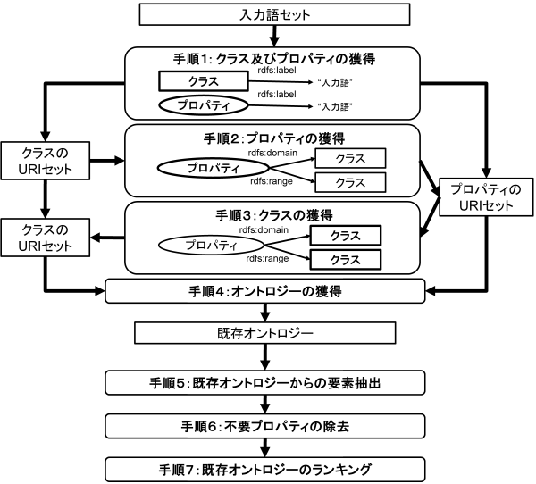

   The procedure flow for acquiring and ranking existing ontologies for a target domain using Swoogle

.. _extracting-ontological-elements:

Extracting ontological elements from existing ontologies
-------------------------------------------------------------------

In order to utilize OWL ontologies as reference ontologies for domain ontology construction support, it is necessary to extract elements that can be leveraged for this purpose. DODDLE-OWL facilitates the definition of taxonomic (hierarchical) relations and non-taxonomic relations within a domain ontology. The essential elements of an OWL ontology required for defining these relations include concepts (classes and properties), lexical labels (headings), concept definitions (descriptions), hierarchical relations, and other semantic relations.

The extraction of concepts is indispensable for domain ontology construction. Lexical labels are required for input concept selection, where input terms are mapped to their corresponding concepts. Concept definitions provide the necessary context for the user to make an informed decision when multiple candidate concepts exist for a single input term. Hierarchical relations are essential for building class hierarchies and property hierarchies. To define other semantic relations, it is necessary to extract the domain (rdfs:domain) and range (rdfs:range) of the properties. Ontology description languages such as RDFS, DAML, and OWL provide the fundamental classes and properties required to define these elements.

Swoogle enables ontology retrieval based on the fundamental classes and properties provided by RDFS, DAML, and OWL. For instance, Swoogle defines a **class** as any resource :math:`X` that satisfies the following statement :math:`(X, Y, Z)`:

* :math:`X` is not an anonymous resource (blank node).
* :math:`Y` is the ``rdf:type`` property.
* :math:`Z` is one of the following classes:
  
  .. math::

     Z \in \{ \text{rdfs:Class, owl:Class, owl:Restriction, owl:DataRange, } \\
     \text{daml:Class, daml:Datatype, daml:Restriction} \}

If the goal were only to extract classes and properties within the scope handled by Swoogle, following Swoogle's definitions would suffice. However, there are general ontologies and thesauri defined in other formats. [Koide06]_ discusses the conversion of WordNet and EDR into OWL, noting that their structures differ from the classes and properties defined in Swoogle. :numref:`label_extraction` illustrates the different representation methods for "lexical labels" in the OWL base vocabulary, SKOS (Simple Knowledge Organisation System) [Miles05]_, and `WordNet RDF/OWL <http://www.w3.org/TR/wordnet-rdf/>`_.

[Nakayama06]_ proposes Wikipedia mining as a method for applying Web mining to Wikipedia and has constructed a thesaurus dictionary (wikipedia-lab). SKOS is employed as the vocabulary to represent this Wikipedia thesaurus. In SKOS, vocabularies such as skos:Concept for representing concepts and skos:broader for representing broader (superordinate) concepts are defined, which differ from the OWL base vocabulary. :numref:`class_and_property_identifying_ontology_elements` lists the classes and properties used to identify ontology elements in the OWL base vocabulary, SKOS, and WordNet RDF/OWL.

To extract ontology elements from diverse formats, DODDLE-OWL utilizes five types of templates: Class Extraction, Property Extraction, Label/Description Extraction, Hierarchical Relation Extraction, and Other Relation Extraction. These templates are described using the RDF query language SPARQL [hommeaux08]_ and are mapped to the respective OWL ontologies.

:numref:`label_extraction` shows the difference of the labels of concepts among OWL basic vocabulary, SKOS, and the WordNet RDF/OWL scheme. In :numref:`label_extraction`, we regard a synset in WordNet as a concept. 

.. _label_extraction:
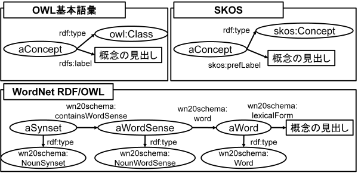

   Difference of the labels of concepts among OWL Basic Vocabulary, SKOS, and the WordNet RDF/OWL scheme

.. _class_and_property_identifying_ontology_elements:
.. list-table:: Classes and properties identifying ontology elements
   :header-rows: 1

   * - Ontological Elements
     - Classes and properties for identifying ontology elements
   * - Concept
     - | ``rdfs:Class``, ``owl:Class``, ``rdf:Property``, ``owl:ObjectProperty``, etc.
       | ``skos:Concept``
       | ``wn20schema:WordSense``, ``wn20schema:NounWordSense``, etc.
   * - Concept Labels
     - | ``rdfs:label``
       | ``skos:prefLabel``, ``skos:altLabel``, ``skos:hiddenLabel``
       | ``wn20schema:lexicalForm``
   * - Concept Descriptions
     - | ``rdfs:comment``
       | ``skos:definition``
       | ``wn20schema:gloss``
   * - Hierarchical Relations
     - | ``rdfs:subClassOf``, ``rdfs:subPropertyOf``
       | ``skos:broader``, ``skos:narrower``
       | ``wn20schema:hypernymOf``, ``wn20schema:hyponymOf``
   * - Other Relations
     - | ``rdfs:domain``, ``rdfs:range``
       | ``skos:related``
       | ``wn20schema:antonymOf``, ``wn20schema:partMeronymOf``, etc.
 
.. _ranking-existing-ontologies:

Ranking existing ontologies
----------------------------------------------------

Currently, DODDLE-OWL employs four metrics for ranking ontologies: **OntoRank**, **TermRank**, the coverage ratio of input concepts within the ontology, and the number of non-taxonomic relations pertaining to those input concepts. OntoRank and TermRank are metrics proposed in [Ding05]_ specifically designed for ranking ontologies, classes, and properties.

In this study, we hypothesize that an ontology containing a higher number of input concepts is more likely to be relevant to the target domain. Furthermore, we assume that an ontology defining a greater number of non-taxonomic relations related to these input concepts also possesses higher domain relevance. For ontologies with a similar coverage ratio of input concepts, OntoRank serves as a reference, allowing users to prioritize and reuse ontologies that are frequently referenced across various Semantic Web documents.

In cases where multiple candidates for an input concept exist due to lexical ambiguity, users can refer to TermRank to select and reuse input concepts that are more widely referenced by other ontologies.

Issues for reusing ontologies
----------------------------------------------------

To support hierarchy construction, DODDLE-OWL extracts paths relevant to the input concepts from the reference ontologies, integrates them, and prunes unnecessary concepts. When integrating paths derived from heterogeneous ontologies scattered across the Web, simple merging is difficult due to discrepancies in the structures of their superconcept hierarchies. Therefore, it is necessary to identify similar concepts through ontology alignment.

Currently, hierarchy construction support utilizing ontology alignment has not yet been implemented. Regarding ontology alignment, various tools have been made public, and competitive evaluations (contests) are actively being held. The integration of such ontology alignment tools with DODDLE-OWL remains a subject for future work.

Input Modules
========================
The input module receives a collection of domain-specific documents as input, references the reference ontology, and outputs a set of input concepts. This module is composed of three sub-modules: the input document selection module, the input term selection module, and the input concept selection module. The system flow of the input module is illustrated in :numref:`input_module`. The following sections provide a detailed description of each module.

.. _input_module:
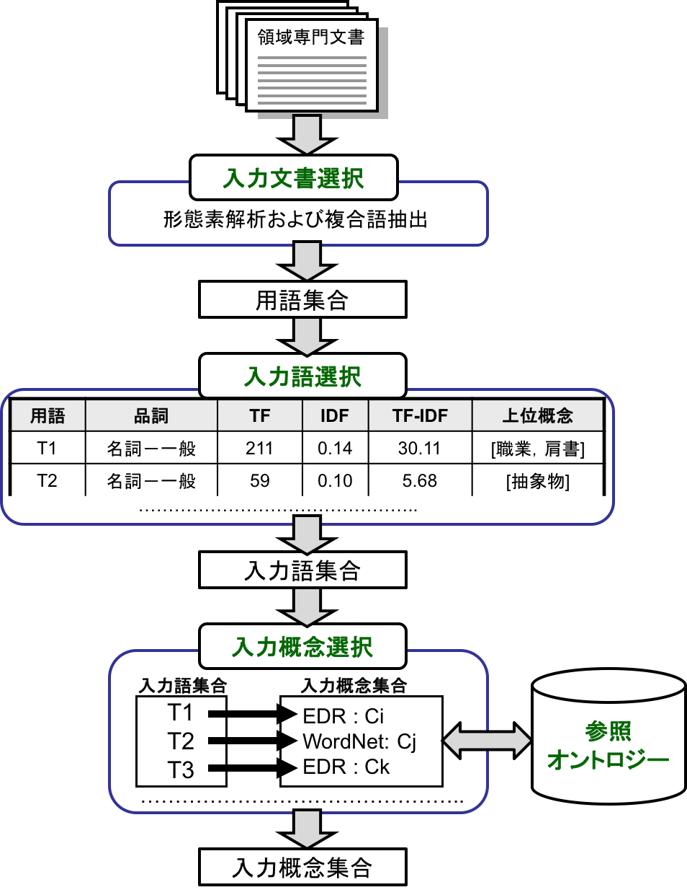

   System flow of Input Module

Input Document Selection Module
--------------------------------------
In the input document selection module, the user selects a collection of technical documents related to the target domain—written in either English or Japanese—as the input document set. From this set, the module extracts a term set, which serves as candidates for input terms (words of high importance to the domain). Utilizing a morphological analyzer, the module can extract words from the technical documents that correspond to user-specified parts of speech (POS). The specifiable POS categories include nouns, verbs, and other grammatical classes. Furthermore, compound words can be extracted by employing an automatic technical term extraction system [Nakagawa03]_ or the Japanese dependency parser CaboCha. In addition to plain text documents, the system is capable of extracting text from various file formats such as PDF, Microsoft Word, Excel, and PowerPoint.

Another crucial role of the input document selection module is to identify sentence boundaries within the input documents. Sentence boundary identification is essential when applying association rules, which is one of the methods used to support the construction of non-taxonomic relations in an ontology. The module automatically determines sentence boundaries based on the Japanese full stop (。), periods (．), and line breaks. However, if these markers are absent, the module may incorrectly identify sentence boundaries. Such misidentification leads to a decrease in the accuracy of relation construction using association rules. To address this issue, the module allows users to manually correct sentence boundaries.

Input Term Selection Module
--------------------------------
In the input term selection module, the user selects input terms from the term set automatically extracted by the previous module. This selection process is performed while considering multiple factors, including compound words, parts of speech (POS), TF (Term Frequency), IDF (Inverse Document Frequency), TF-IDF scores, and superconcepts. Here, a superconcept refers to a concept positioned at a higher level within the conceptual hierarchy of the reference ontology. These superconcepts are pre-defined manually by the user. By referencing both a term and its corresponding superconcept simultaneously, the user can understand and categorize the automatically extracted terms at a more abstract level.

For instance, if the EDR Electronic Dictionary is used as the reference ontology and "Concrete Object" is set as a superconcept, any extracted term that matches a label of a hyponym (subordinate concept) of "Concrete Object" will be displayed with "Concrete Object" indicated as its superconcept.

If a necessary input term is not present in the input documents, or if the input document selection module fails to extract a term, the user can manually add input terms within this module. Furthermore, to prevent the omission of important terms, the system allows the user to verify the correspondence between the selected input terms and their specific occurrences within the input documents.

Input Concept Selection Module
----------------------------------------
In the input concept selection module, the user identifies the meaning of each input term by mapping it to a concept within the reference ontology selected in the ontology selection module. Since a single term may have multiple meanings, multiple concepts may share the same label as a given term. The module presents the input term alongside its candidate concepts to the user, who then selects the most appropriate concept for the target domain as the input concept.

For many compound words, a concept with an identical label does not exist in the reference ontology. To address this, the input concept selection module enables selection for a wider range of compound words through partial matching. There are two methods of concept mapping: exact matching and partial matching. Exact matching occurs when an input term perfectly matches a label in the reference ontology. Partial matching occurs when an input term only partially matches a label.

For input terms that do not result in an exact match, the system applies morphological analysis and attempts to map the term to the reference ontology while sequentially removing the leading morphemes. This approach is based on the assumption that in compound nouns, the word at the end (the head noun) is more significant than the preceding words (the modifiers) and represents the core meaning of the compound. This assumption follows the empirical rule that preceding words typically modify the final word in a compound noun. Therefore, the module performs partial matching so that the resulting match includes the suffix of the input term, ultimately mapping it to the concept corresponding to the longest matching term. For compound words identified through partial matching, the hierarchy is constructed by treating the term as either a hyponym (subordinate concept) or an alias (synonym) of the matched concept.

For example, consider the input term "rocket delivery system". If "rocket delivery system" does not produce an exact match, it is decomposed into "rocket," "delivery," and "system" via morphological analysis. The system first attempts to match "delivery system", and then "system". In this case, if "delivery system" is not found but "system" exists in the reference ontology, the concept for "system" is presented as a candidate meaning. The user then decides whether to define "rocket delivery system" as a hyponym of the "system" concept or as an alias for it.

Input terms that do not match any concept in the reference ontology are categorized as undefined terms. In the ontology refinement module, the user manually defines their hierarchical relationships at appropriate positions within the taxonomy. Furthermore, even if an input term matches a concept in the reference ontology, a semantically equivalent concept may not exist. In such cases, by selecting "undefined terms" during selection, the term is categorized as an undefined term. As with unmatched terms, the user manually defines the hierarchical position for these terms later.

Semi-automation of input concept selection
~~~~~~~~~~~~~~~~~~~~~~~~~~~~~~~~~~~~~~~~~~~~~~~~~~~~~~~~
When the number of input terms is large or when terms are polysemous (possessing multiple meanings), the process of input concept selection imposes a significant burden on the user. The input concept selection module supports this process primarily through two types of automated concept selection methods. Both methods calculate an evaluation value for each candidate concept corresponding to an input term and rank them accordingly. By presenting these candidates to the user in descending order of their evaluation values, the module facilitates more efficient concept selection.

The first automated selection method calculates evaluation values for a target concept based on three specific metrics.

#.	The maximum number of concepts that have labels matching the input term set (input vocabulary) along each path from the target concept to the root concept.
#.	The number of hyponyms (subordinate concepts) of the target concept that have labels matching the input vocabulary.
#.	The number of sibling concepts of the target concept that have labels matching the input vocabulary.

Users can select one or more of these metrics, and the candidate concepts are ranked based on the sum of the evaluation values obtained from the chosen metrics.

The second automated selection method first identifies the set of all candidate concepts for the input terms. Next, it determines all possible pairs within this concept set and calculates the conceptual distance for each pair. For a given concept, its evaluation value is defined as the sum of the reciprocals of the conceptual distances between it and all other concepts in the set. In cases where multiple inheritance exists, multiple methods for calculating conceptual distance are available; therefore, the user can choose to use the shortest distance, longest distance, or average distance.

To simplify selection via partial matching, the module allows the selection result for a specific partially matched term to be applied to all other terms that share the same partial match. For example, if "battery charging device," "noise measuring device," and "valve operation inspection device" are all partially matched to the term "device," the selection result for "device" can be automatically applied as the input concept selection result for all three input terms.

Ontology Construction Modules
=======================================
The ontology construction module is composed of two sub-modules: the hierarchy construction module and the relation construction module.

In the hierarchy construction module, an initial model of the conceptual hierarchy is built by referencing the taxonomic structure of the reference ontology. Meanwhile, the relation construction module identifies a set of concept pairs based on co-occurrence analysis, utilizing the input documents and the set of input concepts.

Together, the initial conceptual hierarchy and the set of concept pairs constitute the initial domain ontology. This initial ontology is subsequently refined through user interaction within the ontology refinement module.

The following sections provide detailed descriptions of the hierarchy construction and relation construction modules.

Hierarchy Construction Module
-----------------------------------
In the hierarchy construction module, an initial model of the conceptual hierarchy—serving as the foundation of the domain ontology—is constructed based on the taxonomic structure of the reference ontology.

The input module distinguishes between exactly-matched concepts (input concepts that perfectly match an input term) and partially-matched concepts (input concepts with only a partial match). Depending on this distinction, different hierarchy construction methods are applied. The following sections describe the respective hierarchy construction methodologies for both exactly-matched and partially-matched concepts.

Hierarchy Construction for Exactly-Matched Concepts
~~~~~~~~~~~~~~~~~~~~~~~~~~~~~~~~~~~~~~~~~~~~~~~~~~~~~~~~~~~~~~~~~~~~~~~~~~~

.. _process_of_perfectly_matched:
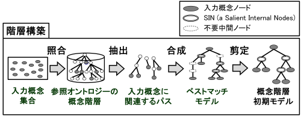

   Hierarchy Construction Process for Exactly-Matched Concepts

The process of hierarchy construction for exactly-matched concepts is illustrated in :numref:`process_of_perfectly_matched`. In this process, the system extracts and integrates all paths from the reference ontology that lead from the exactly-matched concepts (treated as leaf nodes) to the root concept. The resulting conceptual hierarchy is referred to as the Best Match Model.

The Best Match Model in :numref:`process_of_perfectly_matched` consists of three types of nodes:

#.	Input Concept Nodes (enclosed by a single line): Concepts in the reference ontology that correspond to user-selected input terms; these are indispensable for the domain ontology.
#.	SIN (Salient Internal Nodes) (enclosed by double lines): Internal nodes identified as significant for the hierarchy.
#.	Unnecessary Intermediate Nodes (enclosed by a dotted line): Nodes that do not contribute to the essential structure.

Nodes extracted from the reference ontology that are not input concept nodes are categorized as either SINs or unnecessary intermediate nodes.

A SIN is defined as a node that has one or more input concept nodes as its child nodes. SINs play a crucial role in preserving the topological relationships among input concepts—specifically, ancestral, parental, and sibling relationships. In contrast, unnecessary intermediate nodes are those that do not have any input concept nodes as children. Since these nodes do not contribute to maintaining the topological relationships between input concepts, the hierarchy construction module identifies them as redundant and removes them from the Best Match Model.

The process of removing unnecessary intermediate nodes is called pruning. The conceptual hierarchy resulting from pruning, which consists solely of input concept nodes and SINs, is termed the initial model of the conceptual hierarchy. This initial model is further refined through user interaction using conceptual hierarchy refinement methods, ultimately becoming the final conceptual hierarchy in the domain ontology.

Hierarchy Construction for Partially-Matched Concepts
~~~~~~~~~~~~~~~~~~~~~~~~~~~~~~~~~~~~~~~~~~~~~~~~~~~~~~~~~~~~~~~~~~~~~~

.. _process_of_partially_matched:
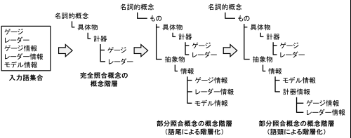

   Hierarchy Construction Process for Partially-Matched Concepts

n the hierarchy construction module, a stratification method based on prefixes and suffixes is applied to partially-matched concepts. :numref:`process_of_partially_matched` illustrates an example of this process. A partially-matched concept is a conceptualized input term that only partially matches a label in the reference ontology. As described in the input concept selection module, if an exact match is not found, the system performs morphological analysis and attempts a partial match that includes the suffix. In this context, the part of the label containing the suffix is defined as the suffix portion, and the preceding part is defined as the prefix portion. For instance, if the input term "gauge information" matches the concept "information", "gauge" is the prefix portion and "information" is the suffix portion. During the input concept selection phase, the user chooses whether to treat the partially-matched term as an alias or a hyponym of the matched concept. The following explanation assumes the user has chosen to define it as a hyponym.

In the example shown in :numref:`process_of_partially_matched`, the user initially selects "gauge," "radar," "gauge information," "radar information," and "model information" as input terms. Since "gauge" and "radar" have identical labels in the reference ontology, they are processed according to the hierarchy construction for exactly-matched concepts. Conversely, "gauge information," "radar information," and "model information" are partially matched to the "information" concept. In the suffix-based stratification, the system first constructs the hierarchy for the "information" concept following the exactly-matched process, then defines the three "information" terms as hyponyms of the "information" concept.

The prefix-based stratification focuses on the prefix portion of these partially-matched concepts. If a concept with the same label as the prefix portion already exists within the developing hierarchy, the system creates a new intermediate concept whose label combines the superconcept of that prefix and the label of the suffix-matched concept. Then, it redefines the hierarchy by placing the partially-matched concepts under this newly created intermediate concept. Since the prefix often serves to modify the suffix, combining prefix-based stratification with suffix-based methods allows for the construction of a more granular and detailed conceptual hierarchy.

As shown in :numref:`process_of_perfectly_matched`, in the hierarchy built only through suffix-based stratification, the "gauge" and "radar" concepts (which correspond to the prefixes of "gauge information" and "radar information") are defined as hyponyms of the "instrument" concept. By applying prefix-based stratification here, a new concept "instrument information" —combining "instrument" and "information"—is created and defined as the superconcept of "gauge information" and "radar information." The introduction of this "instrument information" concept distinguishes these terms from "model information" and enables the systematic classification of information related to instruments.

Relationship Construction Module
---------------------------------------------
To assist in defining other relations, the relationship construction module employs two co-occurrence-based methods - WordSpace and association rules - to extract candidate concept pairs for other relations from the input documents and input vocabulary.

Extraction of Concept Pairs via WordSpace
~~~~~~~~~~~~~~~~~~~~~~~~~~~~~~~~~~~~~~~~~~~~~~~~~~~~~~~~~~~~
WordSpace [Hearst96]_ is employed as a method for computing co-occurrence statistics. WordSpace is a corpus-based approach that induces semantic representations of large word sets from the co-occurrence statistics of a vocabulary. Through WordSpace, each occurring term can be represented as a vector encoding co-occurrence information. The multidimensional vector space formed by this collection of word vectors constitutes the WordSpace, and the inner product between two vectors serves as a measure of contextual similarity between occurring terms. Based on the co-occurrence information obtained from WordSpace, contextually similar concept pairs are extracted from the input documents and utilized as candidate concept pairs potentially relevant to the definition of other relations. We assume that "similarity of context suggests the existence of some conceptual relationship between the terms."

The following describes the procedure for extracting contextually similar concept pairs based on WordSpace ( :numref:`wordspace` ).

.. _wordspace:
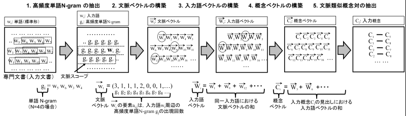

   Procedure for Extracting Contextually Similar Concept Pairs

1. Extraction of High-Frequency Word N-grams
""""""""""""""""""""""""""""""""""""""""""""""""""""""""""""
Phrases composed of N words (word N-grams) are extracted from domain documents and used as the minimal unit of co-occurrence. Compared to computing N-gram statistics at the character level, this approach allows co-occurrence information for meaningless character sequences to be excluded, enabling the extraction of information more useful for representing the context of domain documents. The extracted phrases are converted to their canonical forms, and duplicates are eliminated by consolidating identical forms. From the resulting set of word N-grams, those with high occurrence frequency in the domain documents (high-frequency word N-grams) are selected for use in constructing the WordSpace. This allows the input documents to be treated as sequences of high-frequency word N-grams. In the relationship construction module, users can configure both the word count N and the minimum occurrence count when extracting high-frequency word N-grams.

.. note::
   While [Hearst96]_ constructs WordSpace using character-level co-occurrences, the relationship construction module treats word-level N-gram co-occurrences as the minimal unit. Consequently, the 4-gram vector construction step - performed in standard WordSpace construction to represent character-level co-occurrences in a consolidated form - is omitted.

2. Construction of Context Vectors
"""""""""""""""""""""""""""""""""""""""""""""""""
Next, context vectors are constructed in order to compare the contexts of two given input terms. A context vector represents, as a vector, the occurrence counts of high-frequency word N-grams in the vicinity of a given input term. The element :math:`a_{i,j}` of context vector :math:`\overrightarrow{w_i}` is the occurrence count of high-frequency word N-gram :math:`g_j` within the surrounding region of the occurrences of input term :math:`w_i` (the **context scope**). In the relationship construction module, users can configure the context scope by specifying the number of words before and after input term :math:`w_i` within which high-frequency word N-grams are included in the construction of the context vector.

3. Construction of Input Term Vectors
""""""""""""""""""""""""""""""""""""""""""""""""""""""""
Next, the **input term vector** is derived from the context vectors as a vector representation of each input term. The input term vector :math:`\overrightarrow{W_i}` is represented by the sum of the context vectors :math:`\overrightarrow{w_i}` across all occurrences of input term :math:`w_i` in the domain documents.

4. Construction of Concept Vectors
""""""""""""""""""""""""""""""""""""""""""""""""""""""
Next, **concept vectors** are derived from the input term vectors as vector representations of the input concepts. The input concept selection module has already identified the concepts in the reference ontology that correspond to the input terms (input concepts). The concept vector is obtained as the sum of the input term vectors over the headwords (input terms) of the input concept. The concept vector :math:`\overrightarrow{C}` is expressed by :eq:`concept_vector`. :math:`\mathcal{A}(w)` denotes the set of all occurrences of input term :math:`w` in the domain documents. :math:`\overrightarrow{w}(i)` denotes the context vector at position :math:`i` of input term :math:`w` in the domain documents. :math:`synset(C)` denotes the set of headwords of concept :math:`C`.

.. math:: \overrightarrow{C} = \sum_{w \in {synset(C)}} (\sum_{i \in \mathcal{A}(w)}\overrightarrow{w}(i))
   :label: concept_vector

5. Extraction of Contextually Similar Concept Pairs
""""""""""""""""""""""""""""""""""""""""""""""""""""""""""""""""""""""
Through the processing described above, concept vectors can be obtained for all input concepts. The inner product between concept vectors yields the contextual similarity between concepts. In the relationship construction module, users can set a threshold value against which contextual similarity is measured. Concept pairs whose contextual similarity exceeds the user-specified threshold are extracted as contextually similar concept pairs.

The contextual similarity :math:`sim(\overrightarrow{C_1}, \overrightarrow{C_2})` between concept vectors :math:`\overrightarrow{C_1}` and :math:`\overrightarrow{C_2}` is computed using :eq:`context_similarity`.

.. math:: sim(\overrightarrow{C_1}, \overrightarrow{C_2}) = \frac{\sum_i c_{1,i}c_{2,i}}{\sqrt{\sum_i {c_{1,i}}^2 \sum_i {c_{2,i}}^2}}
   :label: context_similarity

Since no concept relation has yet been inferred to explicitly characterise the relationship between concepts, the concept relation **non-TAXONOMY** is assigned as the initial value prior to inference. The extracted contextually similar concept pairs may include hierarchical relationships. Accordingly, any hierarchical relationships already defined in the concept hierarchy are excluded from the set of contextually similar concept pairs.

Extraction of Concept Pairs via Association Rules
~~~~~~~~~~~~~~~~~~~~~~~~~~~~~~~~~~~~~~~~~~~~~~~~~~~~~~~~~~~~~~~~~~~~~~~~~
Association rules are employed as a second method for extracting candidate concept pairs for the definition of other relations from domain documents. Correlation denotes a co-occurrence property whereby the occurrence of one event tends to be accompanied by the occurrence of another. Furthermore, an association rule of the form :math:`A \Rightarrow B` signifies that the occurrence of event :math:`A` tends to be followed by the occurrence of event :math:`B`. The extraction of association rules is one of the representative data mining techniques and has also been applied to the definition of other relations [Agrawal94]_. Here, combinations of input terms co-occurring within a single sentence in the input documents are extracted as association rules and utilised as candidate concept pairs for the definition of other relations. It is assumed that some conceptual relationship exists between the concepts included in the extracted association rules.

The following describes the definition of association rules and the Apriori algorithm for association rule extraction. The explanations of association rules and the Apriori algorithm are based on Section 2.5 of *Fundamentals of Data Mining* [Motoda06]_.

Definition of Association Rules
""""""""""""""""""""""""""""""""""""""""""""""""""""""
Association rules are extracted from the **transaction set** :math:`T` shown in :eq:`transaction_set`. A **transaction** :math:`t_i` represents the unit of data grouping in a database. Here, since a single sentence in the input documents is taken as the unit of data grouping, the number of elements :math:`n` in the transaction set corresponds to the number of sentences contained in the input documents.

.. math:: T := \{t_i \mid i=1 \ldots n\}
   :label: transaction_set

Each element :math:`t_i` of :math:`T` is an item set. Here, items are taken to be input terms. That is, :math:`t_i` is represented as the set of input terms contained in the :math:`i`-th sentence of the input documents. :math:`t_i` is expressed by :eq:`transaction`. The :math:`C` in :eq:`transaction` denotes the set of all input terms contained in the input documents.

.. math:: t_i=\{a_{i,j} \mid j = 1 \ldots m, a_{i,j} \in C\}
   :label: transaction

For item sets :math:`X_k` and :math:`Y_k` each containing :math:`k` items, an association rule is expressed as :math:`X_k \Rightarrow Y_k (X_k, Y_k \subset C, X_k \cap Y_k = \emptyset)`. Here, :math:`X_k` is referred to as the antecedent and :math:`Y_k` as the consequent. Both the antecedent and the consequent may contain multiple items.

Two metrics for measuring the significance of association rules are **support** and **confidence**. Support denotes the proportion of all transactions in which a given association rule appears. The support :math:`support(X_k \Rightarrow Y_k)` of :math:`X_k \Rightarrow Y_k` is defined as the proportion of transactions containing both :math:`X_k` and :math:`Y_k` in :math:`T`, as expressed by :eq:`support`.

.. math:: support(X_k \Rightarrow Y_k) = \frac{\mid \{t_i \mid X_k \cup Y_k \subseteq t_i \} \mid}{n}
   :label: support

Confidence denotes the proportion of cases in which the consequent occurs given that the antecedent has occurred. The confidence :math:`confidence(X_k \Rightarrow Y_k)` of :math:`X_k \Rightarrow Y_k` is defined as the proportion of transactions containing :math:`X_k` in :math:`T` in which :math:`Y_k` also appears, as expressed by :eq:`confidence`.

.. math:: confidence(X_k \Rightarrow Y_k) = \frac{\mid \{t_i \mid X_k \cup Y_k \subseteq t_i \} \mid}{\mid \{t_i \mid X_k \subseteq t_i\} \mid}
   :label: confidence

In association rule extraction, unless threshold values are imposed on both support and confidence, a combinatorial explosion occurs and a large number of meaningless rules are generated. Therefore, thresholds are set for both support and confidence in association rule extraction, and only association rules whose support and confidence meet or exceed these values are extracted. These respective thresholds are referred to as **minimum support** and **minimum confidence**. Furthermore, item sets whose support meets or exceeds the user-specified minimum support are referred to as **frequent item sets**.

Although association rules generally permit multiple items in the antecedent, since the goal here is to extract concept pairs, a single item is admitted in both the antecedent and the consequent - that is, pairs of input terms are extracted. As with the extraction of concept pairs using WordSpace, since no concept relation has yet been inferred to explicitly characterise the relationship between concepts, the concept relation **non-TAXONOMY** is assigned as the initial value.

Apriori Algorithm for Association Rule Extraction
""""""""""""""""""""""""""""""""""""""""""""""""""""""""""""""""""""

相関ルールは，次の二つのステップにより抽出される．

**ステップ1:** 多頻度アイテム集合を獲得する．
**ステップ2:**  から最小確信度以上の確信度を有する相関ルールを導出する．

ステップ2 は，ステップ1 により求めた :math:`F` からルールを導出する処理であり，その負荷は比較的小さい．一方，ステップ1 は， :math:`T` を繰り返し検索し，数多くのアイテム集合の支持度を調べるため，その負荷は大きい．そのため，ステップ1 の効率の良いアルゴリズムを開発することが，実用的な相関ルール抽出アルゴリズムにつながると考えられてきた．この課題をはじめて解決した方法が，IBM アルマデン研究所のRakesh Agrawal らによって提案されたApriori アルゴリズム [Agrawal94]_ である．Apriori アルゴリズムは，現在最も広く利用されている相関ルール抽出アルゴリズムであり，本研究でも関係構築モジュールの実装に用いている．

以下では，Apriori アルゴリズムについて説明する．

Apriori アルゴリズムでは，「 :math:`A` が多頻度アイテム集合であれば，その部分集合は多頻度アイテム集合である」および，その対偶をとって「 :math:`B` が多頻度アイテム集合でなければ， :math:`B` を含むような集合 :math:`A` も多頻度アイテム集合でない」というアイテム集合の支持度の逆単調性を利用している．これらの性質を利用することにより，効率よく枝刈りを実行して，多頻度アイテム集合を求めることができる．例えば，{1,2}が多頻度アイテム集合でなければ，{1,2}を含むいかなるアイテム集合（{1,2,3}など）も多頻度アイテム集合ではないため，その支持度を調べる必要はない．

Apriori アルゴリズムでは，要素数の少ないアイテム集合から支持度を計算し，あるアイテム集合の支持度が最小支持度より小さくなったとき，この逆単調性を利用して，そのアイテム集合を含むようなアイテム集合は，多頻度アイテム集合の候補とはせずに枝狩りする．

要素数 :math:`k` の多頻度アイテム集合を :math:`F_k` ，多頻度アイテム集合の候補集合を :math:`C_k` とする時，Apriori アルゴリズムの処理手順は以下のようになる．

1. :math:`F_k` から :math:`C_{k+1}` を作成する．この際に，:math:`C_{k+1}` の各要素について，要素数 :math:`k` のアイテム集合からなる各部分集合がすべて :math:`F_k` に含まれるかどうかを点検し，そうでなければその要素を :math:`C_{k+1}` から削除する．
2. :math:`T` を検索し， :math:`C_{k+1}` における各要素の支持度を求める．
3. :math:`C_{k+1}` から :math:`F_{k+1}` を抽出する．
4. 新たな多頻度アイテム集合が空となるまで，(1) から(3) の処理を繰り返す．

:numref:`apriori` に，最小支持度0.50 (2/4 = 0.50) における，Apriori アルゴリズムによる多頻度アイテム集合抽出の例を示す． :numref:`apriori` では， :math:`T` には四つのトランザクションが含まれているため， :math:`T` の中で2 回以上出現するアイテム集合が，多頻度アイテム集合となる．はじめに :math:`T` ，から要素数1 のアイテム集合がトランザクションに含まれる回数を数え上げ， :math:`C_1` を作成する．:math:`C_1` の中から最小支持度以上の支持度を有するアイテム集合を抽出し， :math:`F_1` を求める．次に， :math:`F_1` から :math:`C_2` を作成する．ここでは， :math:`C_2` の各要素について，要素数1 のアイテム集合からなる各部分集合は，すべて多頻度アイテム集合となるため，要素の削除は行われない． :math:`T` を検索し， :math:`C_2` から :math:`F_2` を求める．次に， :math:`F_2` から :math:`C_3` を作成する．ここで， :math:`F_2` からは，{1,2,3}および{1,3,5}といったアイテム集合も :math:`C_3` の候補として抽出される．しかし，これらの部分集合である{1,2}および{1,5}は，それぞれ多頻度アイテム集合ではないため，{1,2,3}および{1,3,5}も多頻度アイテム集合ではないことがわかり， :math:`C_3` から削除される．よって， :math:`C_3` は{2,3,5}のみとなる． :math:`T` を検索すると，{2,3,5}の出現数が2であり，支持度は0.50 以上となる．よって， :math:`F_3` は{2,3,5}となる．{2,3,5}からは， :math:`C_4` を作成することができないため，ここで停止することとなる．

.. _apriori:
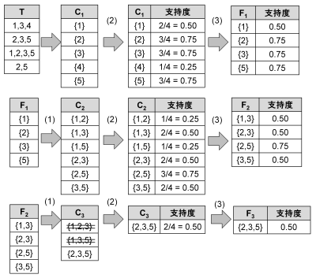

   Apriori アルゴリズムによる多頻度アイテム集合抽出の例

Construction of Property Hierarchies and Definition of Other Relations Using the EDR Concept Description Dictionary
~~~~~~~~~~~~~~~~~~~~~~~~~~~~~~~~~~~~~~~~~~~~~~~~~~~~~~~~~~~~~~~~~~~~~~~~~~~~~~~~~~~~~~~~~~~~~~~~~~~~~~~~~~~~~~~~~~~~~~~~~~~~~~~~~~~~~~~
The ontology construction module is capable of constructing property hierarchies and defining other relations using the EDR Concept Description Dictionary. The EDR Concept Description Dictionary defines eight types of conceptual relationships, centred on case relationships in which verbal concepts govern nominal concepts: agent, object, goal, implement, a-object, place, scene, and cause. The ontology construction module treats verbal concepts defined in the EDR Concept Description Dictionary and their subordinate concepts as OWL object properties, and constructs the property hierarchy separately from the nominal concept hierarchy (class hierarchy) during hierarchy construction.

Furthermore, among the eight types of conceptual relationships, the ontology construction module defines nominal concepts bearing an agent relationship as the domain of a property, and nominal concepts bearing an object relationship as the range of a property.

The same algorithm applied to exact-match and partial-match concept hierarchisation in class hierarchy construction is also applicable to property hierarchy construction. When hierarchising exact-match concepts, unnecessary concepts are pruned. This gives rise to the following cases in which either the consistency of other relation definitions cannot be maintained, or other relation definitions are lost entirely:

1. A pruned concept in the class hierarchy is defined as the value of an agent or object relationship.
2. An agent or object relationship is defined for a pruned concept in the property hierarchy.

In the ontology construction module, case 1 is addressed by substituting the value of the agent or object relationship with a subordinate concept of the pruned concept, thereby preserving consistency. Case 2 is addressed by having the domain and range inherited by the subordinate concepts of the pruned property, thereby preventing the loss of other relation definitions.

Ontology Refinement Module
================================
オントロジー洗練モジュールは，階層洗練モジュールおよび関係洗練モジュールから構成される．オントロジー洗練モジュールでは，オントロジー構築モジュールで構築した **概念階層初期モデル** と，その他の関係定義のための **概念対集合** を基に，ユーザとのインタラクションを通してオントロジーの洗練を行う．

以下では，階層洗練モジュールおよび関係洗練モジュールについて説明する．

Hierarchy Refinement Module
-----------------------------------
参照オントロジー（特に汎用オントロジー）から半自動構築された初期概念階層は一般的な階層関係が定義されているため，ユーザは概念変動（対象領域の変化による概念の意味変化）と呼ばれる問題を考慮しながら，初期概念階層を特定の領域に調整する必要がある．概念変動管理のために，階層洗練モジュールは戦略1：照合結果分析，戦略2：剪定結果分析，戦略3：多重継承の除去の三つの戦略を適用する．:numref:`process-tree-refinement` に概念階層洗練工程を示す．戦略1 は入力概念集合と汎用オントロジーとの照合結果の観点から, 戦略2 は剪定結果の観点から，戦略3 は多重継承から概念変動を同定する戦略である．以下では，それぞれの戦略の詳細を説明する．

.. _process-tree-refinement:
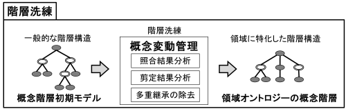

   概念階層洗練工程

Strategy1: Matched result analysis
~~~~~~~~~~~~~~~~~~~~~~~~~~~~~~~~~~~~~~~
戦略1 では，概念階層初期モデルにおいて，入力概念の位置関係から再利用可能な領域と不可能な（概念変動が発生していると推定される）領域に分割し，再利用不可能な領域を移動することによって概念変動を解消する．ここで，移動するとは，再利用不可能な領域に含まれる概念を，他の適切な概念の下位概念として再定義することを意味する．

入力概念（ベストマッチノード）は，問題領域から考えてほぼ妥当と考えられた概念のため，それらが連続するパスは，妥当な概念が集中していると考え，再利用可能なパスとみなせる．このパスを **PAB (PAths including only Bestmatches)** と呼ぶ．一方，SINが含まれる領域は，概念構造の差異（概念変動）が生じている可能性があるため，移動すべき領域とみなせる．この領域を **STM (SubTrees manually Moved)** と呼ぶ．PABとSTM の定義を以下に示す．

PABの定義
    ルート概念から入力概念（ベストマッチノード）が複数個連続しているパス．
STMの定義
    SIN をサブルートとし，その下位ノードがすべてベストマッチノードで構成される部分木．

:numref:`matched-result-analysis` にPAB とSTM の例を示す．実線で囲まれた部分木がPAB，破線で囲まれた部分木がSTMである．ユーザーはSTMを移動することで概念階層初期モデルを洗練し，領域概念階層を構築する．STM の移動先についてはユーザが決定し，移動する必要がないと判断した場合は移動しない．移動時にユーザーが不必要と判断したSTM のルートノードは削除してもよい．戦略1 は，照合結果を分析することによって得られた戦略のため，照合結果分析(Matched Result Analysis: MRA) と呼ぶ．

.. _matched-result-analysis:
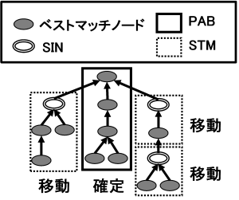
           
   Strategy1: Matched result analysis

Strategy2: Trimmed result analysis
~~~~~~~~~~~~~~~~~~~~~~~~~~~~~~~~~~~~~~~~~~~~~
戦略2 では，概念階層初期モデルにおいて，同じ親ノード（上位概念）を持つ兄弟ノード間で，剪定において取り除かれた中間概念数の差が大きい場合，その階層関係を再構成するよう示唆する．

剪定工程で，削除された中間概念とそれにつながるベストマッチノード以外の概念を含む領域が全て削除されることは，参照オントロジーによる概念の分化の方法が問題領域の概念の分化の方法と異なっていることを示しているといえる．そのような部分木に対して分化の再構成をユーザに促す．剪定の際の削除数の差が概念階層初期モデルのルート概念から末端概念までの距離の1/3 以上であった親子ノードに対し，再構成をユーザに示唆する．ルート概念から末端概念までの剪定の際の削除数は，ユーザによって任意に設定することもできる．戦略2 は関連情報の剪定結果の分析によって行なわれる戦略のため， **剪定結果分析(Trimmed Result Analysis: TRA)**  と呼ぶ．

剪定結果分析の適用例を:numref:`trimmed-result-analysis` に示す．:numref:`trimmed-result-analysis` のベストマッチモデルを剪定した結果，概念Aと概念D間の領域が全て削除された．このような変化は概念Aの分類属性が，対象となる問題領域では異なった形で分化に利用されている可能性があることを意味し，ここに概念変動が発生していることが考えられる．この例では，対象となる問題領域では，概念Dは概念A の下位概念ではなく，概念C の下位概念として概念階層を再構成している．

.. _trimmed-result-analysis:
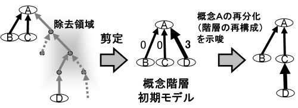
           
   Strategy2: Trimmed result analysis

Strategy3: Removing multiple inheritance
~~~~~~~~~~~~~~~~~~~~~~~~~~~~~~~~~~~~~~~~~~~~~~~~~
WordNet やEDR 電子化辞書などの汎用オントロジーは，網羅的に階層関係を定義するために，多重継承を多用している．汎用オントロジーにおける多重継承関係は，様々なコンテキストを考慮して定義されている．そのため，大部分の継承関係は特定の領域においては不要な継承関係となる．階層洗練モジュールでは，多重継承している概念の一覧を提示し，どの概念を上位概念として持つかをユーザに提示することにより，多重継承の除去を容易に行うことができる．

:numref:`remove-multiple-inheritance` に多重継承の除去の例を示す． :numref:`remove-multiple-inheritance` では，汎用オントロジー中で概念Dは概念A，概念B，概念C の3 つの概念を上位概念として多重継承している．ここでは，概念A と概念C は上位概念として不要であるとみなし，ユーザが継承関係を除去している．

.. _remove-multiple-inheritance:
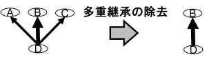
           
   Strategy3: Removing multiple inheritance

Relationship Refinement Module
-------------------------------------
関係洗練モジュールでは，関係構築モジュールでWordSpace および相関ルールにより獲得した概念対集合から，ユーザが概念間関係を定義するのを支援する．関係洗練モジュールでは，WordSpace と相関ルールにおけるパラメータの調節や，結果の合成，正解または不要概念対の選択，概念対間の関係の定義を行うことができる．

Visualization Module
==========================
To provide visual support for refining semi-automatically constructed domain ontologies, DODDLE-OWL integrates a Visualization Module. Specifically, DODDLE-OWL employs |MR3| (Meta-Model Management based on RDFs Revision Reflection) [Morita06]_ for this purpose. |MR3| is a graphical RDF/RDFS editor designed to manage relationships between RDF and RDFS descriptions. Using a dedicated plug-in, DODDLE-OWL can seamlessly interchange OWL ontologies with the |MR3| environment.

The Visualization Module serves two primary roles in supporting domain ontology construction:

#.	**Concept Drift Management in the Refinement Module**: The module visualizes the initial concept hierarchy generated by the Construction Module. This allows users to visually inspect and refine "concept drift" candidates suggested by the Refinement Module, facilitating more intuitive decision-making.
#.	**Externalization of the Domain Ontology**: This refers to the comprehensive visualization of both taxonomic and non-taxonomic (other) relationships within the domain ontology. Since these relationships are constructed separately—in the Hierarchy Construction Module and the Relationship Construction Module, respectively—externalization is crucial. It enables users to refine the ontology while ensuring a structural balance between the taxonomic backbone and the associated properties.

Translation Module
=========================
A domain ontology constructed by DODDLE-OWL consists of hierarchical relations and non-taxonomic (other) relations.

* The is-a hierarchy of classes is defined using the owl:Class class and the rdfs:subClassOf property.
* The has-a hierarchy of classes (part-whole relations) is defined using the owl:Class class and the doddle:partOf property.
* For properties, the is-a hierarchy is defined via owl:ObjectProperty and rdfs:subPropertyOf, while the has-a hierarchy uses owl:ObjectProperty and doddle:partOf.

Other relations are expressed as properties in OWL, where the domain and range of the property are set to the respective concept pair using the owl:ObjectProperty class, the rdfs:domain property, and the rdfs:range property.

The upper part of :numref:`translation_module` illustrates the conversion to OWL format for a conceptual relationship where "aim" and "behavior" are defined as subclasses of the "act" class. The lower part of :numref:`translation_module` shows the conversion process for an "other relation," specifically where an "attribute" property defines the relationship between the "time" class and the "offer" class.

Furthermore, DODDLE-OWL defines the label of a concept using the rdfs:label property and the description using rdfs:comment. The preferred label for display is defined using the skos:prefLabel property. The preferred label refers to the specific label prioritized for display within the conceptual hierarchy when multiple labels are defined for a single concept.

.. note::
    owl is a prefix of http://www.w3.org/2002/07/owl#. rdfs is a prefix of http://www.w3.org/2000/01/rdf-schema#.

.. _translation_module:
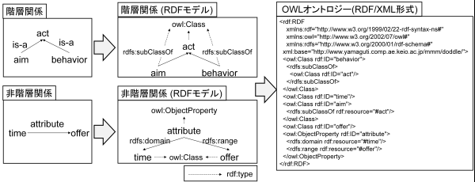

   Example of Converting a Domain Ontology to OWL Format via the Translation Module

