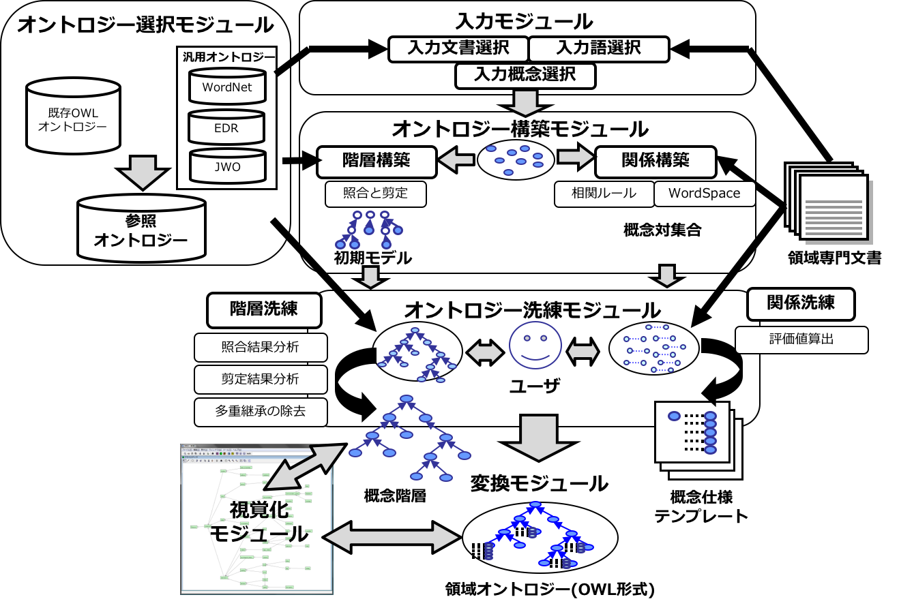
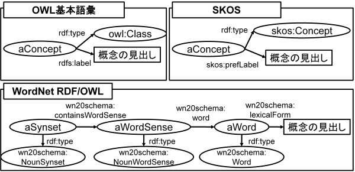
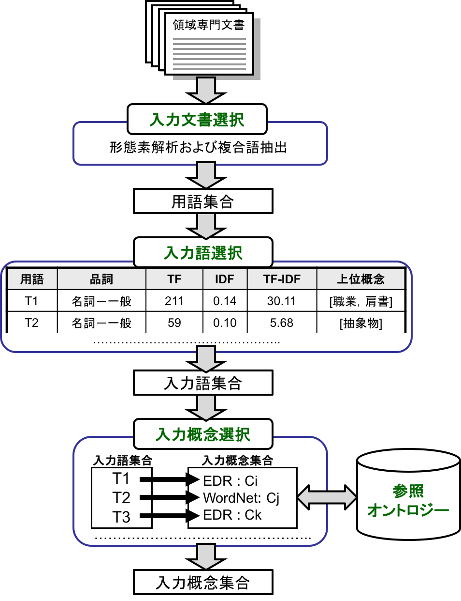
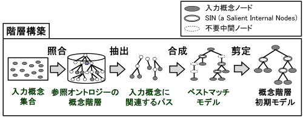
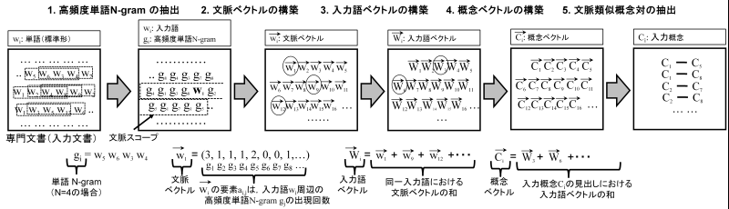

===========================
Module list
===========================

.. contents:: Contents
   :depth: 3

.. |MR3| replace:: MR\ :sup:`3` \

System Overview
==========================
:numref:`system_flow` shows the system overview of DODDLE-OWL. DODDLE-OWL has the following six main modules: Ontology Selection Module, Input Module, Construction Module, Refinement Module, Visualization Module, and Translation Module. 

Hierarchy Construction Module and Hierarchy Refinement Module were included in DODDLE-I  [Yamaguchi99]_ to support the user construct taxonomic relationships. Relationship Construction Module and Relationship Refinement Module, both added on to DODDLE-II [Kurematsu04]_ , support the construction of taxonomic and other rela- tionships. Ontology Selection Module, Input Module, Visualization Module, and Translation Module were additionally integrated in DODDLE-OWL to make possible an interactive domain ontology development environment.

Here, we assume that there are one or more domain specific documents, and we also assume that the users can select important terms that are needed to construct a domain ontology.

First, as input of DODDLE-OWL, the users select several concepts in Input Module. In Construction Module, DODDLE-OWL generates the basis of an ontology, an initial concept hierarchy and set of concept pairs, by referring to reference ontologies and documents. In Refinement Module, the initial ontology generated by Construction Module is refined by the users through interactive support by DODDLE-OWL. The ontology constructed by DODDLE-OWL can be exported with the representation of OWL. Finally, Visualization Module (|MR3| [Morita06]_ ) is connected with DODDLE-OWL and works with an graphical editor.

.. _system_flow:

   System overview of DODDLE-OWL

Ontology Selection Module
=======================================
In the Ontology Selection Module, you select reference ontologies. The reference ontologies are used in the other modules in DODDLE-OWL. WordNet [Miller95]_, Japanese WordNet [Isahara08]_ ，EDR [Yokoi95]_ ，and Japanese Wikipedia Ontology (JWO) [Tamagawa10]_, which are general ontologies in English and Japanese, can be used as reference ontologies in DODDLE-OWL. Furthermore, DODDLE-OWL can use existing ontologies, which are described in OWL, as reference ontologies. 

WordNet やEDR などの汎用オントロジーは，一般的かつ網羅的に定義がなされているため，領域オントロジー構築に利用する際には，領域に特化した構造へ，階層関係の修正や不要概念の除去などの洗練を行う必要がある．このことはユーザの負担となる．

It is considered that if the ontologies for a target domain exist on the web and can be reused, the cost of refining semi-automatically generated ontologies will be reduced. The ontologies constructed by DODDLE-OWL are described in OWL. Therefore, these ontologies can be reused as reference ontologies in DODDLE-OWL.

よって，DODDLE-OWLでは，既存領域オントロジーが存在しない，または，既存領域オントロジーが，ユーザが構築対象とする領域オントロジーを網羅できていない場合には，汎用オントロジーを利用することができ，既存領域オントロジーが存在する場合には，より容易に対象とする領域オントロジーの構築支援を行うことができる．

Web 上に存在する既存オントロジーを参照オントロジーとして再利用するために，オントロジー選択モジュールには，オントロジー検索エンジンを用いた既存領域オントロジーの獲得機能がある．以下では，はじめに汎用オントロジーについて簡単に説明した後，オントロジー検索エンジンを用いた既存領域オントロジー獲得方法について述べる．

General Ontologies
----------------------------
DODDLE-OWLでは，汎用オントロジーとしてWordNet, 日本語WordNet，EDR電子化辞書（一般辞書および専門辞書），日本語Wikipediaオントロジーを利用可能である．以下では簡単にそれぞれの汎用オントロジーについて説明する．

WordNet
~~~~~~~~~~~~~~~~~~~~~~~~~~~
WordNet [Miller95]_ は， プリンストン大学で開発されている英語シソーラス（汎用オントロジー）である．名詞句辞書，動詞句辞書，形容詞句辞書，副詞句辞書，および見出し句辞書か ら構成されており，総計約10万の語彙を保持している．見出し句辞書は，見出し句，意味情報としての概念ID，辞書編集情報，品詞情報などから構成されて いるが，概念IDが，見出し句辞書と各辞書の間のリンクとして機能している．名詞句辞書と動詞句辞書は，概念ID，辞書編集情報，対応する見出し句リスト から構成されているが，概念群は階層構造を有している．また，一部の概念IDには，反対概念の概念ID，part ofやmember ofやsubstance ofの概念IDなども与えられている．形容詞句辞書と副詞句辞書も，概念ID，辞書編集情報，対応する見出し句リストから構成されているが，階層構造は持たない．

Japanese WordNet
~~~~~~~~~~~~~~~~~~~~~~~~~~~
日本語WordNet [Isahara08]_ は，WordNetの日本語版である．

EDR Electric Dictionary
~~~~~~~~~~~~~~~~~~~~~~~~~~~
EDR電子化辞書 [Yokoi95]_ は， 独立行政法人 情報通信研究機構が提供している汎用オントロジーである．EDR電子化辞書は，日本語単語辞書，英語単語辞書，概念辞書，日英対訳辞書，英日対訳辞書，日 本語共起辞書，英語共起辞書，日本語コーパス，英語コーパス，専門用語辞書（情報処理）から構成される．DODDLE-OWLでは，これらの辞書の中から，日本語単語辞書，英語単語辞書，概念辞書，専門用語辞書（情報処理）を利用している．

Japanese Wikipedia Ontology
~~~~~~~~~~~~~~~~~~~~~~~~~~~~~~~
日本語Wikipediaオントロジー [Tamagawa10]_ は，日本語Wikipedia における様々なリソース（カテゴリツリー，一覧記事，リダイレクトリンク，Infobox, Infoboxテンプレート）から構築した大規模な日本語汎用オントロジーである．

Aquiring existing domain ontologies using an ontology search engine
------------------------------------------------------------------------
In order to reuse existing domain ontologies, the user needs to find domain ontologies for the target domain on the web. OntoSelect [Buitelaar04]_ supports the search, selection, and browsing of ontologies on the web. Our proposed method for ranking existing ontologies is similar to the method for selecting appropriate ontology in [Buitelaar04]_ .

Swoogle [Ding05]_  is an ontology search engine which indexes over 10,000 ontologies as of 2007. Swoogle can find classes and properties in ontologies, and also find implicit links and relations which are not defined in the ontologies. Swoogle also provides REST(Representational State Transfer) web-service interface for machine agents to avoid html-scraping. Swoogle uses OntoRank to rank ontologies and TermRank to rank classes and properties by their popularity as in the PageRank algorithm. From the viewpoint of domain ontology construction, not all popular ontologies are reusable. In order to find reusable ontologies appropriately, the mechanism to find existing ontologies for the target domain is necessary. In addition, since it is difficult to reuse the existing ontologies without modifying, it seems preferable to be able to collaborate with the domain ontology development environment and the ontology search engine.

Swoogle provides 19 types of REST web-service interfaces (Swoogle Web Services). DODDLE-OWL acquires and ranks existing ontologies for a target domain using Swoogle by the following procedures depicted in :numref:`ontology_ranking`. 

#. Acquiring the classes and properties which have the input terms (important terms for a domain from domain specific texts) as their URI’s local name or as the value of rdfs:label property. These classes and properties are named input concepts.
#. Acquiring the properties which have the classes acquired from step 1 as their value of rdfs:domain or rdfs:range property.
#. Acquiring the value of rdfs:domain and rdfs:range of the properties which are acquired from step 1 and 2.
#. Acquiring the ontologies which define the classes and properties acquired from step 1 through 3.
#. Referringtheontologiesacquiredfromstep4,removingthepropertieswhichare acquired from step 1 and 2, where the value of rdfs:domain or rdfs:range is neither the input concept nor the upper concept of the input concept.
#. Gathering ontological elements from the acquired ontologies using templates described in SPARQL.
#. Ranking the acquired ontologies mainly using the ratio of input concept in the ontology.

The detail of step 5 is described in :ref:`extracting-ontological-elements` and the details of step 7 is described in ranking-existing-ontologies.

.. _ontology_ranking:
.. figure:: figures/procedure_flow_of_acquiring_and_ranking_existing_ontologies.png
   :scale: 80 %
   :alt:  The procedure flow for acquiring and ranking existing ontologies for a target domain using Swoogle
   :align: center

   The procedure flow for acquiring and ranking existing ontologies for a target domain using Swoogle

.. _extracting-ontological-elements:

Extracting ontological elements from existing ontologies
-------------------------------------------------------------------
 In order to reuse existing ontologies for domain ontology construction, it is necessary to extract reusable elements from existing ontologies. DODDLE-OWL supports the
 construction of taxonomic and other relationships in the domain ontology. The elements constructing taxonomic and other relationships are concepts (classes and properties), labels of concepts, descriptions of concepts, super-subrelations, and other relations. Concept is absolutely essential for the domain ontology construction. Labels of concepts are necessary to find concepts related to input terms. Descriptions of concepts are necessary for word sense disambiguation. Super-subrelations are necessary to construct taxonomic relationships. Other relations include the definitions of the properties and their **rdfs:domain** and **rdfs:range**. Other relations are necessary to construct other relationships. Ontology languages (e.g. RDFS, DAML, and OWL) provide the vocabularies to define the above elements of ontology.

In Swoogle, the user can search ontologies based on the vocabularies provided by RDFS, DAML, and OWL. 

例えば，Swoogle ではクラスを，次の(X, Y, Z) というステートメントを満たすXと定義している．

* X は匿名リソース（空白ノード）ではない
* Y はrdf:type プロパティである
* Zは以下のいずれかのクラスである- rdfs:Class, owl:Class, owl:Restriction, owl:DataRange, daml:Class, daml:Datatype, daml:Restriction

Most of the existing ontologies are described in basic vocabularies of RDFS, DAML, and OWL. However, some general ontologies and thesauruses are described based on other schemes. `WordNet RDF/OWL <http://www.w3.org/TR/wordnet-rdf/>`_ provides a standard conversion of WordNet for direct use by Semantic Web application developers. The WordNet RDF/OWL schema is different from the OWL basic vocabularies. SKOS (Simple Knowledge Organisation System) [Miles05]_ provides a model for expressing the basic structure and the content of concept schemes. Some thesauruses are converted to SKOS. SKOS is also different from the OWL basic vocabularies.

:numref:`label_extraction` shows the difference of the labels of concepts among OWL basic vocabulary, SKOS, and the WordNet RDF/OWL scheme. In :numref:`label_extraction`, we regard a synset in WordNet as a concept. 

表1 にOWL基本語彙，SKOS, WordNet RDF/OWLにおけるオントロジーの要素を特定するクラスおよびプロパティ一覧を示す．

From the viewpoint of domain ontology construction reusing existing ontologies in various schemes, including thesauruses, we use five types of templates for extracting
the elements of ontology described in SPARQL query language for RDF [hommeaux08]_ . The five types of templates each extract one of the following elements: Classes, properties, labels and descriptions, super-subrelations, and other relations. 

.. _label_extraction:

   Difference of the labels of concepts among OWL Basic Vocabulary, SKOS, and the WordNet RDF/OWL scheme

OWL 基本語彙，SKOS, WordNet RDF/OWL におけるオントロジーの要素を特定するクラスおよびプロパティ一覧

=====================  =============================================================
Ontological Elements     オントロジーの要素を特定するクラスおよびプロパティ一覧
=====================  =============================================================
概念                   | rdfs:Class, owl:Class, rdf:Property, owl:ObjectProperty, etc
                       | skos:Concept
                       | wn20schema:WordSense, wn20schema:NounWordSense, etc
概念の見出し           | rdfs:label
                       | skos:prefLabel, skos:altLabel, skos:hiddenLabel
                       | wn20schema:lexicalForm
概念の説明             | rdfs:comment
                       | skos:definition
                       | wn20schema:gloss
階層関係               | rdfs:subClassOf, rdfs:subPropertyOf
                       | skos:broader, skos:narrower
                       | wn20schema:hypernymOf, wn20schema:hyponymOf
その他の関係           | rdfs:domain, rdfs:range
                       | skos:related
                       | wn20schema:antonymOf, wn20schema:partMeronymOf, etc
=====================  =============================================================

Ranking existing ontologies
----------------------------------------------------
DODDLE-OWL uses **OntoRank**, **TermRank**, and the ratio of input concept in the ontology as the ranking measures for the extracted ontologies. **OntoRank** is the
ranking measure for ontologies proposed in [Ding05]_, and **TermRank** is the ranking measure for classes and properties also proposed in [Ding05]_. We assume that the more the ontology includes input concepts, the more it relates to the target domain. If two ontologies include the same number of input concepts, the user can select the more popular ontology according to their **OntoRank**. When there are multiple candidates for the input concept due to the ambiguity of the input term, the user can select the more popular concept according to their **TermRank**.

Issues for reusing ontologies
----------------------------------------------------
DODDLE-OWLでは，階層関係構築支援を行うために，参照オントロジーから入力概念に関連するパスを抽出し，合成および不要概念の剪定を行う．Web 上に散在する異種のオントロジーのパスを合成する際には，上位概念階層の構造の違いにより単純に合成することは困難である．そのため，オントロジーアライメントによる類似概念の同定が必要となる．現状では，オントロジーアライメントを用いた階層関係構築支援は実現できていない．オントロジーアライメントについては，オントロジーアライメントのコンテスト が活発に行われており，ツールも多数公開されている．オントロジーアライメントツールとDODDLE-OWLの連携については，今後の課題である．

Input Modules
========================
In the Input Module, the users select input concepts which are significant concepts in a domain. Input Module consists of the following three sub-modules: Input Document Selection Module, Input Term Selection Module, and Input Concept Selection Module. :numref:`input_module` shows the flow of the Input Module. The detail of each sub module is described below.

.. _input_module:

   System flow of Input Module

Input Document Selection Module
--------------------------------
First, in the Input Document Selection Module, the users select domain specific documents described in English or Japanese. At this step, the users can select part of speech (POS) for extraction of words from the documents. The Input Document Selection Module automatically distinguishes one sentence from another referring to the period punctuation. However, when the input document consists of sentences with no period punctuation marks, the Input Document Selection Module cannot distinguish where to punctuate the sentence. These input documents cause the decrease in the accuracy of other relationships constructed by using association rule learner in the Relationship Construction Module. Considering such a case, the users can edit manually the punctuation of one sentence in the documents using the Input Document Selection Module.

Input Term Selection Module
--------------------------------
Second, the Input Term Selection Module shows a list of extracted terms including compound words, POS, Term Frequency (TF), Inverse Document Frequency (IDF), TF-IDF, and upper concepts of the terms in the documents. Here, the uppser concepts are in the reference ontologies and the users can set them in an upper concept list file. For example, if EDR is set as a reference ontology and the users set the "concrete object" concept as one of the upper concepts, input terms which match labels of sub concepts of the "concrete object" concept are shown with the concept. 

Domain specific documents contain many significant compound words. Therefore, accurate extraction of compound words is necessary to construct domain ontologies. At this step, while considering POS, TF, and so on, the user selects input terms which are significant terms for the domain. For certain domains, important terms do not occur in the documents. In such a case, Input Term Selection Module has a function allowing the manual addition of important terms as input terms by the user. In order to prevent the leakage of the selection of input terms from the documents, Input Term Selection Module maintains the relationships between the extracted terms and the place where the terms appear in the documents. 

Input Concept Selection Module
--------------------------------
Finally, in the Input Concept Selection Module, the user identifies the word sense of input terms to map those terms to the concepts in the reference ontologies selected with the Ontology Selection Module. A particular single term may have many word senses. Therefore, there may be many concepts that correspond to the word. Input Concept Selection Module shows the input terms and the concepts that correspond to the input terms. While considering the domain, the users select the most appropriate concept for the term from the list of concepts. In order to decrease the cost for input concepts selection, the Input Concept Selection Module has a function enabling automatic word disambiguation (input concept selection). This function shows the list of concepts, which is ordered by some criteria, corresponding to the selected input term.

Input Concept Selection Module uses **perfectly matching** and **partially matching** to disambiguate input terms. Though, labels of most concepts do not contain compound words. Therefore, it is difficult to select the appropriate concept for compound words. To deal with this, **partially matching** is used to disambiguate most of the compound words of the input terms. **Perfectly matching** and **partially matching** mean an input term perfectly or partially corresponds to labels of a concept. The priority of **perfectly matching** is higher than that of **partially matching**. If an input term does not correspond perfectly to any labels of concepts in the reference ontologies, the Input Concept Selection Module analyzes the morphemes of the input term. The input term can be considered to be a list of the morphemes. Input Concept Selection Module tries to correspond the sub lists (example shown below) to the concepts of the reference ontologies. Of the matched concepts corresponding to the sub lists, the longest concept is selected as the concept of the input term, and the input term becomes the sub concept of the concept.

For example, the input term **rocket delivery system** does not perfectly correspond to the labels of concepts in the reference ontologies. The Input Concept Selection Module analyzes morphemes of **rocket delivery system**. **Rocket delivery system** is resolved to **rocket**, **delivery**, and **system**. The sub lists for this input term becomes **delivery system** and **system**. First, Input Concept Selection Module disambiguates **delivery system**. Then, the Input Concept Selection Module disambiguates **system**. In this example, **delivery system** does not correspond to the labels of concepts in the reference ontologies. On the other hand, **system** corresponds to the labels of concepts in the reference ontologies. Consequently, in order to  disambiguate **rocket delivery system**, Input Concept Selection Module shows the concepts which have **system** as their label. 

Input terms which do not correspond to the labels of concepts in the reference ontologies are **undefined terms**. The input terms are also undefined terms if the concept exists but there are no appropriate concepts in the reference ontologies. The user defines the undefined terms manually in the Refinement Module. 

Semi-automation of input concept selection
~~~~~~~~~~~~~~~~~~~~~~~~~~~~~~~~~~~~~~~~~~~~~~~~~~~~~~~~
入力語数が多い場合や入力語が多くの意味を持つ場合，入力概念選択はユーザの負担となる．入力概念選択モジュールでは，主に2 種類の自動概念選択方法を用いて入力概念選択の支援を行う．両手法共に入力語に対応する概念候補の評価値を求めてランキングを行い，評価値の高い概念から順番にユーザに提示することにより，ユーザが入力概念選択を行うことを支援する．

一つ目の評価値の計算方法は以下のとおりである．

対象とする概念からそのルート概念までの各パスに出現する概念のうち，入力語集合（入力語彙）を見出しとして持つ概念の総数の最大値
対象とする概念の全ての下位概念のうち，入力語彙を見出しとして持つ概念の総数
対象とする概念の兄弟概念のうち，入力語彙を見出しとして持つ概念の総数
以上，三つの中からユーザは一つ以上の指標を選択し，選択した指標により得られた評価値の総和を用いて，入力語に対応する概念候補をランキングする．
二つ目の方法における評価値の計算方法は以下のとおりである．

入力語に対応する概念候補となる概念集合を得る
概念集合から二つの組み合わせを求め，それぞれの概念間距離を求める
ある概念と組み合わせ関係にある概念集合との概念間距離の逆数の総和をその概念の評価値とする
多重継承している場合には，概念間距離の計算方法が複数考えられる．その場合には，最短，最長，平均のどれかをユーザは選択することができる．
部分照合する用語の入力概念選択を簡略化するために，ある部分照合した用語の入力概念選択結果を，同様に部分照合するすべての用語の入力概念選択結果に反映させることが，入力概念選択モジュールでは可能である．例えば，「バッテリ充電装置」，「ノイズ測定装置」，「バルブ作動点検装置」がそれぞれ，「装置」で部分照合していた場合，装置の入力概念選択結果を，上記三つの入力語の入力概念選択結果とすることができる．

Ontology Construction Modules
=======================================
The Construction Module automatically generates the basis of an ontology, an initial concept hierarchy and set of concept pairs, by referring to reference ontologies and documents. An initial concept hierarchy is constructed as taxonomic relationships. Set of concept pairs are extracted by using co-occurrency based statistic methods. These pairs are considered to be closely related and that they will be used as candidates to refine and add other relations. The users identify some relationships between concepts in the pairs. 

The Construction Module consists of the Hierarchy Construction and the Relationship Construction Module. The detail of each module is described below.

Hierarchy Construction Module
-----------------------------------
階層構築モジュールでは，参照オントロジーの概念階層を参照し，領域オントロジーの基礎となる概念階層初期モデルを構築する．入力モジュールにおいて，入力語と完全照合した入力概念（完全照合概念）と部分照合した入力概念（部分照合概念）により，階層構築方法が異なる．以下では，完全照合概念と部分照合概念のそれぞれについて，階層構築方法を説明する．

完全照合概念の階層構築
~~~~~~~~~~~~~~~~~~~~~~~~~~~~~~~~~~~

.. _process_of_perfectly_matched:

   完全照合概念の階層構築工程

:numref:`process_of_perfectly_matched` に完全照合概念の階層構築工程を示す．はじめに，参照オントロジーから，入力モジュールにより獲得した完全照合概念を末端ノードとするルート概念までのパスを抽出し，合成する．これをベストマッチモデルと呼ぶ．

:numref:`process_of_perfectly_matched` のベストマッチモデルは，1 重線で囲まれたノードである入力概念ノード，2 重線で囲まれたノードであるSIN (a Salient Internal Nodes)，点線で囲まれたノードである不要中間ノードの3 種類のノードから構成される．入力概念ノードは，ユーザが選択した入力語に対応する参照オントロジー中の概念であり，領域にとって必須である．参照オントロジーから抽出したノードのうち，入力概念ノード以外のノードはSIN または不要中間ノードとなる．SIN は，入力概念ノードを一つ以上子ノードとして持つノードである．SIN は，各入力概念間の位相関係（祖先・親子・兄弟関係）を保持することに貢献する．一方，不要中間ノードは，入力概念ノードを子ノードとして持たないノードである．不要中間ノードはSIN とは異なり，各入力概念間の位相関係を保持することに貢献しないため，階層構築モジュールは階層構築において不要な概念であると見なし，ベストマッチモデルから削除する．不要中間ノードを削除する工程を剪定と呼ぶ．剪定によって得られた入力概念ノードとSIN のみから構成される概念階層を概念階層初期モデルと呼ぶ．概念階層初期モデルは， **概念階層洗練手法** を用いて，ユーザとのインタラクションにより洗練され，最終的な領域オントロジーにおける概念階層となる．

部分照合概念の階層構築
~~~~~~~~~~~~~~~~~~~~~~~~~~~~~~~~~~~~

.. _process_of_partially_matched:
.. figure:: figures/process_of_partially_matched_concept_tree_construction.png
   :scale: 80 %
   :alt: 部分照合概念の階層構築工程
   :align: center

   部分照合概念の階層構築工程

階層構築モジュールでは，部分照合概念について語尾および語頭による階層化を行う．図2 に部分照合概念の階層構築例を示す．ここで，部分照合概念とは，参照オントロジー中の概念の見出しと部分的に照合する入力語を概念化したものである．入力概念選択モジュールで説明したように，入力語が完全照合しなかった場合，入力語を形態素解析し，語尾を含むように部分照合を行っている．ここで，部分照合概念の見出しについて，語尾を含むように照合された部分を語尾部分，それ以前の部分を語頭部分と呼ぶことにする．例えば，「ゲージ情報」という入力語が参照オントロジー中の「情報」概念と部分照合した場合，「ゲージ」を語頭部分，「情報」を語尾部分と呼ぶ．また，入力概念選択モジュールにおいて，ユーザは部分照合した入力語を照合した概念の別見出しとするか，下位概念とするかを選択する．ここでは，下位概念とするほうをユーザが選択したものとして説明する．

:numref:`process_of_partially_matched` では，はじめに，ユーザは，入力語として「ゲージ」，「レーダー」，「ゲージ情報」，「レーダー情報」，「モデル情報」を選択した．「ゲージ」および「レーダー」は，参照オントロジー中にそれらを見出しとする概念が存在するため，図1に示した完全照合概念の階層構築工程に従って階層構築される．「ゲージ情報」，「レーダー情報」，「モデル情報」は，参照オントロジー中の「情報」概念と部分照合した．語尾による階層化により，はじめに，「情報」概念が完全照合概念の階層構築工程に従って階層構築され，次に，「ゲージ情報」，「レーダー情報」，「モデル情報」が概念化され，「情報」概念の下位概念として定義される．さらに，語頭による階層化では，部分照合概念の語頭部分に着目し，語頭部分を見出しとして持つ概念が構築中の概念階層内に存在する場合，その概念の上位概念と部分照合概念の語尾部分と照合した概念の見出しを組み合わせた見出しを持つ概念を新たに作成する．語頭部分が照合した部分照合概念は，新たに作成された概念の下位概念として階層関係が再定義される．部分照合概念の語頭部分は，部分照合概念を修飾していることが多い．そのため，語頭による階層化により，語尾による階層化のみに比べて，より詳細な階層構築を行うことができると考えられる．

:numref:`process_of_partially_matched` の語尾による階層化により構築された概念階層では，部分照合概念である「ゲージ情報」概念および「レーダー情報」概念の語頭部分にあたる「ゲージ」および「レーダー」を見出しとして持つ，「ゲージ」概念および「レーダー」概念が「計器」概念の下位概念として定義されている．ここで，語頭による階層化により，「計器」概念と「情報」概念を組み合わせた「計器情報」概念が新規に作成され，「ゲージ情報」概念および「レーダー情報」概念の上位概念として，階層化が行われる．「計器情報」概念を定義することにより，「モデル情報」概念と「ゲージ情報」概念および「レーダー情報」概念という計器に関する情報を分類することができる．

Relationship Construction Module
------------------------------------
その他の関係の定義を支援するために，関係構築モジュールでは，WordSpace と相関ルールの二つの共起性に基づく手法を用いて，入力文書および入力語彙からその他の関係の候補となる概念対を獲得する．

WordSpace による概念対の抽出
~~~~~~~~~~~~~~~~~~~~~~~~~~~~~~~~~~
共起統計の計算手法としてWordSpace [Hearst96]_ を利用する．WordSpace とは，語彙の共起統計から大規模な単語群の意味表現を誘導するコーパスに基づく方法である．WordSpaceによって，出現語句を共起情報を含むベクトルとして表現できる．この単語ベクトルの集合である多次元ベクトル空間がWordSpace であり，2 ベクトル間の内積は出現語句の文脈類似度の指標となる．WordSpace から得られる共起情報を基に，文脈類似概念対を入力文書から獲得し，その他の関係定義に関わる可能性のある概念対として利用する．“文脈の類似は，その語句間の何らかの概念関係の存在を示唆している” と仮定する．　

以下では，WordSpace に基づく文脈類似概念対の獲得手順（ :numref:`wordspace` ）について説明する．

.. _wordspace:

   文脈類似概念対の獲得手順

1. 高頻度単語N-gram の抽出
"""""""""""""""""""""""""""""""""""""""""
専門文書中からN 個の単語から構成される句（単語N-gram）を抽出し，共起の最小単位として用いる．文字単位のN-gram 統計を取るのに比べ意味の無い文字列の共起情報を除外でき，より専門文書の文脈表現に役立つ情報が抽出できる．この際抽出される句は，標準形に変換し，同形のものをまとめることで重複を排除している．ここで抽出された単語N-gram 集合の中から，専門文書における出現頻度の高い単語N-gram（高頻度単語N-gram）をWordSpace の構築に用いる．これにより入力文書は高頻度単語N-gram の配列とみなせる．関係構築モジュールでは，高頻度単語N-gram を抽出する際に，単語N-gram の単語数N および出現数をユーザは設定することができる．

.. note::
    [Hearst96]_ においては文字単位の共起を用いてWordSpace の構築を行っているが，関係構築モジュールでは単語単位N-gram の共起を最小単位として扱う．従って，通常のWordSpace 構築時に文字単位共起をある程度まとまった形で表現するために行う4-gram ベクトル構築工程は行わない．

2. 文脈ベクトルの構築
"""""""""""""""""""""
次に，ある二つの入力語の文脈を比較するために，文脈ベクトル(context vector)を構築する．文脈ベクトルとは，ある入力語周辺の高頻度単語N-gram の出現回数をベクトルで表現したものである．文脈ベクトル :math:`\overrightarrow{w_i}` の要素 :math:`a_{i,j}` は，入力語 :math:`w_i` の出現場所周辺（ **文脈スコープ** ）の高頻度単語N-gram :math:`g_j` の出現回数である．関係構築モジュールでは，文脈スコープとして，入力語 :math:`w_i` の前後何語以内に含まれる高頻度単語N-gram を文脈ベクトルの構築に用いるかをユーザは設定することができる．

3. 入力語ベクトルの構築
"""""""""""""""""""""""
次に，文脈ベクトルから入力語のベクトル表現である **入力語ベクトル(input term vector)**  を導く．入力語ベクトル :math:`\overrightarrow{W_i}` は，専門文書において，入力語 :math:`w_i` の全出現場所についての文脈ベクトル :math:`\overrightarrow{w_i}` の和によって表される．

4. 概念ベクトルの構築
"""""""""""""""""""""
次に，入力語ベクトルから入力概念のベクトル表現である **概念ベクトル(concept vector)** を導く．入力概念選択モジュールによって，入力語に対応する参照オントロジー中の概念（入力概念）は特定されている．入力概念の見出し（入力語）における入力語ベクトルの和が概念ベクトルとなる．概念ベクトル :math:`\overrightarrow{C}` は， :eq:`concept_vector` で表される． :math:`\mathcal{A}(w)` は，入力語 :math:`w` の専門文書における全出現場所を表す．:math:`\overrightarrow{w}(i)` は，入力語 :math:`w` の専門文書中の位置 :math:`i` における文脈ベクトルを表す．:math:`synset(C)` は，概念 における見出し集合を表す．

.. math:: \overrightarrow{C} = \sum_{w \in {synset(C)}} (\sum_{i \in \mathcal{A}(w)}\overrightarrow{w}(i))
   :label: concept_vector

5. 文脈類似概念対の獲得
"""""""""""""""""""""""
以上の処理より，全入力概念について概念ベクトルを得ることができる．概念ベクトル間の内積は，概念間の文脈類似度となる．関係構築モジュールでは，文脈類似度に対してある一定の閾値をユーザは設定することができる．ユーザが指定した閾値を越える値を持つ概念対を文脈類似概念対として獲得する．
概念ベクトル :math:`\overrightarrow{C_1}` ， :math:`\overrightarrow{C_2}` ，間の文脈類似度 :math:`sim(\overrightarrow{C_1}, \overrightarrow{C_2})` は， :eq:`context_similarity` を用いて計算する．

.. math:: sim(\overrightarrow{C_1}, \overrightarrow{C_2}) = \frac{\sum_i c_{1,i}c_{2,i}}{\sqrt{\sum_i {c_{1,i}}^2 \sum_i {c_{2,i}}^2}}
   :label: context_similarity

概念間の関係を明示する概念関係子は推定されていないため，推定前の初期値として概念関係子 **non-TAXONOMY** を割当てる．獲得された文脈類似概念対の中には，階層関係が含まれる可能性がある．そのため，概念階層において既に定義されている階層関係については，文脈類似概念対集合の中から除外する．

相関ルールによる概念対の抽出
~~~~~~~~~~~~~~~~~~~~~~~~~~~~~~~~~~~~~~~~~~~
専門文書からその他の関係定義の候補となる概念対を獲得するもう一つの方法として，相関ルールを利用する．相関とは，ある事象が発生すると別の事象が発生しやすいという共起性を意味する．また， :math:`A \Rightarrow B` という相関ルールは， :math:`A` という事象が起こると :math:`B` という事象も起こりやすいことを意味する．相関ルールの抽出は代表的なデータマイニング技術の一つであり，その他の関係定義にも利用されている [Agrawal94]_ ．ここでは，入力文書内の1 文中に同時に出現する入力語の組み合わせを相関ルールとして抽出し，その他の関係定義の候補となる概念対として利用する．抽出された相関ルールに含まれる概念間に，何らかの概念関係が存在すると仮定する．

以下では，相関ルールの定義および相関ルール抽出アルゴリズムApriori について述べる．相関ルールおよびApriori アルゴリズムの説明は，データマイニングの基礎 [Motoda06]_ 2.5節を参考にした．

相関ルールの定義
""""""""""""""""""""""""""""""
相関ルールは， :eq:`transaction_set` に示す **トランザクション集合(transaction set)** :math:`T` から抽出される． **トランザクション(transaction)** :math:`t_i` は，データベース内でのデータのまとまりの単位を表す．ここでは，入力文書内の1 文をデータのまとまりの単位としているため，トランザクション集合の要素数 :math:`n` は，入力文書に含まれる文の数を表す．

.. math:: T := \{t_i \mid i=1 \ldots n\}
   :label: transaction_set

:math:`T` の要素 :math:`t_i` は，アイテム集合(item set) である．ここでは，アイテムは入力語とする．つまり， :math:`t_i` は，入力文書の :math:`i` 番目の文に含まれる入力語の集合として表される． :math:`t_i` は， :eq:`transaction` で表される． :eq:`transaction` の :math:`C` は，入力文書に含まれる全入力語の集合を表す．

.. math:: t_i=\{a_{i,j} \mid j = 1 \ldots m, a_{i,j} \in C\}
   :label: transaction

:math:`k` 個のアイテムを含むアイテム集合 :math:`X_k` と :math:`Y_k` について，相関ルールは，:math:`X_k \Rightarrow Y_k (X_k,Y_k \subset C, X_k \cap Y_k = \emptyset)` で表される．ここで，:math:`X_k` を条件部， :math:`Y_k` を結論部と呼ぶ．条件部，結論部共に複数アイテムを含んでいてもよい．

相関ルールの重要性を測る指標として， **支持度** (support) と **確信度** (confidence) がある．支持度とは，相関ルールが全トランザクションでどの程度出現するかを表す割合である．:math:`X_k \Rightarrow Y_k` の支持度 :math:`support(X_k \Rightarrow Y_k)` は，の中でとを共に含むトランザクションの割合により定義される :eq:`support` ．

.. math:: support(X_k \Rightarrow Y_k) = \frac{\mid \{t_i \mid X_k \cup Y_k \subseteq t_i \} \mid}{n}
   :label: support

確信度とは，条件部が起こったときに結論部が起こる割合である． :math:`X_k \Rightarrow Y_k` の確信度 :math:`confidence(X_k \Rightarrow Y_k)` は， :math:`T` において :math:`X_k` を含むトランザクションの中で， :math:`Y_k` が出現する割合により定義される :eq:`confidence` ．

.. math:: confidence(X_k \Rightarrow Y_k) = \frac{\mid \{t_i \mid X_k \cup Y_k \subseteq t_i \} \mid}{\mid \{t_i \mid X_k \subseteq t_i\} \mid}
   :label: confidence

相関ルールの抽出では，支持度と確信度にある一定の閾値を設けないと，組み合わせ爆発を起こし，多数の無意味なルールが生成されてしまう．そのため，相関ルールの抽出では，支持度と確信度に閾値を設け，その値以上の支持度と確信度を有する相関ルールのみを抽出する．ここで，それぞれの閾値を **最小支持度** (minimum support)， **最小確信度** (minimum confidence) と呼ぶ．また，ユーザから与えられた最小支持度以上の支持度を有するアイテム集合を **多頻度アイテム集合** (frequent item set) と呼ぶ．

通常，相関ルールの条件部には複数のアイテムを許すが，ここでは概念対を抽出したいため，条件部と結論部共に一つずつのアイテム，つまり入力語の対を獲得する．WordSpaceを用いた概念対の抽出と同様に，概念間の関係を明示する概念関係子は推定されていないため，初期値として概念関係子 **non-TAXONOMY** を割当てる．

相関ルール抽出アルゴリズム Apriori
""""""""""""""""""""""""""""""""""

相関ルールは，次の二つのステップにより抽出される．

**ステップ1:** 多頻度アイテム集合を獲得する．
**ステップ2:**  から最小確信度以上の確信度を有する相関ルールを導出する．

ステップ2 は，ステップ1 により求めた :math:`F` からルールを導出する処理であり，その負荷は比較的小さい．一方，ステップ1 は， :math:`T` を繰り返し検索し，数多くのアイテム集合の支持度を調べるため，その負荷は大きい．そのため，ステップ1 の効率の良いアルゴリズムを開発することが，実用的な相関ルール抽出アルゴリズムにつながると考えられてきた．この課題をはじめて解決した方法が，IBM アルマデン研究所のRakesh Agrawal らによって提案されたApriori アルゴリズム [Agrawal94]_ である．Apriori アルゴリズムは，現在最も広く利用されている相関ルール抽出アルゴリズムであり，本研究でも関係構築モジュールの実装に用いている．

以下では，Apriori アルゴリズムについて説明する．

Apriori アルゴリズムでは，「 :math:`A` が多頻度アイテム集合であれば，その部分集合は多頻度アイテム集合である」および，その対偶をとって「 :math:`B` が多頻度アイテム集合でなければ， :math:`B` を含むような集合 :math:`A` も多頻度アイテム集合でない」というアイテム集合の支持度の逆単調性を利用している．これらの性質を利用することにより，効率よく枝刈りを実行して，多頻度アイテム集合を求めることができる．例えば，{1,2}が多頻度アイテム集合でなければ，{1,2}を含むいかなるアイテム集合（{1,2,3}など）も多頻度アイテム集合ではないため，その支持度を調べる必要はない．

Apriori アルゴリズムでは，要素数の少ないアイテム集合から支持度を計算し，あるアイテム集合の支持度が最小支持度より小さくなったとき，この逆単調性を利用して，そのアイテム集合を含むようなアイテム集合は，多頻度アイテム集合の候補とはせずに枝狩りする．

要素数 :math:`k` の多頻度アイテム集合を :math:`F_k` ，多頻度アイテム集合の候補集合を :math:`C_k` とする時，Apriori アルゴリズムの処理手順は以下のようになる．

1. :math:`F_k` から :math:`C_{k+1}` を作成する．この際に，:math:`C_{k+1}` の各要素について，要素数 :math:`k` のアイテム集合からなる各部分集合がすべて :math:`F_k` に含まれるかどうかを点検し，そうでなければその要素を :math:`C_{k+1}` から削除する．
2. :math:`T` を検索し， :math:`C_{k+1}` における各要素の支持度を求める．
3. :math:`C_{k+1}` から :math:`F_{k+1}` を抽出する．
4. 新たな多頻度アイテム集合が空となるまで，(1) から(3) の処理を繰り返す．

:numref:`apriori` に，最小支持度0.50 (2/4 = 0.50) における，Apriori アルゴリズムによる多頻度アイテム集合抽出の例を示す． :numref:`apriori` では， :math:`T` には四つのトランザクションが含まれているため， :math:`T` の中で2 回以上出現するアイテム集合が，多頻度アイテム集合となる．はじめに :math:`T` ，から要素数1 のアイテム集合がトランザクションに含まれる回数を数え上げ， :math:`C_1` を作成する．:math:`C_1` の中から最小支持度以上の支持度を有するアイテム集合を抽出し， :math:`F_1` を求める．次に， :math:`F_1` から :math:`C_2` を作成する．ここでは， :math:`C_2` の各要素について，要素数1 のアイテム集合からなる各部分集合は，すべて多頻度アイテム集合となるため，要素の削除は行われない． :math:`T` を検索し， :math:`C_2` から :math:`F_2` を求める．次に， :math:`F_2` から :math:`C_3` を作成する．ここで， :math:`F_2` からは，{1,2,3}および{1,3,5}といったアイテム集合も :math:`C_3` の候補として抽出される．しかし，これらの部分集合である{1,2}および{1,5}は，それぞれ多頻度アイテム集合ではないため，{1,2,3}および{1,3,5}も多頻度アイテム集合ではないことがわかり， :math:`C_3` から削除される．よって， :math:`C_3` は{2,3,5}のみとなる． :math:`T` を検索すると，{2,3,5}の出現数が2であり，支持度は0.50 以上となる．よって， :math:`F_3` は{2,3,5}となる．{2,3,5}からは， :math:`C_4` を作成することができないため，ここで停止することとなる．

.. _apriori:
.. figure:: figures/apriori.png
   :scale: 80 %
   :alt: Apriori アルゴリズムによる多頻度アイテム集合抽出の例
   :align: center

   Apriori アルゴリズムによる多頻度アイテム集合抽出の例

EDR概念記述辞書を用いたプロパティ階層の構築およびその他の関係定義
~~~~~~~~~~~~~~~~~~~~~~~~~~~~~~~~~~~~~~~~~~~~~~~~~~~~~~~~~~~~~~~~~~~~~~~~~~~~~~~
オントロジー構築モジュールは，EDR 概念記述辞書を用いてプロパティ階層の構築およびその他の関係定義を行うことができる．EDR 概念記述辞書には動詞的概念が名詞的概念を支配する場合の格関係を中心に，agent，object， goal， implement，a-object，place， scene， cause の8 種類の概念関係が定義されている．オントロジー構築モジュールはEDR 概念記述辞書に定義されている動詞的概念およびその下位概念をOWLにおけるオブジェクトプロパティとみなし，階層構築時に名詞的概念階層（クラス階層）とは分離してプロパティ階層構築を行う．

また，オントロジー構築モジュールは，8 種類の概念関係のうちagent 関係がある名詞的概念をプロパティの定義域，object 関係がある名詞的概念をプロパティの値域として定義する．

プロパティ階層構築にも，クラス階層構築における完全および部分照合概念階層化と同様のアルゴリズムが適用可能である．完全照合概念を階層化する際には，不要概念の剪定が行われる．そのため，以下の場合にその他の関係定義の整合性が保持できなかったり，その他の関係定義が欠落してしまう問題が発生する．

1. クラス階層中の剪定された概念がagent またはobject の値として定義されている場合
2. プロパティ階層中の剪定された概念にagent またはobject 関係が定義されている場合

オントロジー構築モジュールでは，1. については，agent またはobject の値を，剪定された概念の下位概念に置換することで整合性を保持している．2. については，剪定されたプロパティの下位概念に定義域および値域を継承させることによりその他の関係定義が欠落しないようにしている．

Ontology Refinement Module
================================
オントロジー洗練モジュールは，階層洗練モジュールおよび関係洗練モジュールから構成される．オントロジー洗練モジュールでは，オントロジー構築モジュールで構築した **概念階層初期モデル** と，その他の関係定義のための **概念対集合** を基に，ユーザとのインタラクションを通してオントロジーの洗練を行う．

以下では，階層洗練モジュールおよび関係洗練モジュールについて説明する．

Hierarchy Refinement Module
-----------------------------------
参照オントロジー（特に汎用オントロジー）から半自動構築された初期概念階層は一般的な階層関係が定義されているため，ユーザは概念変動（対象領域の変化による概念の意味変化）と呼ばれる問題を考慮しながら，初期概念階層を特定の領域に調整する必要がある．概念変動管理のために，階層洗練モジュールは戦略1：照合結果分析，戦略2：剪定結果分析，戦略3：多重継承の除去の三つの戦略を適用する．:numref:`process-tree-refinement` に概念階層洗練工程を示す．戦略1 は入力概念集合と汎用オントロジーとの照合結果の観点から, 戦略2 は剪定結果の観点から，戦略3 は多重継承から概念変動を同定する戦略である．以下では，それぞれの戦略の詳細を説明する．

.. _process-tree-refinement:
.. figure:: figures/process_of_tree_refinement.png
   :scale: 80 %
   :alt:  概念階層洗練工程
   :align: center

   概念階層洗練工程

Strategy1: Matched result analysis
~~~~~~~~~~~~~~~~~~~~~~~~~~~~~~~~~~~~~~~
戦略1 では，概念階層初期モデルにおいて，入力概念の位置関係から再利用可能な領域と不可能な（概念変動が発生していると推定される）領域に分割し，再利用不可能な領域を移動することによって概念変動を解消する．ここで，移動するとは，再利用不可能な領域に含まれる概念を，他の適切な概念の下位概念として再定義することを意味する．

入力概念（ベストマッチノード）は，問題領域から考えてほぼ妥当と考えられた概念のため，それらが連続するパスは，妥当な概念が集中していると考え，再利用可能なパスとみなせる．このパスを **PAB (PAths including only Bestmatches)** と呼ぶ．一方，SINが含まれる領域は，概念構造の差異（概念変動）が生じている可能性があるため，移動すべき領域とみなせる．この領域を **STM (SubTrees manually Moved)** と呼ぶ．PABとSTM の定義を以下に示す．

PABの定義
    ルート概念から入力概念（ベストマッチノード）が複数個連続しているパス．
STMの定義
    SIN をサブルートとし，その下位ノードがすべてベストマッチノードで構成される部分木．

:numref:`matched-result-analysis` にPAB とSTM の例を示す．実線で囲まれた部分木がPAB，破線で囲まれた部分木がSTMである．ユーザーはSTMを移動することで概念階層初期モデルを洗練し，領域概念階層を構築する．STM の移動先についてはユーザが決定し，移動する必要がないと判断した場合は移動しない．移動時にユーザーが不必要と判断したSTM のルートノードは削除してもよい．戦略1 は，照合結果を分析することによって得られた戦略のため，照合結果分析(Matched Result Analysis: MRA) と呼ぶ．

.. _matched-result-analysis:
.. figure:: figures/matched_result_analysis.png
   :scale: 80 %
   :alt: Strategy1: Matched result analysis
   :align: center
           
   Strategy1: Matched result analysis

Strategy2: Trimmed result analysis
~~~~~~~~~~~~~~~~~~~~~~~~~~~~~~~~~~~~~~~~~~~~~
戦略2 では，概念階層初期モデルにおいて，同じ親ノード（上位概念）を持つ兄弟ノード間で，剪定において取り除かれた中間概念数の差が大きい場合，その階層関係を再構成するよう示唆する．

剪定工程で，削除された中間概念とそれにつながるベストマッチノード以外の概念を含む領域が全て削除されることは，参照オントロジーによる概念の分化の方法が問題領域の概念の分化の方法と異なっていることを示しているといえる．そのような部分木に対して分化の再構成をユーザに促す．剪定の際の削除数の差が概念階層初期モデルのルート概念から末端概念までの距離の1/3 以上であった親子ノードに対し，再構成をユーザに示唆する．ルート概念から末端概念までの剪定の際の削除数は，ユーザによって任意に設定することもできる．戦略2 は関連情報の剪定結果の分析によって行なわれる戦略のため， **剪定結果分析(Trimmed Result Analysis: TRA)**  と呼ぶ．

剪定結果分析の適用例を:numref:`trimmed-result-analysis` に示す．:numref:`trimmed-result-analysis` のベストマッチモデルを剪定した結果，概念Aと概念D間の領域が全て削除された．このような変化は概念Aの分類属性が，対象となる問題領域では異なった形で分化に利用されている可能性があることを意味し，ここに概念変動が発生していることが考えられる．この例では，対象となる問題領域では，概念Dは概念A の下位概念ではなく，概念C の下位概念として概念階層を再構成している．

.. _trimmed-result-analysis:
.. figure:: figures/trimmed_result_analysis.png
   :scale: 80 %
   :alt: Strategy2: Trimmed result analysis
   :align: center
           
   Strategy2: Trimmed result analysis

Strategy3: Removing multiple inheritance
~~~~~~~~~~~~~~~~~~~~~~~~~~~~~~~~~~~~~~~~~~~~~~~~~
WordNet やEDR 電子化辞書などの汎用オントロジーは，網羅的に階層関係を定義するために，多重継承を多用している．汎用オントロジーにおける多重継承関係は，様々なコンテキストを考慮して定義されている．そのため，大部分の継承関係は特定の領域においては不要な継承関係となる．階層洗練モジュールでは，多重継承している概念の一覧を提示し，どの概念を上位概念として持つかをユーザに提示することにより，多重継承の除去を容易に行うことができる．

:numref:`remove-multiple-inheritance` に多重継承の除去の例を示す． :numref:`remove-multiple-inheritance` では，汎用オントロジー中で概念Dは概念A，概念B，概念C の3 つの概念を上位概念として多重継承している．ここでは，概念A と概念C は上位概念として不要であるとみなし，ユーザが継承関係を除去している．

.. _remove-multiple-inheritance:
.. figure:: figures/remove_multiple_inheritance.png
   :scale: 80 %
   :alt: Strategy3: Removing multiple inheritance
   :align: center
           
   Strategy3: Removing multiple inheritance

Relationship Refinement Module
-------------------------------------
関係洗練モジュールでは，関係構築モジュールでWordSpace および相関ルールにより獲得した概念対集合から，ユーザが概念間関係を定義するのを支援する．関係洗練モジュールでは，WordSpace と相関ルールにおけるパラメータの調節や，結果の合成，正解または不要概念対の選択，概念対間の関係の定義を行うことができる．

Visualization Module
======================
In order to visually support the refinement of the semi-automatically constructed domain ontology, DODDLE-OWL is integrated with the Visualization Module. DODDLE-OWL uses |MR3|: Meta-Model Management based on RDFs Revision Reflection [Morita06]_ as the Visualization Module. |MR3| is a graphical RDF and RDFS editor for managing relationships between RDF and RDFS descriptions. DODDLE-OWL can interchange an OWL ontology with ¥mrcube using a plug-in function of |MR3|. 

Visualization Module has two main roles for supporting domain ontology construction. One is the visualization function for concept drift management in the Refinement Module. Visualization Module displays the initial concept hierarchy generated in the Construction Module. Then, the user can visually refine candidates of concept drifts which are suggested by the Refinement Module. The other role is the externalization of the domain ontology. The externalization of the domain ontology means visualizing the whole taxonomic relationships and other relationships in the domain ontology. Taxonomic relationships and other relationships are constructed separately in the Hierarchy Construction Module and the Relationship Construction Module. By the externalization of the domain ontology, the user can refine the domain ontology while regarding the balance of the taxonomic relationships and other relationships. 

Translation Module
====================
Translation Module exports the taxonomic relationships and other relationships described in OWL. Taxonomic relationships are defined using **owl:Class** class **rdfs:subClassOf** property. Other relationships are defined using **owl:ObjectProperty** class, **rdfs:domain** property, and **rdfs:range** property. 

:numref:`translation_module` shows an example of exporting taxonomic relationships and other relationships in OWL. The upper part of :numref:`translation_module` shows that **goods** class is a subclass of **artifact** class. The lower part of :numref:`translation_module` shows that **attribute** relationships is defined between an individual of **goods** class and an individual of **quality** class. 

.. note::
    owl is a prefix of http://www.w3.org/2002/07/owl#. rdfs is a prefix of http://www.w3.org/2000/01/rdf-schema#.

クラスのhas-a階層は，owl:Classクラスおよびdoddle:partOfプロパティにより定義する．プロパティのis-a 階層は，owl:ObjectProperty クラスおよびrdfs:subPropertyOfプロパティにより定義する．プロパティのhas-a階層は，owl:ObjectPropertyクラスおよびdoddle:partOf プロパティにより定義する．

:numref:`translation_module` の上部は，概念関係の定義の例として，「act」クラスの下位クラスとして「aim」と「behavior」クラスが定義された状態を，OWL形式に変換する方法を示している．:numref:`translation_module` の下部は，その他の関係の定義の例として，「time」と「offer」クラスの間に「attribute」プロパティという関係がある状態を，OWL形式に変換する方法を示している．

また，DODDLE-OWL では概念の見出しをrdfs:label プロパティ，概念の説明をrdfs:comment プロパティ，概念の表示見出しをskos:prefLabel プロパティを用いて定義している．概念の表示見出しは，概念に複数の見出しが定義されている場合に，概念階層を表示する際に優先的に表示する見出しのことである．

.. _translation_module:
.. figure:: figures/translation_module.png
   :scale: 80 %
   :alt: An example of exporting taxonomic relationships and other relationships in OWL
   :align: center

   An example of exporting taxonomic relationships and other relationships in OWL

