==========================
User manual
==========================

.. contents:: Contents
   :depth: 3

.. |MR3| replace:: MR\ :sup:`3` \

Implementation Architecture
=============================
:numref:`implementation_architecture` shows the implementation architecture of DODDLE-OWL. DODDLE-OWL is implemented by Java language and used Java Swing as GUI components. DODDLE-OWL has the following six main modules: Ontology Selection Module, Input Module, Construction Module, Refinement Module, Visualization Module, and Translation Module. On implementation, Construction Module and Refinement Module are implemented in the same panel.

In order to get existing ontologies on the web, we use Swoogle Web services in the Ontology Selection Module. In the Input Module, Construction Module, and Refinement Module, we use `extJWNL(Extended Java WordNet Library)  <http://extjwnl.sourceforge.net/Java>`_  to refer WordNet. In the Input Module, we use Japanese morphological analyzer `lucene-gosen <https://github.com/lucene-gosen/lucene-gosen>`_ to analyze Japanese morphmes and identify part-of-speech in the documents. In order to identify English part-of-speech, we use `The Stanford Parser <https://nlp.stanford.edu/software/lex-parser.shtml>`_ . In order to extract English and Japanese compound words, we use Automatic Domain Terminology Extraction System [Nakagawa03]_ . We also use Yet Another Japanese Dependency Structure Analyzer `CaboCha <http://taku910.github.io/cabocha/>`_ to extract Japanese compound words. In order to extract texts from various format documents such as PDF, Microsoft Word, Excel, and PowerPoint, we use `Apache POI <http://poi.apache.org>`_ and `Apache PDFBox <https://pdfbox.apache.org>`_ . We use |MR3| <http://mrcube.org> as the Visualization Module. In the Translation Module, we use `Apache Jena <http://jena.apache.org>`_ to import and export ontologies in OWL format.

.. _implementation_architecture:
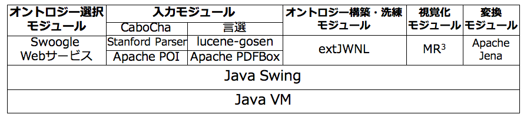

   Implementation Architecture of DODDLE-OWL

Ontology Selection Panel
======================================

Aquiring existing ontologies using Swoogle
----------------------------------------------------
Swoogle provides 19 types of REST web-service interfaces (Swoogle Web Services). When a query URL made by the user is inputted to Swoogle, the user can get the query results in RDF/XML. Swoogle Web Services mainly have queryType and searchString as their parameters. The queryType parameter specifies the type of the web service to call. The searchString parameter is given the input search string of the web service. :numref:`swoogle-web-service-io` shows the Swoogle Web Services available for domain ontology construction, and their input and output. SWD (Semantic Web Document) in :numref:`swoogle-web-service-io` is an RDF document described in RDF/XML, N-Triple, or Notation 3. SWT (Semantic Web Term) in :numref:`swoogle-web-service-io` is an RDF resource with URI being defined, referenced, and populated as classes or properties in SWD. SWO (Semantic Web Ontology) is a special type of SWD which defines many classes and properties.

.. list-table:: The Swoogle Web Services, which can be used for domain ontology construction, and their inputs and outputs
   :name: swoogle-web-service-io

   * - Type
     - Swoogle Web Services
     - Input
     - Output
   * - 1
     - Search ontology
     - search keyword
     - List of SWO which relates to the input search keyword
   * - 3
     - Search terms
     - search keyword
     - List of SWT which relates to the input search keyword
   * - 4
     - Digest semantic web document
     - SWD
     - Swoogle Metadata for the input SWD
   * - 13
     - List documents using term
     - SWT
     - List of SWD defining/referencing/ populating the input SWT
   * - 16
     - List domain classes of a property
     - property
     - List of classes which are used as the rdfs:domain of the input property
   * - 17
     - List properties of a domain class
     - class
     - List of properties which use the input class as their rdfs:domain
   * - 18
     - List range classes of a property
     - property
     - List of classes which are used as the rdfs:range of the input property
   * - 19
     - List properties of a range class
     - class
     - List of properties which use the input class as their rdfs:range

:numref:`swoogle-web-service-type-and-condition` shows the types of Swoogle web services to use and the limiting conditions for each step in acquiring existing ontologies. The Step column in :numref:`swoogle-web-service-type-and-condition` corresponds to the steps described in :numref:`ontology_ranking` . The Types of Swoogle Web Services to Use column in :numref:`swoogle-web-service-type-and-condition` corresponds to the types in :numref:`swoogle-web-service-io`. In order to reduce the cost of computation time, DODDLE-OWL has limiting conditions for each steps.
 
.. list-table:: Types of Swoogle web services to use and limiting conditions for each step in acquiring existing ontologies
  :name: swoogle-web-service-type-and-condition

  * - Step
    - Types of Swoogle Web Services to Use
    - Limiting Conditions
  * - 1
    - 3
    - The number of classes and properties for each input term is limited to the top 5 sorted by TermRank.
  * - 2
    - 17, 19
    - The number of properties which have the classes as their value of rdfs:domain or rdfs:range property is limited to the top 100.
  * - 3
    - 16, 18
    - The number of values for rdfs:domain and rdfs:range of each property is limited to the top 100.
  * - 4
    - 1, 4, 13
    - The number of ontologies for each input term is limited to the top 10 sorted by OntoRank.

.. _extracting-ontology-elements-using-sparql-template:

Extracting ontological elements using SPARQL templates
---------------------------------------------------------------------
:numref:`sparql-template1` to :numref:`sparql-template5` show templates described in SPARQL to extract ontological elements described in RDFS, DAML, and OWL.

If DODDLE-OWL executes the extracting labels and descriptions template in :numref:`sparql-template3` directly as a SPARQL query, DODDLE-OWL acquires all values of rdfs:label, rdfs:comment, and etc properties as the SPARQL query result. In order to acquire only the labels and descriptions of an input concept, DODDLE-OWL replaces the ?concept variable in :numref:`sparql-template3` with the URI of the input concept. In a similar way, DODDLE-OWL replaces the variables in other templates with the appropriate URIs, and executes the replaced templates as the SPARQL query. By building the five types of templates using ?concept, ?subConcept, ?class, ?property, ?label, ?description, ?domain, and ?range variables and setting the templates in DODDLE-OWL, extraction of the ontologies’ elements described in various scheme is possible with DODDLE-OWL.

.. code-block:: sparql
   :caption: Extracting class template for RDFS，DAML，and OWL basic vocaburalies
   :name: sparql-template1

     PREFIX rdf: <http://www.w3.org/1999/02/22-rdf-syntax-ns#>
     PREFIX rdfs: <http://www.w3.org/2000/01/rdf-schema#>
     PREFIX owl: <http://www.w3.org/2002/07/owl#>
     PREFIX daml03: <http://www.daml.org/2001/03/daml+oil#>
     PREFIX daml10: <http://www.w3.org/2001/10/daml+oil#>

     SELECT ?class WHERE {
          {?class rdf:type rdfs:Class} UNION {?class rdf:type owl:Class} UNION
          {?class rdf:type owl:Restriction} UNION {?class rdf:type owl:DataRange} UNION
          {?class rdf:type daml03:Class} UNION {?class rdf:type daml03:Datatype} UNION
          {?class rdf:type daml03:Restriction} UNION  {?class rdf:type daml10:Class} UNION
          {?class rdf:type daml10:Datatype} UNION {?class rdf:type daml10:Restriction}
     }

.. code-block:: sparql
   :caption: Extracting property template for RDFS，DAML，and OWL basic vocaburalies
   :name: sparql-template2

     PREFIX rdf: <http://www.w3.org/1999/02/22-rdf-syntax-ns#>
     PREFIX rdfs: <http://www.w3.org/2000/01/rdf-schema#>
     PREFIX owl:  <http://www.w3.org/2002/07/owl#>
     PREFIX daml03: <http://www.daml.org/2001/03/daml+oil#>
     PREFIX daml10: <http://www.w3.org/2001/10/daml+oil#>

     SELECT ?property WHERE {
         {?property rdf:type rdf:Property} UNION {?property rdf:type owl:ObjectProperty} UNION
         {?property rdf:type owl:DatatypeProperty} UNION {?property rdf:type owl:AnnotationProperty} UNION
         {?property rdf:type owl:FunctionalProperty} UNION {?property rdf:type owl:InverseFunctionalProperty} UNION
         {?property rdf:type owl:SymmetricProperty} UNION {?property rdf:type owl:OntologyProperty} UNION
         {?property rdf:type owl:TransitiveProperty} UNION {?property rdf:type daml03:Property} UNION
         {?property rdf:type daml03:ObjectProperty} UNION {?property rdf:type daml03:DatatypeProperty} UNION
         {?property rdf:type daml03:TransitiveProperty} UNION {?property rdf:type daml03:DatatypeProperty} UNION
         {?property rdf:type daml03:UniqueProperty}  UNION {?property rdf:type daml10:Property} UNION
         {?property rdf:type daml10:ObjectProperty} UNION {?property rdf:type daml10:DatatypeProperty} UNION
         {?property rdf:type daml10:TransitiveProperty} UNION {?property rdf:type daml10:DatatypeProperty} UNION
         {?property rdf:type daml10:UniqueProperty}
     }

.. code-block:: sparql
   :caption: Extracting labels and descriptions template for RDFS，DAML，and OWL basic vocaburalies
   :name: sparql-template3

     PREFIX rdfs: <http://www.w3.org/2000/01/rdf-schema#>
     PREFIX daml03: <http://www.daml.org/2001/03/daml+oil#>
     PREFIX daml10: <http://www.w3.org/2001/10/daml+oil#>

     SELECT ?label ?description WHERE {
          {?concept rdfs:label ?label} UNION {?concept rdfs:comment ?description} UNION
          {?concept daml03:label ?label} UNION {?concept daml03:comment ?description} UNION
          {?concept daml10:label ?label} UNION  {?concept daml10:comment ?description}
     }
 
.. code-block:: sparql
   :caption: Extracting class hierarchy template for RDFS，DAML，and OWL basic vocaburalies
   :name: sparql-template4

     PREFIX  rdfs: <http://www.w3.org/2000/01/rdf-schema#>
     PREFIX daml03: <http://www.daml.org/2001/03/daml+oil#>
     PREFIX daml10: <http://www.w3.org/2001/10/daml+oil#>

     SELECT ?subConcept WHERE {
         {?subConcept rdfs:subClassOf ?concept} UNION {?subConcept rdfs:subPropertyOf ?concept} UNION
         {?subConcept daml03:subClassOf ?concept} UNION {?subConcept daml03:subPropertyOf ?concept} UNION
         {?subConcept daml10:subClassOf ?concept} UNION {?subConcept daml10:subPropertyOf ?concept}
     }

.. code-block:: sparql
   :caption: Extracting other relationships template for RDFS，DAML，and OWL basic vocaburalies
   :name: sparql-template5

     PREFIX rdfs: <http://www.w3.org/2000/01/rdf-schema#>
     PREFIX daml03: <http://www.daml.org/2001/03/daml+oil#>
     PREFIX daml10: <http://www.w3.org/2001/10/daml+oil#>

     SELECT ?property ?domain ?range WHERE {
         {?property rdfs:domain ?domain} UNION  {?property rdfs:range ?range} UNION
         {?property daml03:domain ?domain} UNION {?property daml03:range ?range} UNION
         {?property daml10:domain ?domain} UNION {?property daml10:range ?range}
     }

General Ontology Selection Panel
-------------------------------------------
:numref:`ontology-selection-panel` shows a screenshot of the General Ontology Selection Panel. In the Ontology Selection Module, the users can select reference ontologies. The reference ontologies are used in the other modules in DODDLE-OWL.  5 types of general ontologies as shown in :numref:`ontology-selection-panel` -1 (WordNet, Japanese, WordNet, Japanese Wikipedia Ontology, EDR general electronic dictionary, and EDR special electronic dictionary) can be used as reference ontologies in DODDLE-OWL. For WordNet, the users can choose either ver.3.0 or ver.3.1. Using general ontologies with checkboxes checked, then build a concept hierarchy in a domain ontology. Depending on the domain, it may not be possible to cover the vocabulary with only one general ontology, so it is possible to combine multiple general ontologies to build domain ontologies.

The namespace table as shown in :numref:`ontology-selection-panel` -2 manages the correspondence between the namespace URI and its namespace prefix. The users can input a prefix and a namespace in the :numref:`ontology-selection-panel` -3  and add them by the add button in the right side of :numref:`ontology-selection-panel` -3. 

.. _ontology-selection-panel:
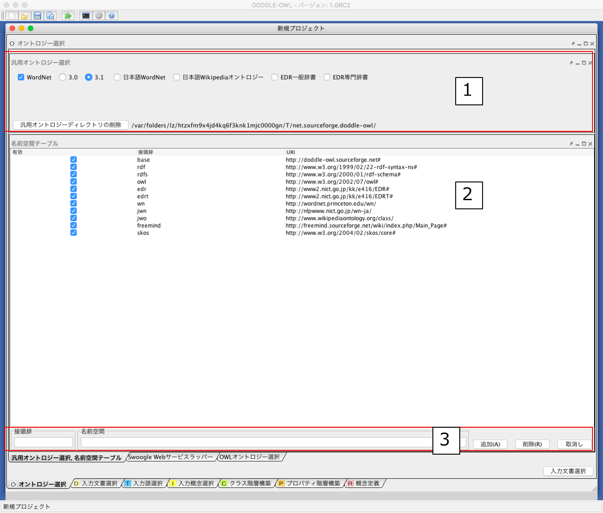

   A screenshot of the General Ontology Selection Panel

OWL Ontology Selection Panel
------------------------------------------
:numref:`owl-ontology-selection-panel` shows a screenshot of the OWL Ontology Selection Panel. The users can select existing OWL ontologies as reference ontologies by the Add (File) or Add (URI) buttons in the :numref:`owl-ontology-selection-panel` -1.

It is considered that if the ontologies for a target domain exist on the web and can be reused, the cost of refining semi-automatically generated ontologies will be reduced. The ontologies constructed by DODDLE-OWL are described in OWL. Therefore, these ontologies can be reused as reference ontologies in DODDLE-OWL.

OWL meta data of the selected ontology from the ontology list (:numref:`owl-ontology-selection-panel` -1 ) is shown in the :numref:`owl-ontology-selection-panel` -3. The users can select SPARQL templates to extract ontological elements in OWL ontologies in the :numref:`owl-ontology-selection-panel` -2 . The users can use 5 types of SPARQL templates as shown in :ref:`extracting-ontology-elements-using-sparql-template`. 

.. _owl-ontology-selection-panel:
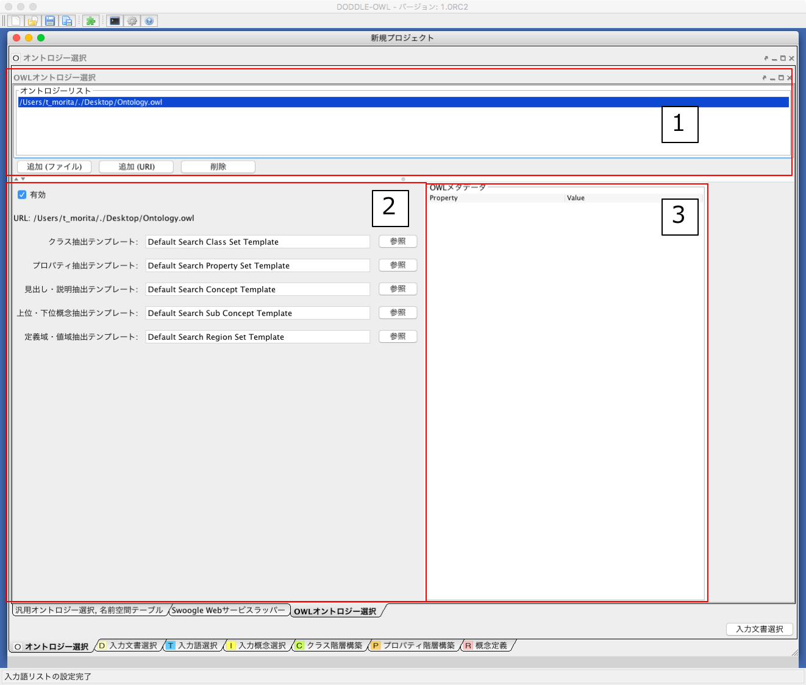

   A screenshot of the OWL Ontology Selection Panel

Input Document Selection Panel
=================================
:numref:`input-document-selection-panel` shows a screenshot of the Input Document Selection Panel. In the Input Document Selection Panel, the users can select domain specific documents described in English or Japanese. Text data can be extracted from files of various formats (Word, Excel, PowerPoint, and PDF) using Apache POI and Apache PDFBox.  At this step, the users can select part of speech (POS) (Noun, Verb, Others, and Compound Word) for extraction of words from the documents.

We describe the details of each part in :numref:`input-document-selection-panel` below. 

.. _input-document-selection-panel:
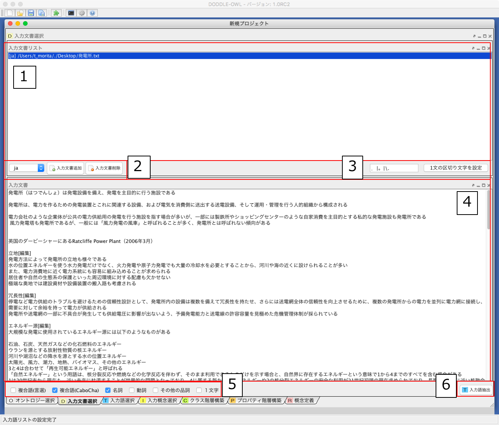

   A screenshot of the Input Document Selection Panel

#. Display a list of input documents.
#. Selects the description language (Japanese or English) of the input document and adds and deletes the input document.
#. Sets the delimiter of one sentence.
#. The content of the document selected from the input document list of 1 is displayed.
#. Whether part-of-speech of words to be extracted, compound words are extracted or not, and whether to extract one word of words are selected.
#. From the documents selected in the input document list of 1, words of the conditions specified by 5 are extracted.

Input Term Selection Panel
=================================
The Input Term Selection Panel is composed of the Input Document Viewer, the Input Term Table, and the Removed Term Table. Each component will be described below.

Input Document Viewer
--------------------------
In the Input Document Viewer, the user can select input terms while viewing the contents of the input document. :numref:`input-document-viewer` shows a screenshot of the Input Document Viewer. The details of each part are described below.

.. _input-document-viewer:
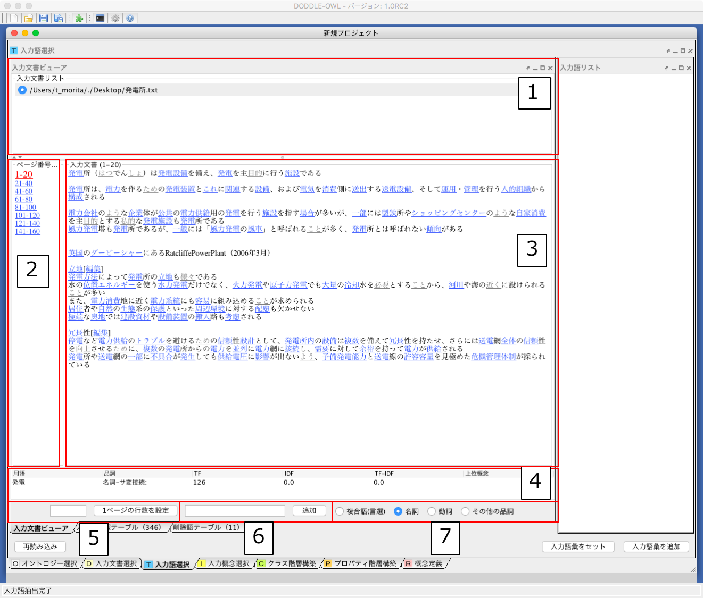

   A screenshot of the Input Document Viewer

#. Display the input document list.
#. When displaying the content of the input document selected in 1 to 3, select the line range in the document.
#. Display the contents of the input document selected in 1. The displayed row range is selected by 2. By clicking on the term to which the hyperlink is placed in the input document, it is possible to select either an input term or an unnecessary term. The blue link represents an input term, and the gray link represents an unnecessary term.
#. When matching the mouse cursor to the hyperlink of 3, the term name, part of speech, TF, IDF, TF-IDF, and upper concept of the term are displayed.
#. Sets the number of divided lines for dividing the content of the input document.
#. The users can manually add terms that could not be extracted. By selecting the range in 3 and right clicking on the mouse, the users can add terms manually as well. For added terms, a blue hyperlink is established in 3.
#. Select a type (compound words, nouns, verbs, other parts of speech) of the term that makes a hyperlink to the content of the input document displayed in 3.

Input Term Table
---------------------------------
In the Input Term Table, it is possible to select input terms from terms automatically extracted from the input documents. :numref:`input-term-table` shows a screenshot of the Input Term Table. The details of eatch part of the Input Term Table are shown below.

.. _input-term-table:
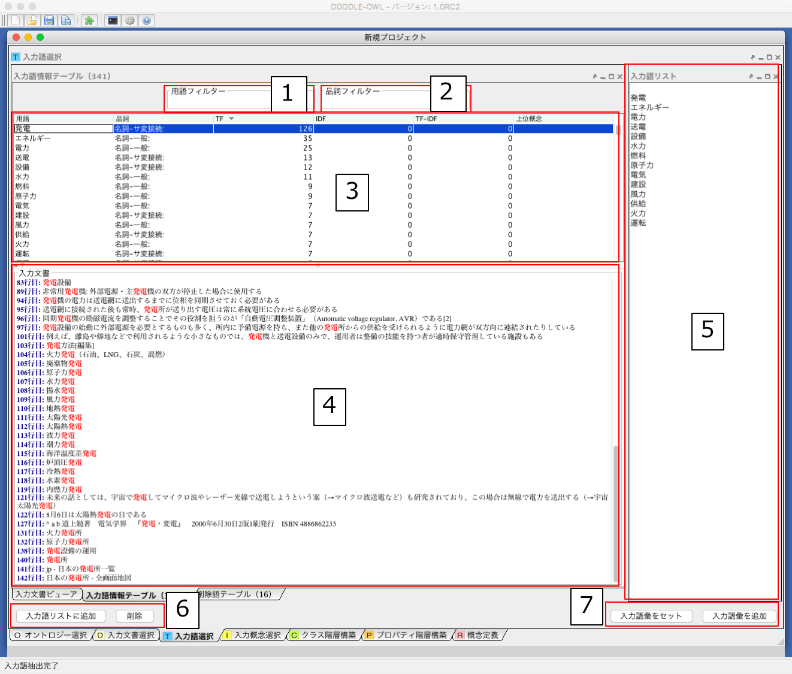

   A screenshot of the Input Term Table

#. Narrows down the term list displayed in 3 by the term entered by the user.
#. Narrows down the term list displayed in 3 by the part of speech entered by the user. 
#. Display terms automatically extracted from input documents. The term information includes a term name, part of speech, TF, IDF, TF-IDF, and an upper concept of the term, and it is possible to sort the list from each viewpoint. 抽出された語が，あらかじめユーザが用意した参照オントロジー中の概念の下位概念の見出しに含まれる場合，その概念の見出しを上位概念に表示する．概念階層中の上位概念を設定しておくことで，抽出された語を「もの」「場所」「時間」などに分類して表示することができ，入力語選択を支援することができる．
#. Display the occurrence of the term selected in 3 in the input documents.
#. A list of input terms finally decided by the users. Since it is a text area, the users can add input terms that did not appear in the input documents.
#. When "Add to input term list" button is pushed, the term of the line selected in 3 is added to the input term list of 5. When the "remove" button is pushed, the term selected in 3 is transferred to the "removed term table".
#. 5に入力された入力語を設定し，入力概念選択パネルに移る．「入力語彙をセット」ボタンを押した場合は，新規に入力語リストを入力概念選択パネルに設定する．「入力語彙を追加」ボタンを押した場合は，設定済みの入力語リストに新たに入力語を追加する．

Removed Term Table
------------------------------------
In the Removed Term Table, a list of the term from the Input Term Table is displayed．:numref:`removed-term-table` shows a screenshot of the Removed Term Table. 削除語情報テーブルの各部分は，入力語情報テーブルと同様である．異なる点は，「戻す」ボタンと「完全削除」ボタンである．「戻す」ボタンにより，誤って削除語情報テーブルに移動させてしまった用語情報を入力語情報テーブルに戻すことができる．「完全削除」ボタンにより，用語情報をリストから完全に削除することができる．

.. _removed-term-table:
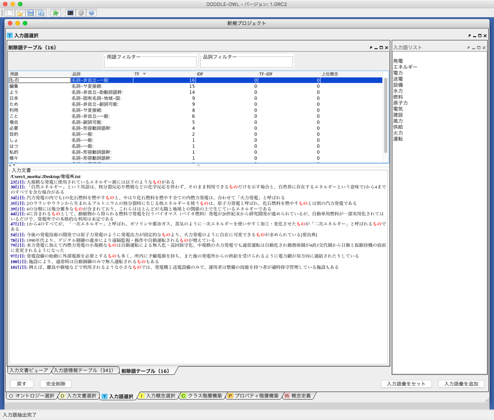

   A screenshot of the Removed Term Table

Input Concept Selection Panel
==================================
:numref:`input-concept-selection-panel` に入力概念選択パネルを示す．入力概念選択パネルでは，入力語と参照オントロジー中の概念との対応付けを行う．語には多義性があり，ある入力語を見出しとして持つ概念が複数存在する可能性がある．入力概念選択パネルでは，対象領域にとって最も適切な入力語に対応する概念を選択する際の支援を行う．以下に入力概念選択パネルの構成要素の説明を示す．

.. _input-concept-selection-panel:
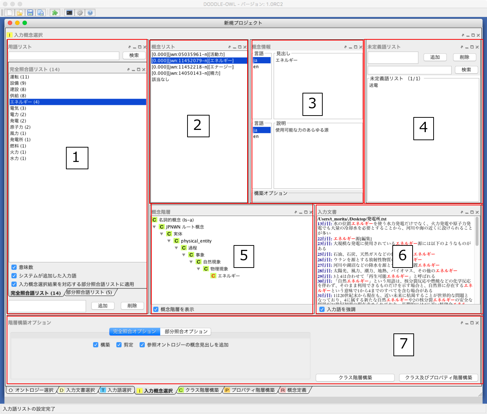

   Input Concept Selection Panel

#. **用語リスト**: 入力語彙の中で参照オントロジー中の概念見出しと完全照合または部分照合した用語のリストを表示する．
#. **概念リスト**: 1で選択された語を見出しとしてもつ参照オントロジー中の概念のリストを表示する．
#. **概念情報**: 	2で選択された概念の見出しおよび説明を言語ごとに分類して表示する．
#. **未定義語リスト**: 参照オントロジー中の概念の見出しと照合しなかった入力語（未定義語）を表示する．
#. **概念階層**: 2で選択された概念の参照オントロジー中の概念階層を表示する．
#. **入力文書**: 1で選択された語の入力文書中の出現箇所を表示する．
#. **階層構築オプション**: 階層構築における条件を設定する．

Term List
-----------------------
:numref:`input-concept-selection-panel-term-list` は :numref:`input-concept-selection-panel` -1 用語リストを拡大した図である．以下では，入力概念選択パネルの用語リストの各部分について説明する．

.. _input-concept-selection-panel-term-list:
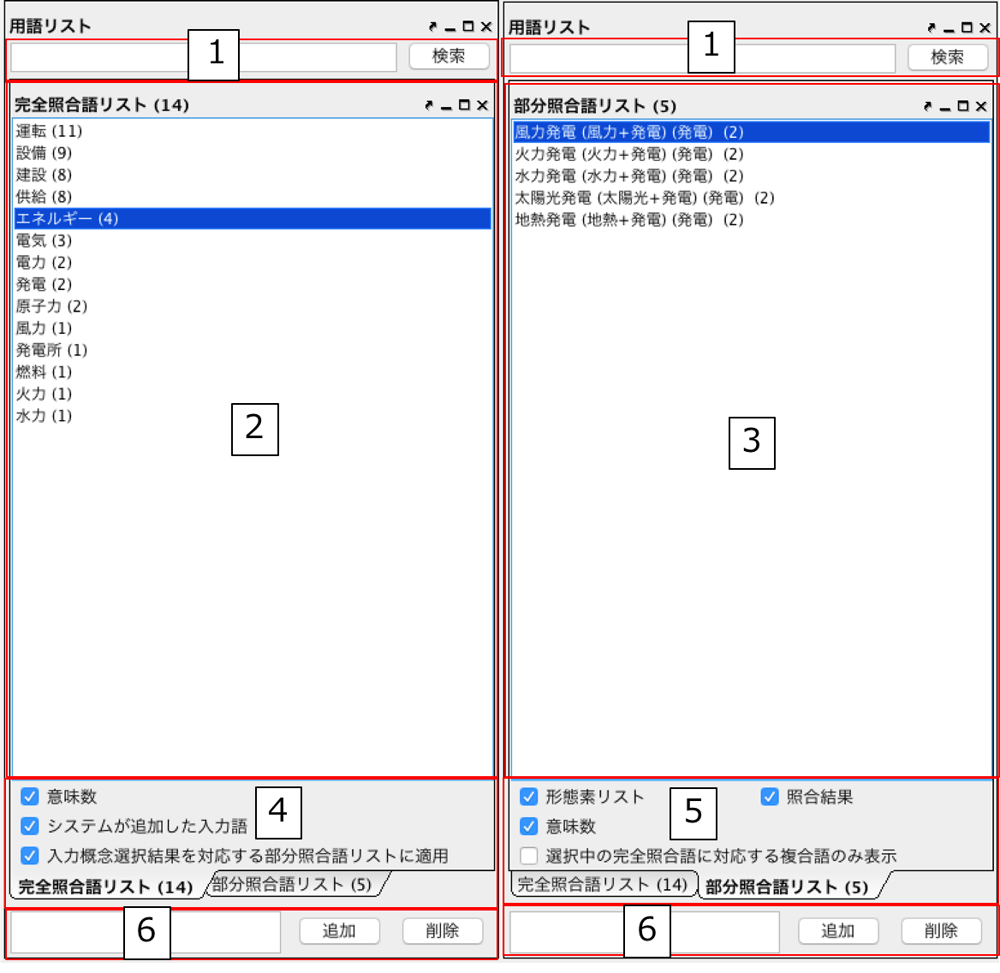

   Input Concept Selection Panel: Term List

#. テキストフィールドに検索キーワードを入力し，検索ボタンを押すと2および3の完全照合語リストおよび部分照合語リストに検索キーワードを含む入力語のみが表示される．
#. 完全照合語リストを表示する．1番目の括弧内には，入力語を見出しとする参照オントロジー中の概念の数が表示される．システムが自動的に追加した入力語は，2番目の括弧内に「自動追加」と表示される．
#. 部分照合語リストを表示する．1 番目の括弧内には，部分照合語を形態素解析し，各形態素を「+」記号で結合した結果が表示される．2 番目の括弧内には，参照オントロジー中の概念の見出しと照合した部分照合語内の語が表示される．3 番目の括弧内には，2 番目の括弧内に表示された語を見出しとする参照オントロジー中の概念の数が表示される．
#. 完全照合語リストに関する設定を行うことができる． 

    #. 「意味数」チェックボックスは，完全照合語リスト中の各語を見出しとする参照オントロジー中の概念の数を表示するかどうかを設定するオプションである．
    #. 「システムが追加した入力語」チェックボックスは，システムが自動的に追加した語かどうかを完全照合語リスト中の語に提示するかどうかを設定するオプションである．部分照合語の中で参照オントロジー中の概念と照合した語を，ユーザが入力語として追加していなかった場合に，システムはその語を自動的に完全照合語として完全照合語リストに追加する．例えば，「資格取得日」をユーザが入力語として選択した場合，「資格取得日」自体は参照オントロジー中の概念の見出しに存在しないため，部分照合語となる．「資格取得日」の「日」に対して部分照合したとする．ここで，ユーザが「日」を入力語として選択している場合には問題ない．しかし，「日」をユーザが入力語として選択していなかった場合には，「日」が自動的に完全照合語リストに追加される．システムが自動的に追加した語には，「（自動追加）」と表示される．
    #. 「入力概念選択結果を対応する部分照合語リストに適用」チェックボックスは，完全照合語の入力概念選択結果を，その完全照合語に照合した部分照合語リストの入力概念選択に反映させるかどうかを設定するためのオプションである．例えば，完全照合語「日」に対して入力概念選択を行った結果を，部分照合語リスト中の「資格取得日」や「研究日」などにも反映させるかどうかを設定することができる．

#. 部分照合語リストに関する設定を行うことができる．

    #. 「意味数」チェックボックスは4の完全照合語リストのオプションにおける「意味数」と同様である． 
    #. 「形態素リスト」チェックボックスは，部分照合語を形態素解析器で形態素に分割したときの分割のされ方を表示するか否かを設定するためのオプションである．このオプションを有効にした場合，例えば，「資格取得日」に対して，「（資格+取得+日）」が表示される．「+」記号は形態素の区切りをあらわす． 
    #. 「照合結果」チェックボックスは，部分照合語の形態素リストの中で，参照オントロジー中の概念と照合した形態素リストを表示するか否かを設定するオプションである．このオプションを有効にした場合，例えば，「資格取得日」は，「日」で照合しているため，「（日）」と表示される． 
    #. 「選択中の完全照合語に対応する複合語のみ表示」チェックボックスは，完全照合語リストで選択した語を照合語とする部分照合語のみを表示するか否かを設定するためのオプションである．このオプションを有効にした場合，例えば，完全照合語リスト中の「日」を選択した場合，「資格取得日」や「研究日」など「日」と照合した部分照合語のみが部分照合語リストに表示される．

#. 入力語の追加および削除を行うことができる．

Concept List
-------------------
:numref:`input-concept-selection-panel-concept-list` は :numref:`input-concept-selection-panel` -2「概念リスト」を拡大した図である．

.. _input-concept-selection-panel-concept-list:
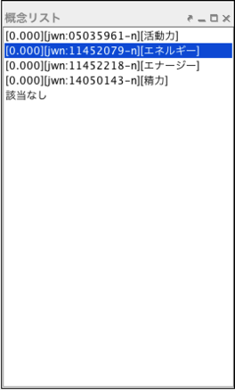

   Input Concept Selection Panel: Concept List

概念リストは，:numref:`input-concept-selection-panel-term-list` -2 または-3で選択した完全照合語または部分照合語を見出しとして持つ参照オントロジー中の概念のリストを表示する．:numref:`input-concept-selection-panel-concept-list` は，「エネルギー」を見出しとして持つ参照オントロジー（この例では日本語WordNetを参照オントロジーとしている）中の概念リストを示している．リストの項目は，三つの部分から構成されている．左側は，入力モジュールの設計で述べた，自動概念選択方法により求めた，入力語に対応する概念候補の評価値を示す．入力語に対応する概念候補は，評価値の降順に並び替えて表示される．評価値が高い概念ほど，より入力概念となる可能性が高い概念となる．中央は概念のID をあらわす．概念のID はURIで表され，画面上には修飾名が表示される．jwn は日本語WordNet の名前空間接頭辞を示しており，ここで表示される接頭辞は，汎用オントロジー選択パネル ( :numref:`ontology-selection-panel` -2) で示した名前空間テーブルで設定した名前空間接頭辞となる．右側には，概念の見出しが複数ある場合，そのうちのいずれか一つが表示される．

Concept Information
--------------------
:numref:`input-concept-selection-panel-concept-info` は :numref:`input-concept-selection-panel` -3「概念情報」を拡大した図である．

.. _input-concept-selection-panel-concept-info:
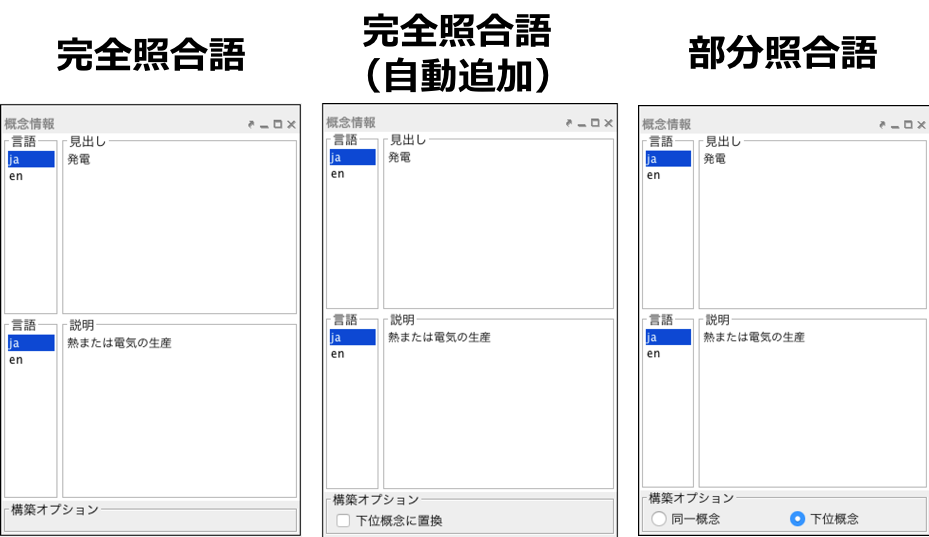

   Input Concept Selection Panel: Concept Information

「概念情報」には，:numref:`input-concept-selection-panel-concept-list` の「概念リスト」で選択された概念の見出しと説明が表示される．「言語」リストで選択した言語の見出しおよび説明が「見出し」リストおよび「説明」リストに表示される．:numref:`input-concept-selection-panel-concept-info` 下部の「構築オプション」では，概念階層の構築方法を設定することができる．「構築オプション」には，:numref:`input-concept-selection-panel-term-list` 「用語リスト」で選択する用語の種類に応じて3 種類の表示方法がある．:numref:`input-concept-selection-panel-term-list` -2で完全照合語を選択した場合，:numref:`input-concept-selection-panel-concept-info` 左側のように「構築オプション」には何も表示されない．:numref:`input-concept-selection-panel-term-list` -2でシステムが自動的に追加した完全照合語（「自動追加」が表示される完全照合語）を選択した場合には，:numref:`input-concept-selection-panel-concept-info` 中央のように「構築オプション」には「下位概念に置換」するかどうかを選択するチェックボックスが表示される．:numref:`input-concept-selection-panel-term-list` -3で部分照合語を選択した場合には :numref:`input-concept-selection-panel-concept-info` 右側のように「構築オプション」には，「同一概念」か「下位概念」かの選択をするためのラジオボタンが表示される．

.. note::
	部分照合語の照合部分の語をユーザが入力語としていない場合には，システムは自動的にその語を入力語として追加する．これを完全照合語（自動追加）と呼ぶ．

:numref:`input-concept-selection-panel-concept-info` 中央の「構築オプション」の例として，「火力発電」のみを入力語とした場合を考える．この場合，「火力発電」は部分照合語となり，「発電」と照合するため，「発電」はシステムにより自動的に完全照合語リストに追加される．「発電」の入力概念選択を行う際に，:numref:`input-concept-selection-panel-concept-info` 中央の「構築オプション」として「下位概念に置換」というチェックボックスが表示される．ここでは，「発電」はシステムが自動的に追加した語であるため，ユーザがあえて「発電」を入力語としなかったのか，入力語にし忘れたかの確認をしている．ユーザがあえて「発電」を入力語にしなかった場合，概念階層中に「発電」は含まれるべきではない．「構築オプション」の「下位概念に置換」をチェックすることにより，「火力発電」は「発電」の下位概念とはならず，概念階層中に表示されない．ユーザが「発電」を入力語に追加し忘れた場合には，「構築オプション」の「下位概念に置換」にチェックをいれなければ，「火力発電」は「発電」の下位概念として概念階層が構築される．

:numref:`input-concept-selection-panel-concept-info` 右側の「構築オプション」の例として，「発電」と「火力発電」を入力語とした場合を考える．上記と同様に「火力発電」は「発電」で照合する部分照合語である．「火力発電」の入力概念選択を行う際に，:numref:`input-concept-selection-panel-concept-info` 右側の「構築オプション」が表示される．「同一概念」のほうを選択した場合は，概念階層構築時に「火力発電」は「発電」と同一概念として扱われる．つまり，「火力発電」は「発電」概念に対応する参照オントロジー中の概念の別見出しとして概念階層が構築される．一方，「下位概念」のほうを選択した場合は，「火力発電」は「発電」とは異なる概念，ここでは，「発電」の下位概念として概念階層が構築される．初期状態において，部分照合語を「同一概念」とみなすか，「下位概念」とみなすかは，オプションダイアログにより設定することができる．

Construct Concept Tree Option
-------------------------------
:numref:`input-concept-selection-panel-construct-concept-tree-option` は :numref:`input-concept-selection-panel` -7「階層構築オプション」を拡大した図である．

.. _input-concept-selection-panel-construct-concept-tree-option:
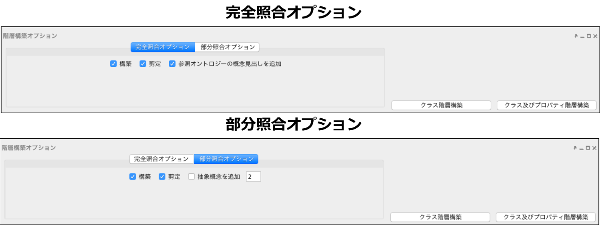

   Input Concept Selection Panel: Construct Concept Tree Option

「階層構築オプション」では，クラスおよびプロパティ階層構築モジュールにおいて，クラスおよびプロパティ階層を構築する際のパラメータの設定を行う．「階層構築オプション」は，「完全照合オプション」および「部分照合オプション」から構成される．

:numref:`input-concept-selection-panel-construct-concept-tree-option` の「完全照合オプション」では，完全照合語リストから概念階層を構築する際の設定を行う．「構築」チェックボックスでは，完全照合語リストから概念階層を構築するかどうかを選択する．「剪定」チェックボックスでは，概念階層構築時に剪定を行うかどうかを選択する．「参照オントロジーの概念見出しを追加」チェックボックスでは，概念階層構築時に，各概念の見出しとして，入力語として与えた語のみを概念の見出しとするか，対応する参照オントロジー中の概念の見出しをすべて利用するかどうかを選択する．

:numref:`input-concept-selection-panel-construct-concept-tree-option` の「部分照合オプション」では，部分照合語リストから概念階層を構築する際の設定を行う．「構築」チェックボックスでは，部分照合語リストから概念階層を構築するかどうかを選択する．「剪定」チェックボックスでは，概念階層構築時に剪定を行うかどうかを選択する．「抽象概念を追加」チェックボックスでは，部分照合語リストから概念階層を構築する際に，語頭による階層化を行うかどうかを選択する．このチェックボックス右側のテキストフィールドには，いくつ以上グループ化できる場合に共通の上位概念を挿入するかを設定する．

:numref:`input-concept-selection-panel-construct-concept-tree-option` 右端にある「クラス階層構築」ボタンを押すと，上記の階層構築オプションに基づいて，クラス階層構築パネルにクラス階層のみが構築される．「クラスおよびプロパティ階層構築」ボタンを押すと，上記の階層構築オプションに基づいて，クラス階層構築パネルおよびプロパティ階層構築パネルに，クラス階層およびプロパティ階層が構築される．クラス階層とプロパティ階層の両方を構築するためには，参照オントロジーとしてEDR一般辞書またはプロパティ階層を含むOWLオントロジーを設定しなければならない．

Construct Class Tree Panel
=================================================
:numref:`construct-class-tree-panel` にクラス階層構築パネルを示す．

.. _construct-class-tree-panel:
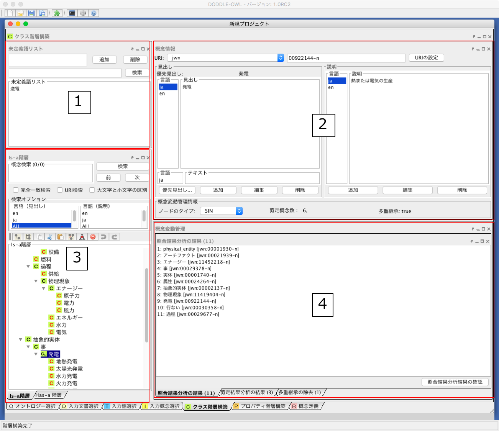

   Construct Class Tree Panel

以下に各部分の説明を示す．

#. **未定義語リスト**: 参照オントロジー中の概念に照合しなかった入力語リスト．リストから語を選択し，「Is-a 階層パネル」にドラッグ＆ドロップすると，未定義語を概念としてIs-a 階層に追加できる．
#. **概念情報パネル**: 概念階層中の選択された概念のURI，優先見出し（階層中に表示する見出し），見出し，説明，概念変動管理情報を表示する．見出しと説明については，言語属性の付与と追加，編集，削除ができる．
#. **概念階層パネル**: Is-a 階層とHas-a 階層．概念の検索，追加，削除などを行うことができる．
#. **概念変動管理パネル**: 照合結果分析結果，剪定結果分析結果，多重継承している概念をリストで表示し，各項目を選択するとIs-a 階層中の修正候補箇所が選択される．

以下では， :numref:`construct-class-tree-panel` 2から4の詳細を説明する．

Concept Information Panel
-------------------------------
:numref:`construct-class-tree-panel-concept-info` は :numref:`construct-class-tree-panel` -2. 概念情報パネルを拡大した図である．

.. _construct-class-tree-panel-concept-info:
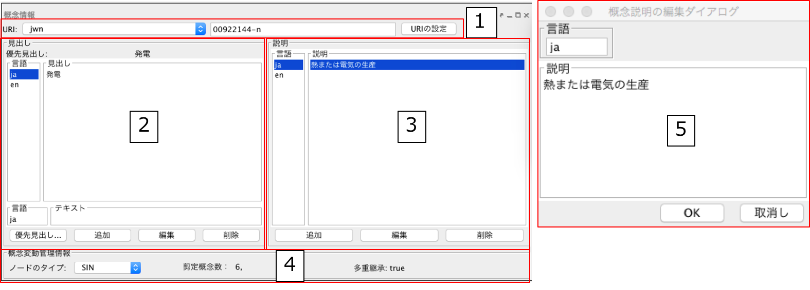

   Construct Class Tree Panel: Concept Information Panel

以下では，概念情報パネルの各部分について説明する．

#. 名前空間接頭辞をコンボボックスから選択し，ローカル名をテキストフィールドに入力し，「URI の設定」ボタンを押すことで，選択した概念のURI を変更することができる．汎用オントロジー選択パネル ( :numref:`ontology-selection-panel` -2) で示した名前空間テーブルに定義された名前空間接頭辞が選択可能である． 
#. 概念の見出しを編集するための領域である．「言語」リストの項目を選択することで，選択した言語の見出しが「見出し」リストに表示される．:numref:`construct-class-tree-panel-concept-info` -2 では，日本語見出しとして「発電」が表示されている．:numref:`construct-class-tree-panel-concept-info` -2 下部の「言語」と「テキスト」テキストフィールドに追加したい見出しの言語とテキストを入力し，「追加」ボタンを押すことで概念の見出しを追加することができる．また，選択した見出しを編集したい場合には「編集」ボタンを，削除したい場合には「削除」ボタンを押すことにより，見出しの編集および削除を行うことができる．また，「優先見出しの設定」ボタンを押すことで，選択された見出しがIs-a 階層およびHas-a 階層パネルの概念の表示用の見出しとなる． 
#. 概念の説明を編集するための領域である．見出しと同様に「言語」リストの項目を選択することで，選択した言語の説明が「説明」リストに表示される． 
#. 概念変動管理情報を表示・編集するための領域である．「ノードのタイプ」は，編集対象のノードがSIN（参照オントロジーから抽出した概念）かベストマッチノード（入力概念）かを表示する．SIN の中でベストマッチノードとしたいノードについては，ここでノードのタイプをSIN からベストマッチに変更することができる．「剪定概念数」は，階層構築時の剪定により，選択された概念とその上位概念の間の概念がいくつ削除されたかを表示している．「多重継承」は，編集対象のノードが多重継承をしているかしていないかを表している．多重継承をしている場合は「true」，していない場合は「false」と表示される． 
#. 3 の「追加」または「編集」ボタンを押すと表示される．「言語」と「説明」を入力し，「OK」ボタンを押すと，概念の説明の追加や編集を行うことができる．また，「削除」ボタンにより選択された概念の説明を削除することができる．

Is-a and Has-a Hierarchy Panel
----------------------------------------
:numref:`construct-class-tree-panel-isa-hasa-tree-panel` は :numref:`construct-class-tree-panel` -3を拡大した図である．:numref:`construct-class-tree-panel-isa-hasa-tree-panel` の左側がIs-a 階層パネルを右側がHas-a階層パネルを示している．

.. _construct-class-tree-panel-isa-hasa-tree-panel:
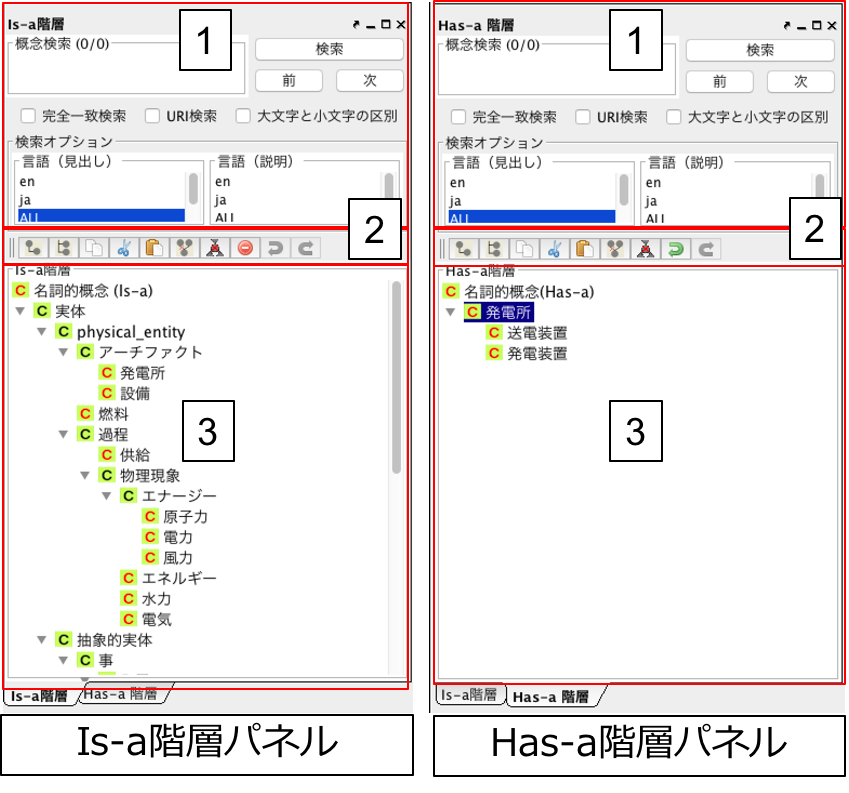

   Construct Class Tree Panel: Is-a and Has-a Hierarchy Panel

#. 概念階層中の概念を検索するための領域である．テキストフィールドに検索キーワードを入力し，「検索」ボタンを押すと検索オプションを満たす概念が選択される．候補が複数ある場合には，「次」ボタンまたは「前」ボタンで別の概念候補に移動できる．検索オプションとしては，言語，概念の見出し，概念の説明が選択できる．また，「完全一致検索」チェックボックスにチェックをいれると，入力した検索キーワードと完全に一致する見出しや説明を含む概念のみが検索される．「完全一致検索」チェックボックスにチェックが入っていない場合は部分一致検索となり，検索キーワードを見出しまたは説明の一部に含む概念が検索される．「URI 検索」チェックボックスにチェックをいれると，概念のURI も検索対象となる．「大文字と小文字の区別」チェックボックスにチェックをいれると，英語見出しまたは説明を検索する際に，大文字と小文字を区別して検索する．
#. Is-a 階層およびHas-a 階層の編集に利用可能なツールバー．ツールバーは，階層中の概念をマウスで右クリックした際に表示される， :numref:`construct-class-tree-panel-popup-menu` のポップアップメニューと同様の機能を持つ．
#. Is-a 階層とHas-a 階層を表示・編集するためのパネル．2のツールバーまたは概念を選択して，マウスを右クリックすることで表示されるポップアップメニューから，概念の追加，削除などを行うことができる．

.. _construct-class-tree-panel-popup-menu:
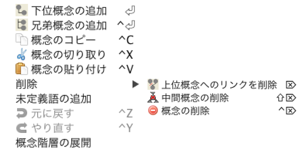

   Construct Class Tree Panel: Popup menu

:numref:`construct-class-tree-panel-popup-menu`  はIs-a 階層パネルのポップアップメニューを示している．Is-a 階層パネルとHas-a階層パネルの主な違いとして，Has-a 階層パネルではIs-a 階層パネルで定義された概念を用いてHas-a 関係を定義する点が異なる．また，Has-a 階層では，以下で説明する「概念の削除」を行うことはできない．

DODDLE-OWLにおける概念の削除は3 種類ある．「概念の削除」は削除対象のノードと同一URI を持つノードおよびその下位ノードをすべて削除する．「上位概念へのリンクを削除」は，多重継承している場合に削除対象のノードとその上位ノードの間の関係を削除する．「中間概念の削除」は，削除対象のノードを削除し，その下位ノードを削除対象のノードの上位ノードの下位ノードとして定義する．

.. _construct-class-tree-panel-node-icon:
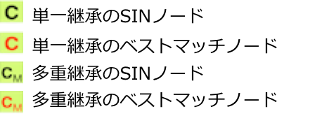

   Construct Class Tree Panel: Node icon

クラス階層構築パネルにおけるIs-a 階層パネルとHas-a 階層パネルのクラスには， :numref:`construct-class-tree-panel-node-icon` に示す4 種類がある．

Concept Drift Management Panel
---------------------------------
:numref:`construct-class-tree-panel-concept-drift-management-panel` は :numref:`construct-class-tree-panel` -4 概念変動管理パネルの各タブを展開し，拡大した図である．

.. _construct-class-tree-panel-concept-drift-management-panel:
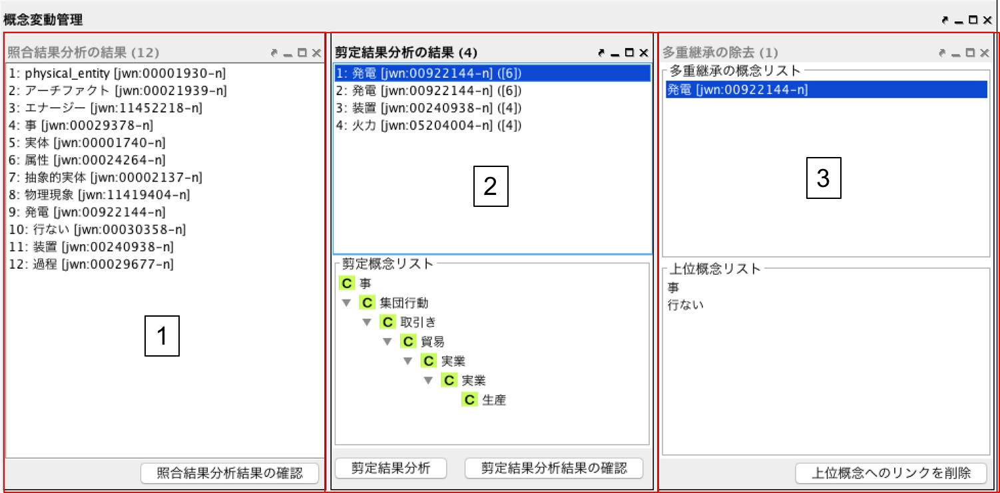

   Construct Class Tree Panel: Concept Drift Management Panel

以下では，概念変動管理パネルの各部分について説明する．

#. 照合結果分析の結果をリストで表示する．リストの項目はSIN ノードであり，項目を選択するとIs-a 階層中の該当する部分木が選択される．また，照合結果分析結果を確認し修正する必要がない場合，もしくは，修正後に「照合結果分析結果の確認」ボタンを押すことで，選択した項目をリストから削除することができる．
#. 剪定結果分析の結果をリストで表示する．2下部の「剪定概念リスト」は，概念階層構築時に剪定された，選択した概念とその上位概念の間の概念が提示されている．「剪定結果分析」ボタンを押すと，ボタン左側のテキストフィールドに指定した数よりも多くの中間概念が削除された概念をリストに表示する．また，剪定結果分析結果を確認し，修正する必要がない場合，もしくは，修正後に「剪定結果分析結果の確認」ボタンを押すことで，選択した項目をリストから削除することができる．（当該概念の剪定概念数がゼロとなる）
#. 多重継承している概念のリストを表示する．リストの項目を選択すると，3下部に多重継承しているノードのリストが表示される．このノードを選択すると，Is-a 階層パネル中の概念に移動し，ノードを選択する．「上位概念へのリンクを削除」ボタンを押すと，選択した概念と上位概念の間の関係が削除される．

Construct Property Tree Panel
========================================================
:numref:`construct-property-tree-panel` にプロパティ階層構築パネルを示す．

.. _construct-property-tree-panel:
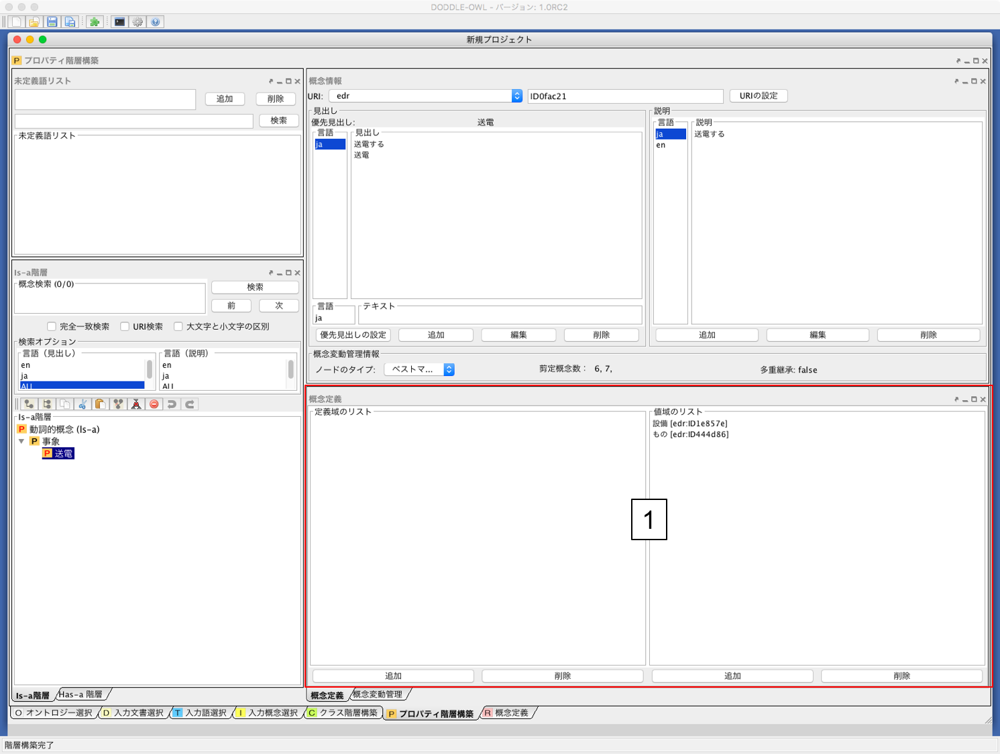

   Construct Property Tree Panel

プロパティ階層構築パネルの構成要素の大部分は，クラス階層構築パネルと同様である．異なる点は， :numref:`construct-property-tree-panel` -1の概念定義パネルがある点である．概念定義パネルは，汎用オントロジーとしてEDR 一般辞書を指定し，プロパティ階層を構築した場合，EDR 概念記述辞書における，agent およびobject の関係にある概念を定義域および値域として自動的に定義している．また，クラス階層を参照し，定義域および値域の追加を行うことも可能である．

.. _construct-property-tree-panel-node-icon:
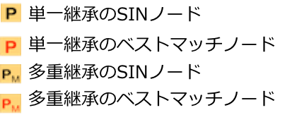

   Construct Property Tree Panel: Node icon

プロパティ階層構築パネルにおけるIs-a 階層パネルとHas-a 階層パネルのプロパティには， :numref:`construct-property-tree-panel-node-icon`  に示す4 種類がある．

Construct Relationship Panel
=============================================
:numref:`construct-relationship-panel` に，関係構築パネルのスクリーンショットを示す．

.. _construct-relationship-panel:
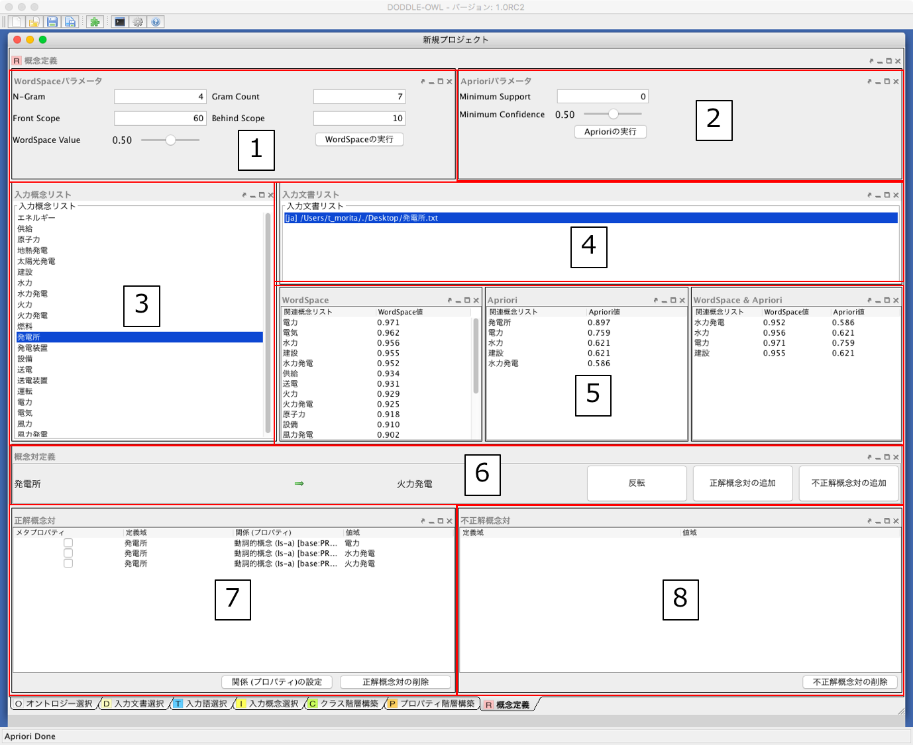

   Construct Relationship Panel

以下では，関係構築パネルの各部分について説明する．

#. WordSpace パラメータの設定を行う．WordSpace のパラメータとしては，N-gram，N-gram 出現頻度，文脈スコープ（前，後N 語），文脈類似度の閾値を設定できる．「WordSpace の実行」ボタンを押すと結果が5に表示される．
#. Apriori パラメータの設定を行う．Apriori のパラメータとしては，最小支持度および最小確信度を設定できる．「Apriori」の実行ボタンを押すと結果が5に表示される．
#. 入力語選択パネルで選択した入力語が表示される．
#. 入力文書選択パネルで選択した入力文書が表示される．
#. 3で選択した入力語と関連のある入力語を関係値と共に表示する．関係値の高い順に表示される．WordSpace，Apriori，WordSpace およびApriori のアルゴリズムの関係値をタブで切り替えて表示することができる．
#. 3で選択した入力語と関連のある5で選択された語を表示し，正解概念対または不正解概念対として7または8に追加する．矢印の向きによって，定義域と値域が変化する．
#. 定義域，プロパティ，値域が表示される．プロパティは，プロパティ階層構築パネルから選択することができる．
#. 不要な概念対が表示される．不要な概念対は，概念定義の候補となる概念対集合から削除されるため，残りの概念定義を行いやすくなっている．

Option Dialog
================================
「ツール」→「オプションダイアログを表示」メニューを選択するとオプションダイアログが表示される．オプションダイアログでは，DODDLE- OWLにおける様々な設定を行うことができる．オプションダイアログは，「基本」，「フォルダ」，「入力概念選択」，「複合語」，「表示」の各タブから構成 されている． オプションダイアログの下部にある4つのボタンは，それぞれ，設定の保存，設定の適用，設定の削除，オプションダイアログを閉じるために用意されている．「保存」ボタンは，オプションダイアログで設定した内容をWindowsのレジストリに保存することができる（Unixの場合はXML形式 等でユーザごとのフォルダに保存される）．ここで保存した内容は，DODDLE-OWLを再起動後も有効となる．「削除」ボタンによりレジストリに保存された設定を削除できる．以下では，それぞれのタブについて説明する．

Basic Tab
---------------------
:numref:`option-dialog-basic` にオプションダイアログの基本タブを示す．基本タブでは，「言語」，「基本接頭辞」，「基本URI」の設定を行うことができる．「言語」では DODDLE-OWLユーザインタフェースのメニュー等の表示言語や概念の見出しが複数言語用意されていた場合のデフォルト言語を設定するために用いる． 「基本接頭辞」では，OWL形式で領域オントロジーを保存する際の基本URIの接頭辞を設定する．「基本URI」では，OWL形式で領域オントロジーを保 存する際の基本URIを設定する．

.. _option-dialog-basic:
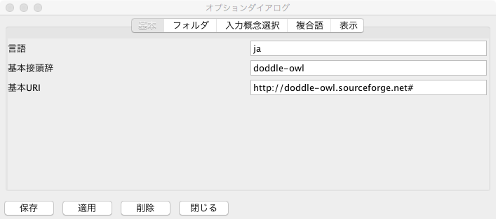

   Option Dialog: Basic Tab

Folder Tab
---------------------
:numref:`option-dialog-folder` にオプションダイアログのフォルダタブを示す．フォルダタブでは，DODDLE-OWLが参照する外部プログラムや辞書データなどのパスを設定する．以下にフォルダタブで設定する項目を示す．

プロジェクトフォルダ
	DODDLE-OWLのプロジェクトファイルを保存する際に最初に開かれるフォルダのパスを設定．
ストップワードリスト
	ストップワードリストを保存したファイルのパスを設定．ストップワードリストは，入力文書から単語を抽出する際に抽出を行うべきではない単語集合を保存するファイル．
EDR辞書フォルダ
	EDR概念体系辞書とEDR概念記述辞書をDODDLE-OWLが参照する形式に変換したファイルを置いたフォルダを設定．
EDRT辞書フォルダ
	EDR専門辞書をDODDLE-OWLが参照する形式に変換したファイルを置いたフォルダを設定．
日本語形態素解析器
	ChasenまたはMecabの実行ファイルのパスを設定．
日本語係り受け解析器
	Cabochaの実行ファイルのパスを設定．
perl.exe
	perlの実行ファイルのパスを設定．
上位概念リスト
	上位概念リストを保存したファイルのパスを設定．上位概念リストは入力単語を選択する際に参照される．ある入力単語が設定した上位概念の下位概念の見出しとして存在する場合に入力単語テーブルに表示される．
  
.. Swoogleクエリー結果フォルダ
.. 	（実装中のため現バージョンでは使用しない）オントロジー検索エンジンSwoogleからオントロジーを獲得する際に実行したクエリー結果をローカルにキャッシュする際に用いるフォルダを設定．
.. OWLオントロジーフォルダ
.. 	（実装中のため現バージョンでは使用しない）オントロジー検索エンジンSwoogleから獲得したオントロジーを保存するフォルダを設定．

.. _option-dialog-folder:
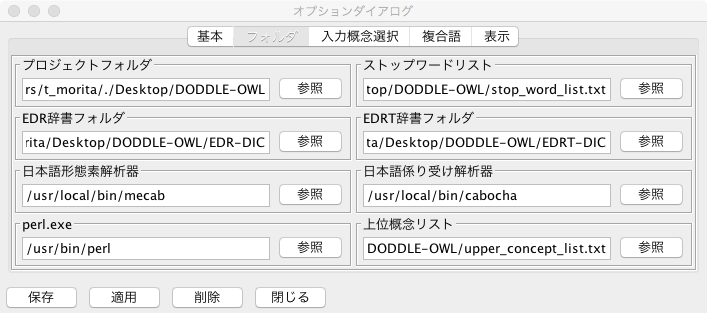

   Option Dialog: Folder Tab

Input Concept Selection Tab
--------------------------------
:numref:`option-dialog-input-concept-selection` にオプションダイアログの多義性解消タブを示す．入力概念選択タブでは，半自動的に入力概念選択を行う際のオプションを設定する．詳細は，入力概念選択の半自動化を参照．

.. _option-dialog-input-concept-selection:
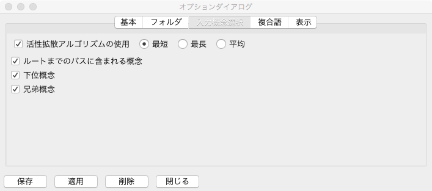

   Option Dialog: Input Concept Selection Tab

Comound Word Tab
---------------------------------
:numref:`option-dialog-compound-word` にオプションダイアログの複合語タブを示す．複合語タブでは，多義性解消パネルにおける部分照合単語のオプションを設定する．ユーザがこのオ プションを選択しない場合に，デフォルト状態として，部分照合単語を階層構築時に照合した概念の「下位概念」とするか「同一概念」とするかをラジオボタン で設定できる．

.. _option-dialog-compound-word:
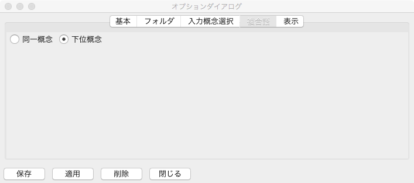

   Option Dialog: Compound Word Tab

Display Tab
-------------------------
:numref:`option-dialog-display` にオプションダイアログの表示タブを示す．表示タブでは，クラス階層構築パネル及びプロパティ階層構築パネルにおいて，クラスまたはプロパ ティのノードを表示する際に，接頭辞を表示するかどうかを選択することができる．「修飾名を表示」にチェックをいれた場合，クラスまたはプロパティの名前 空間接頭辞がそれぞれのパネルに表示される．

.. _option-dialog-display:
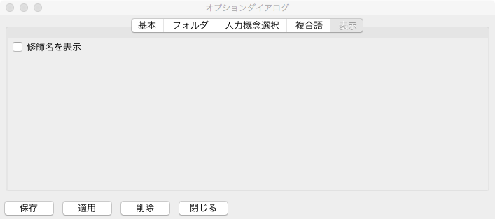

   Option Dialog: Display Tab

Menu
===================

File menu
----------------------

* New Project

  * Create a new DODDLE-OWL project

* Open Project

  * Open the project folder or project file of DODDLE-OWL

* Open recent project
* Open->Inut Term List
* Open->Input Term Table
* Open->Concept Definition
* Open->Input Concept Selection Results
* Open->Correspondence between input terms and concepts
* Open->OWL Ontology
* Open->FreeMind Ontology
* Open->Correspondence between concepts and priority labels
* Save Project
* Save Project As

  * Save the project of DODDLE-OWL with a name. Select the DODDLE project folder as the file format if the users want to check the intermediate result file being processed. If the users want to save it in one file, select the DODDLE project file (.ddl).

* Save->Input Term List
* Save->Input Term Table
* Save->Concept Definition
* Save->Input Concept Selection Results
* Save->Correspondence between input terms and concepts
* Save->OWL Ontology
* Save->FreeMind Ontology
* Save->Correspondence between concepts and priority labels

* Quit

  * Quit DODDLE-OWL

Tool menu
-----------------------
* Show all terms
* Automatically select input concepts

  * 入力語集合から自動的に入力語に対応する汎用オントロジー中の概念をランキングする．入力概念選択パネル中で入力語を選択した際に，ランキング順に対応する概念を表示する．

* Construct Class Hierarchy
* Construct Class and Property Hierarchy
* DODDLE Dic Converter

  * EDR電子化辞書と日本語WordNetの辞書ファイルををDODDLE-OWLで利用可能な形式に変換するためのダイアログを表示する．

* Show Log Console

  * 標準出力と標準エラー出力を画面上に表示する．

* XGA Layout

  * 1024x768の解像度に合わせてウィンドウをレイアウトする．

* UXGA Layout

  * 1600 x 1200の解像度に合わせてウィンドウをレイアウトする．

* Show the Option Dialog

Project menu
------------------------
* 開いているプロジェクトをサブメニューとして表示し，切り替えることができる．

Help menu
----------------------------
* バージョン
  
  * バージョン番号や利用ライブラリなどを確認するためのダイアログを表示する．

Toolbar
==========================

.. list-table:: Icons and functions in the toolbar in DODDLE-OWL
  :name: toolbar-icons

  * - Icon
    - Function
  * - .. figure:: figures/toolbar/page_white.png
    - New Project
  * - .. figure:: figures/toolbar/folder_page_white.png
    - Open Project
  * - .. figure:: figures/toolbar/disk.png
    - Save Project
  * - .. figure:: figures/toolbar/page_save.png
    - Save Project Asプロジェクトを名前を付けて保存
  * - .. figure:: figures/toolbar/plugin.png
    - DODDLE Dic Converter
  * - .. figure:: figures/toolbar/cog.png
    - Show Option Dialog
  * - .. figure:: figures/toolbar/help.png
    - Show Version Dialog

Shortcut keys
==============================
* Ctrl-N

  * New Project
* Ctrl-O

  * Open Project

* Ctrl-S

  * Save Project

* Ctrl-Shift-S

  * Save Project As

* Ctrl-Q

  * Quit

* F1

  * Show Version Dialog
  
