==========================
User manual
==========================

.. contents:: Contents
   :depth: 3

.. |MR3| replace:: MR\ :sup:`3` \

Implementation Architecture
=============================
:numref:`implementation_architecture` shows the implementation architecture of DODDLE-OWL. DODDLE-OWL is implemented by Java language and used Java Swing as GUI components. DODDLE-OWL has the following six main modules: Ontology Selection Module, Input Module, Construction Module, Refinement Module, Visualization Module, and Translation Module. On implementation, Construction Module and Refinement Module are implemented in the same panel.

In order to get existing ontologies on the web, we use Swoogle Web services in the Ontology Selection Module. In the Input Module, Construction Module, and Refinement Module, we use `extJWNL(Extended Java WordNet Library)  <http://extjwnl.sourceforge.net/Java>`_  to refer WordNet. In the Input Module, we use Japanese morphological analyzer `lucene-gosen <https://github.com/lucene-gosen/lucene-gosen>`_ to analyze Japanese morphmes and identify part-of-speech in the documents. In order to identify English part-of-speech, we use `The Stanford Parser <https://nlp.stanford.edu/software/lex-parser.shtml>`_ . In order to extract English and Japanese compound words, we use Automatic Domain Terminology Extraction System [Nakagawa03]_ . We also use Yet Another Japanese Dependency Structure Analyzer `CaboCha <http://taku910.github.io/cabocha/>`_ to extract Japanese compound words. In order to extract texts from various format documents such as PDF, Microsoft Word, Excel, and PowerPoint, we use `Apache POI <http://poi.apache.org>`_ and `Apache PDFBox <https://pdfbox.apache.org>`_ . We use |MR3| (https://mr-3.github.io/) as the Visualization Module. In the Translation Module, we use `Apache Jena <http://jena.apache.org>`_ to import and export ontologies in OWL format.

.. _implementation_architecture:
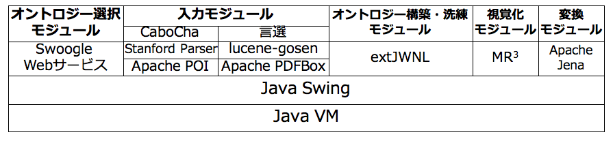

   Implementation Architecture of DODDLE-OWL

Ontology Selection Panel
======================================

Aquiring existing ontologies using Swoogle
----------------------------------------------------
Swoogle provides 19 types of REST web-service interfaces (Swoogle Web Services). When a query URL made by the user is inputted to Swoogle, the user can get the query results in RDF/XML. Swoogle Web Services mainly have queryType and searchString as their parameters. The queryType parameter specifies the type of the web service to call. The searchString parameter is given the input search string of the web service. :numref:`swoogle-web-service-io` shows the Swoogle Web Services available for domain ontology construction, and their input and output. SWD (Semantic Web Document) in :numref:`swoogle-web-service-io` is an RDF document described in RDF/XML, N-Triple, or Notation 3. SWT (Semantic Web Term) in :numref:`swoogle-web-service-io` is an RDF resource with URI being defined, referenced, and populated as classes or properties in SWD. SWO (Semantic Web Ontology) is a special type of SWD which defines many classes and properties.

.. list-table:: The Swoogle Web Services, which can be used for domain ontology construction, and their inputs and outputs
   :name: swoogle-web-service-io

   * - Type
     - Swoogle Web Services
     - Input
     - Output
   * - 1
     - Search ontology
     - search keyword
     - List of SWO which relates to the input search keyword
   * - 3
     - Search terms
     - search keyword
     - List of SWT which relates to the input search keyword
   * - 4
     - Digest semantic web document
     - SWD
     - Swoogle Metadata for the input SWD
   * - 13
     - List documents using term
     - SWT
     - List of SWD defining/referencing/ populating the input SWT
   * - 16
     - List domain classes of a property
     - property
     - List of classes which are used as the rdfs:domain of the input property
   * - 17
     - List properties of a domain class
     - class
     - List of properties which use the input class as their rdfs:domain
   * - 18
     - List range classes of a property
     - property
     - List of classes which are used as the rdfs:range of the input property
   * - 19
     - List properties of a range class
     - class
     - List of properties which use the input class as their rdfs:range

:numref:`swoogle-web-service-type-and-condition` shows the types of Swoogle web services to use and the limiting conditions for each step in acquiring existing ontologies. The Step column in :numref:`swoogle-web-service-type-and-condition` corresponds to the steps described in :numref:`ontology_ranking` . The Types of Swoogle Web Services to Use column in :numref:`swoogle-web-service-type-and-condition` corresponds to the types in :numref:`swoogle-web-service-io`. In order to reduce the cost of computation time, DODDLE-OWL has limiting conditions for each steps.
 
.. list-table:: Types of Swoogle web services to use and limiting conditions for each step in acquiring existing ontologies
  :name: swoogle-web-service-type-and-condition

  * - Step
    - Types of Swoogle Web Services to Use
    - Limiting Conditions
  * - 1
    - 3
    - The number of classes and properties for each input term is limited to the top 5 sorted by TermRank.
  * - 2
    - 17, 19
    - The number of properties which have the classes as their value of rdfs:domain or rdfs:range property is limited to the top 100.
  * - 3
    - 16, 18
    - The number of values for rdfs:domain and rdfs:range of each property is limited to the top 100.
  * - 4
    - 1, 4, 13
    - The number of ontologies for each input term is limited to the top 10 sorted by OntoRank.

.. _extracting-ontology-elements-using-sparql-template:

Extracting ontological elements using SPARQL templates
---------------------------------------------------------------------
:numref:`sparql-template1` to :numref:`sparql-template5` show templates described in SPARQL to extract ontological elements described in RDFS, DAML, and OWL.

If DODDLE-OWL executes the extracting labels and descriptions template in :numref:`sparql-template3` directly as a SPARQL query, DODDLE-OWL acquires all values of rdfs:label, rdfs:comment, and etc properties as the SPARQL query result. In order to acquire only the labels and descriptions of an input concept, DODDLE-OWL replaces the ?concept variable in :numref:`sparql-template3` with the URI of the input concept. In a similar way, DODDLE-OWL replaces the variables in other templates with the appropriate URIs, and executes the replaced templates as the SPARQL query. By building the five types of templates using ?concept, ?subConcept, ?class, ?property, ?label, ?description, ?domain, and ?range variables and setting the templates in DODDLE-OWL, extraction of the ontologies’ elements described in various scheme is possible with DODDLE-OWL.

.. code-block:: sparql
   :caption: Extracting class template for RDFS，DAML，and OWL basic vocaburalies
   :name: sparql-template1

     PREFIX rdf: <http://www.w3.org/1999/02/22-rdf-syntax-ns#>
     PREFIX rdfs: <http://www.w3.org/2000/01/rdf-schema#>
     PREFIX owl: <http://www.w3.org/2002/07/owl#>
     PREFIX daml03: <http://www.daml.org/2001/03/daml+oil#>
     PREFIX daml10: <http://www.w3.org/2001/10/daml+oil#>

     SELECT ?class WHERE {
          {?class rdf:type rdfs:Class} UNION {?class rdf:type owl:Class} UNION
          {?class rdf:type owl:Restriction} UNION {?class rdf:type owl:DataRange} UNION
          {?class rdf:type daml03:Class} UNION {?class rdf:type daml03:Datatype} UNION
          {?class rdf:type daml03:Restriction} UNION  {?class rdf:type daml10:Class} UNION
          {?class rdf:type daml10:Datatype} UNION {?class rdf:type daml10:Restriction}
     }

.. code-block:: sparql
   :caption: Extracting property template for RDFS，DAML，and OWL basic vocaburalies
   :name: sparql-template2

     PREFIX rdf: <http://www.w3.org/1999/02/22-rdf-syntax-ns#>
     PREFIX rdfs: <http://www.w3.org/2000/01/rdf-schema#>
     PREFIX owl:  <http://www.w3.org/2002/07/owl#>
     PREFIX daml03: <http://www.daml.org/2001/03/daml+oil#>
     PREFIX daml10: <http://www.w3.org/2001/10/daml+oil#>

     SELECT ?property WHERE {
         {?property rdf:type rdf:Property} UNION {?property rdf:type owl:ObjectProperty} UNION
         {?property rdf:type owl:DatatypeProperty} UNION {?property rdf:type owl:AnnotationProperty} UNION
         {?property rdf:type owl:FunctionalProperty} UNION {?property rdf:type owl:InverseFunctionalProperty} UNION
         {?property rdf:type owl:SymmetricProperty} UNION {?property rdf:type owl:OntologyProperty} UNION
         {?property rdf:type owl:TransitiveProperty} UNION {?property rdf:type daml03:Property} UNION
         {?property rdf:type daml03:ObjectProperty} UNION {?property rdf:type daml03:DatatypeProperty} UNION
         {?property rdf:type daml03:TransitiveProperty} UNION {?property rdf:type daml03:DatatypeProperty} UNION
         {?property rdf:type daml03:UniqueProperty}  UNION {?property rdf:type daml10:Property} UNION
         {?property rdf:type daml10:ObjectProperty} UNION {?property rdf:type daml10:DatatypeProperty} UNION
         {?property rdf:type daml10:TransitiveProperty} UNION {?property rdf:type daml10:DatatypeProperty} UNION
         {?property rdf:type daml10:UniqueProperty}
     }

.. code-block:: sparql
   :caption: Extracting labels and descriptions template for RDFS，DAML，and OWL basic vocaburalies
   :name: sparql-template3

     PREFIX rdfs: <http://www.w3.org/2000/01/rdf-schema#>
     PREFIX daml03: <http://www.daml.org/2001/03/daml+oil#>
     PREFIX daml10: <http://www.w3.org/2001/10/daml+oil#>

     SELECT ?label ?description WHERE {
          {?concept rdfs:label ?label} UNION {?concept rdfs:comment ?description} UNION
          {?concept daml03:label ?label} UNION {?concept daml03:comment ?description} UNION
          {?concept daml10:label ?label} UNION  {?concept daml10:comment ?description}
     }
 
.. code-block:: sparql
   :caption: Extracting class hierarchy template for RDFS，DAML，and OWL basic vocaburalies
   :name: sparql-template4

     PREFIX  rdfs: <http://www.w3.org/2000/01/rdf-schema#>
     PREFIX daml03: <http://www.daml.org/2001/03/daml+oil#>
     PREFIX daml10: <http://www.w3.org/2001/10/daml+oil#>

     SELECT ?subConcept WHERE {
         {?subConcept rdfs:subClassOf ?concept} UNION {?subConcept rdfs:subPropertyOf ?concept} UNION
         {?subConcept daml03:subClassOf ?concept} UNION {?subConcept daml03:subPropertyOf ?concept} UNION
         {?subConcept daml10:subClassOf ?concept} UNION {?subConcept daml10:subPropertyOf ?concept}
     }

.. code-block:: sparql
   :caption: Extracting other relationships template for RDFS，DAML，and OWL basic vocaburalies
   :name: sparql-template5

     PREFIX rdfs: <http://www.w3.org/2000/01/rdf-schema#>
     PREFIX daml03: <http://www.daml.org/2001/03/daml+oil#>
     PREFIX daml10: <http://www.w3.org/2001/10/daml+oil#>

     SELECT ?property ?domain ?range WHERE {
         {?property rdfs:domain ?domain} UNION  {?property rdfs:range ?range} UNION
         {?property daml03:domain ?domain} UNION {?property daml03:range ?range} UNION
         {?property daml10:domain ?domain} UNION {?property daml10:range ?range}
     }

General Ontology Selection Panel
-------------------------------------------
:numref:`ontology-selection-panel` shows a screenshot of the General Ontology Selection Panel. In the Ontology Selection Module, the users can select reference ontologies. The reference ontologies are used in the other modules in DODDLE-OWL.  5 types of general ontologies as shown in :numref:`ontology-selection-panel` -1 (WordNet, Japanese, WordNet, Japanese Wikipedia Ontology, EDR general electronic dictionary, and EDR special electronic dictionary) can be used as reference ontologies in DODDLE-OWL. For WordNet, the users can choose either ver.3.0 or ver.3.1. Using general ontologies with checkboxes checked, then build a concept hierarchy in a domain ontology. Depending on the domain, it may not be possible to cover the vocabulary with only one general ontology, so it is possible to combine multiple general ontologies to build domain ontologies.

The namespace table as shown in :numref:`ontology-selection-panel` -2 manages the correspondence between the namespace URI and its namespace prefix. The users can input a prefix and a namespace in the :numref:`ontology-selection-panel` -3  and add them by the add button in the right side of :numref:`ontology-selection-panel` -3. 

.. _ontology-selection-panel:
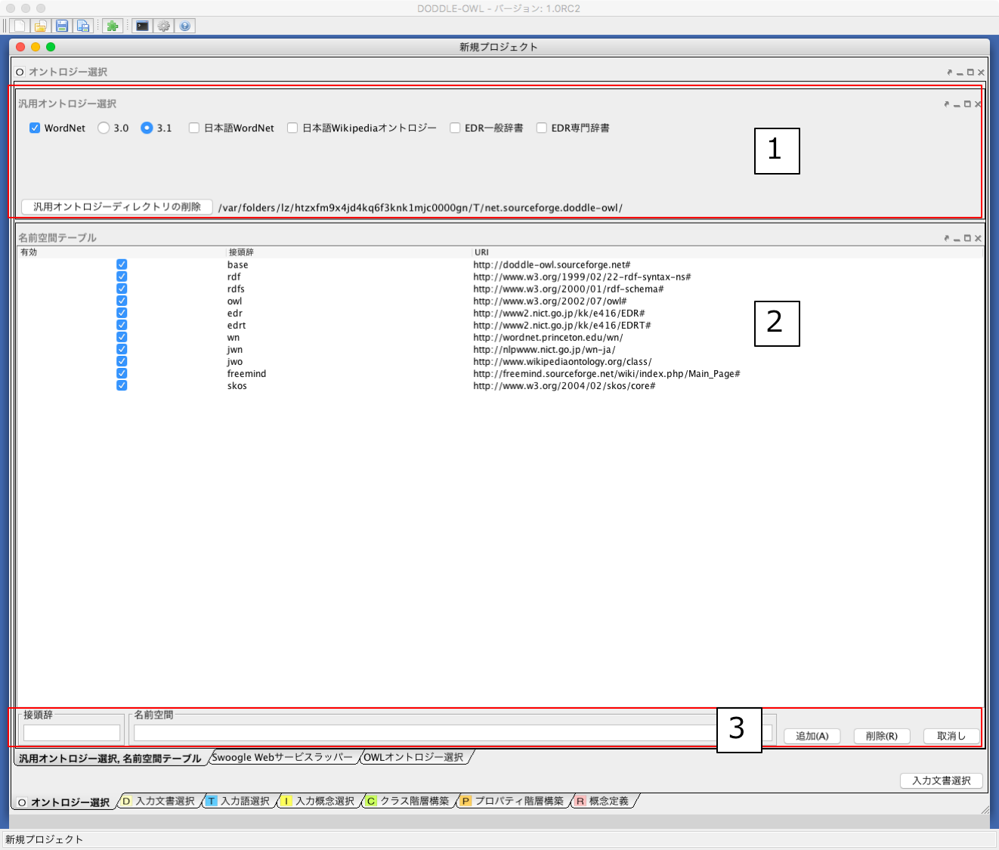

   A screenshot of the General Ontology Selection Panel

OWL Ontology Selection Panel
------------------------------------------
:numref:`owl-ontology-selection-panel` shows a screenshot of the OWL Ontology Selection Panel. The users can select existing OWL ontologies as reference ontologies by the Add (File) or Add (URI) buttons in the :numref:`owl-ontology-selection-panel` -1.

It is considered that if the ontologies for a target domain exist on the web and can be reused, the cost of refining semi-automatically generated ontologies will be reduced. The ontologies constructed by DODDLE-OWL are described in OWL. Therefore, these ontologies can be reused as reference ontologies in DODDLE-OWL.

OWL meta data of the selected ontology from the ontology list (:numref:`owl-ontology-selection-panel` -1 ) is shown in the :numref:`owl-ontology-selection-panel` -3. The users can select SPARQL templates to extract ontological elements in OWL ontologies in the :numref:`owl-ontology-selection-panel` -2 . The users can use 5 types of SPARQL templates as shown in :ref:`extracting-ontology-elements-using-sparql-template`. 

.. _owl-ontology-selection-panel:
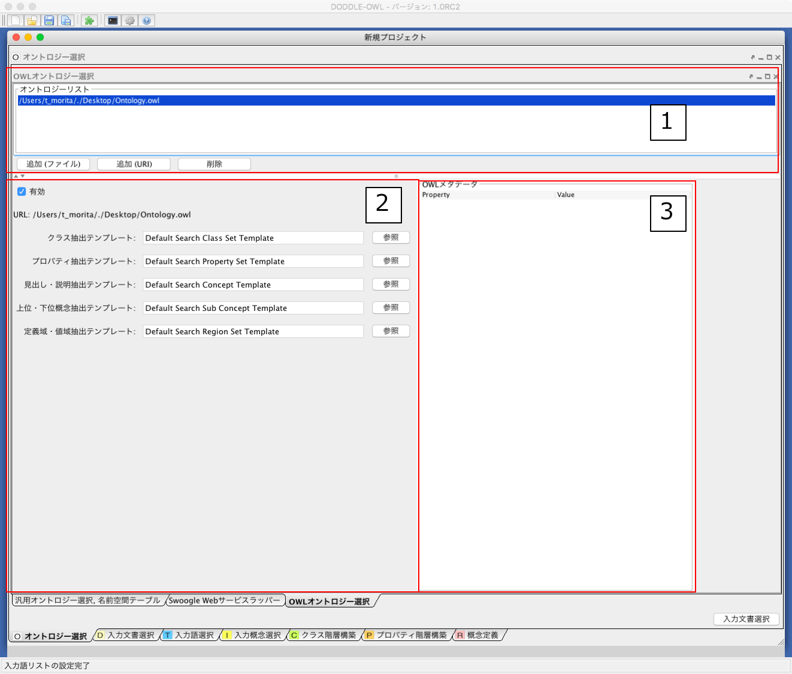

   A screenshot of the OWL Ontology Selection Panel

Input Document Selection Panel
=================================
:numref:`input-document-selection-panel` shows a screenshot of the Input Document Selection Panel. In the Input Document Selection Panel, the users can select domain specific documents described in English or Japanese. Text data can be extracted from files of various formats (Word, Excel, PowerPoint, and PDF) using Apache POI and Apache PDFBox.  At this step, the users can select part of speech (POS) (Noun, Verb, Others, and Compound Word) for extraction of words from the documents.

We describe the details of each part in :numref:`input-document-selection-panel` below. 

.. _input-document-selection-panel:
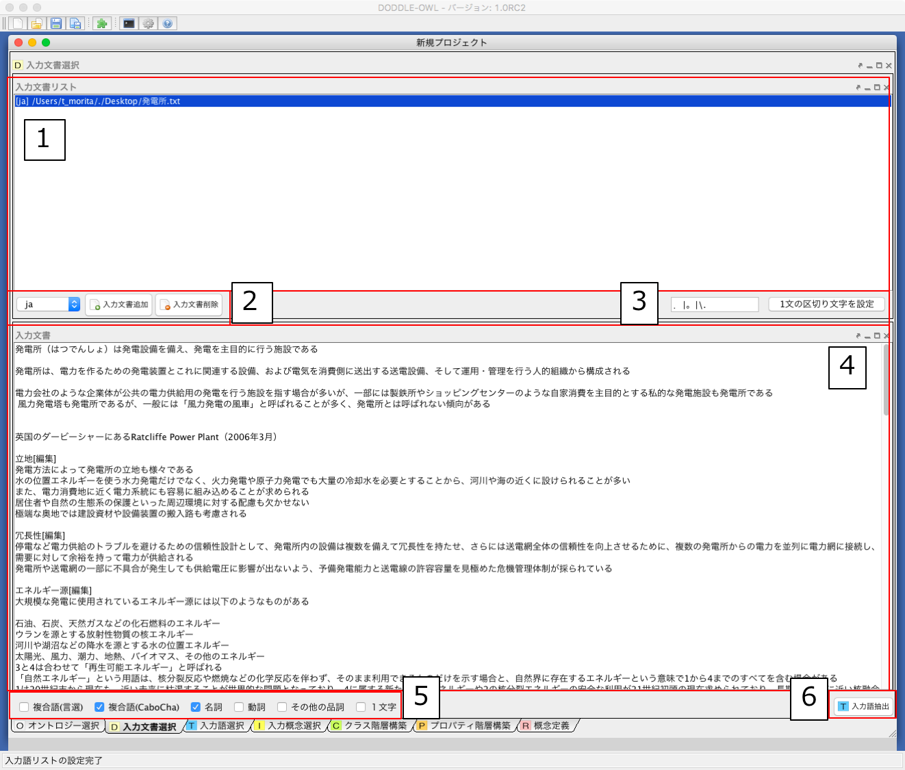

   A screenshot of the Input Document Selection Panel

#. Display a list of input documents.
#. Selects the description language (Japanese or English) of the input document and adds and deletes the input document.
#. Sets the delimiter of one sentence.
#. The content of the document selected from the input document list of 1 is displayed.
#. Whether part-of-speech of words to be extracted, compound words are extracted or not, and whether to extract one word of words are selected.
#. From the documents selected in the input document list of 1, words of the conditions specified by 5 are extracted.

Input Term Selection Panel
=================================
The Input Term Selection Panel is composed of the Input Document Viewer, the Input Term Information Table, and the Removed Term Information Table. Each component will be described below.

Input Document Viewer
--------------------------
In the Input Document Viewer, the user can select input terms while viewing the contents of the input document. :numref:`input-document-viewer` shows a screenshot of the Input Document Viewer. The details of each part are described below.

.. _input-document-viewer:
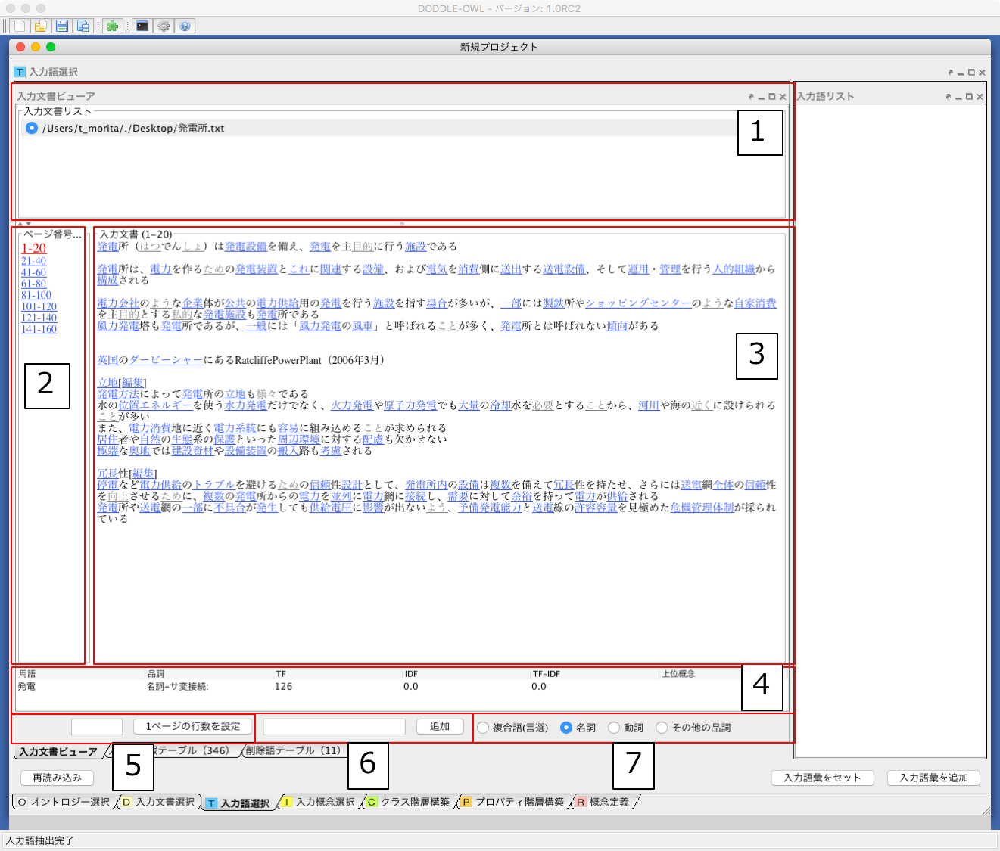

   A screenshot of the Input Document Viewer

#. Display the input document list.
#. When displaying the content of the input document selected in 1 to 3, select the line range in the document.
#. Display the contents of the input document selected in 1. The displayed row range is selected by 2. By clicking on the term to which the hyperlink is placed in the input document, it is possible to select either an input term or an unnecessary term. The blue link represents an input term, and the gray link represents an unnecessary term.
#. When matching the mouse cursor to the hyperlink of 3, the term name, part of speech, TF, IDF, TF-IDF, and upper concept of the term are displayed.
#. Sets the number of divided lines for dividing the content of the input document.
#. The users can manually add terms that could not be extracted. By selecting the range in 3 and right clicking on the mouse, the users can add terms manually as well. For added terms, a blue hyperlink is established in 3.
#. Select a type (compound words, nouns, verbs, other parts of speech) of the term that makes a hyperlink to the content of the input document displayed in 3.

Input Term Information Table
---------------------------------
In the Input Term Information Table, it is possible to select input terms from terms automatically extracted from the input documents. :numref:`input-term-table` shows a screenshot of the Input Term Information Table. The details of eatch part of the Input Term Information Table are shown below.

.. _input-term-table:
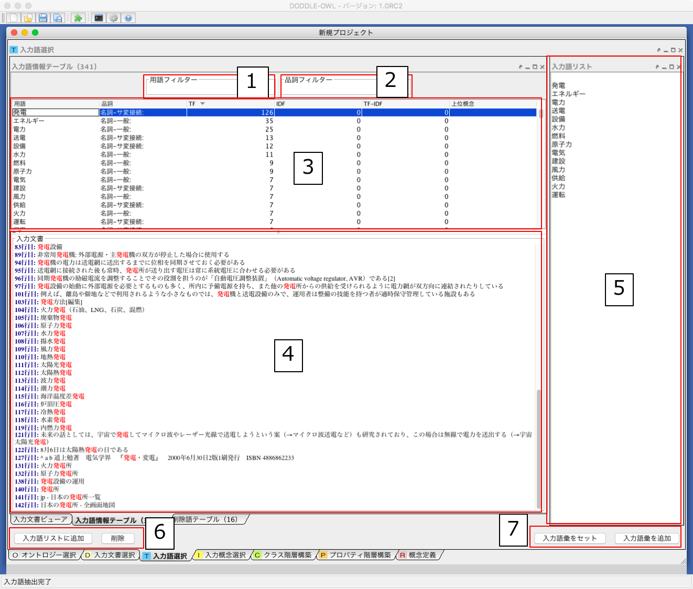

   A screenshot of the Input Term Information Table

#. Narrows down the term list displayed in 3 by the term entered by the user.
#. Narrows down the term list displayed in 3 by the part of speech entered by the user. 
#. Display terms automatically extracted from input documents. The term information includes a term name, part of speech, TF, IDF, TF-IDF, and an upper concept of the term, and it is possible to sort the list from each viewpoint. If an extracted term is included in the heading of a subconcept within a reference ontology prepared in advance by the user, that concept’s heading is displayed as a superordinate concept. By preconfiguring superordinate concepts within the concept hierarchy, extracted terms can be classified and displayed as “things,” “places,” “times,” and so on, thereby assisting the user in selecting input terms.
#. Display the occurrence of the term selected in 3 in the input documents.
#. A list of input terms finally decided by the users. Since it is a text area, the users can add input terms that did not appear in the input documents.
#. When "Add to input term list" button is pushed, the term of the line selected in 3 is added to the input term list of 5. When the "remove" button is pushed, the term selected in 3 is transferred to the "Removed Term Information Table".
#. Set the input terms entered in Step 5, then proceed to the Input Concept Selection Panel. If you click the "Set Input Vocabulary" button, a new list of input terms will be set in the Input Concept Selection Panel. If you click the "Add Input Vocabulary" button, new input terms will be added to the existing list of input terms.

Removed Term Information Table
------------------------------------
In the Removed Term Information Table, a list of the term from the Input Term Information Table is displayed．:numref:`removed-term-table` shows a screenshot of the Removed Term Information Table. Each section of the Removed Term Information Table is identical to that of the Input Terms table. The only differences are the "Restore" button and the "Permanently Delete" button. The "Restore" button allows you to return term information that was accidentally moved to the Removed Term Information Table back to the Input Term Information Table. The "Permanently Delete" button allows you to permanently remove term information from the list.

.. _removed-term-table:
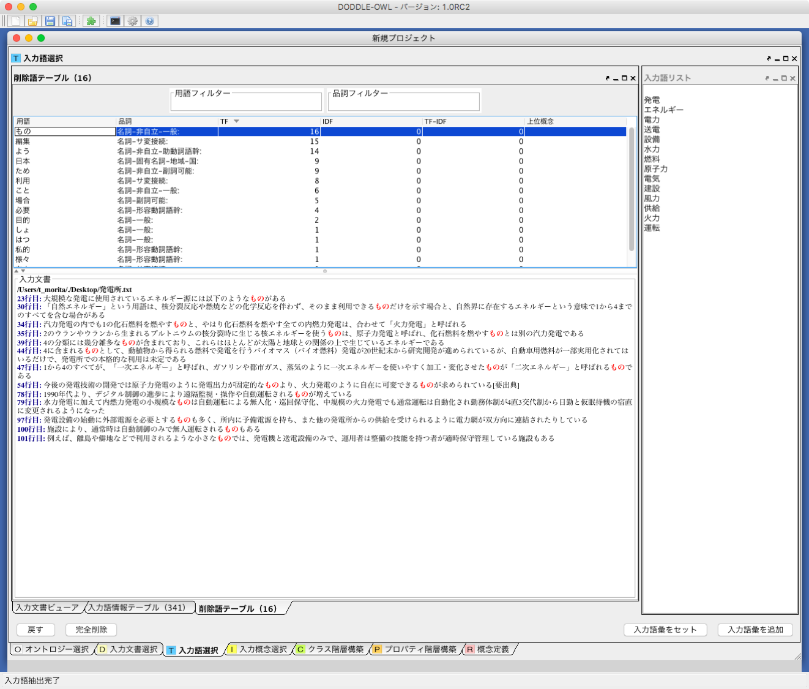

   A screenshot of the Removed Term Information Table

Input Concept Selection Panel
==================================
:numref:`input-concept-selection-panel` shows the Input Concept Selection Panel. This panel is used to establish correspondences between input terms and concepts in a reference ontology. Since terms can be polysemous, there may be multiple concepts that share a given input term as their label. The Input Concept Selection Panel assists users in selecting the concept that most appropriately corresponds to an input term within the target domain. The components of the Input Concept Selection Panel are described below.

.. _input-concept-selection-panel:
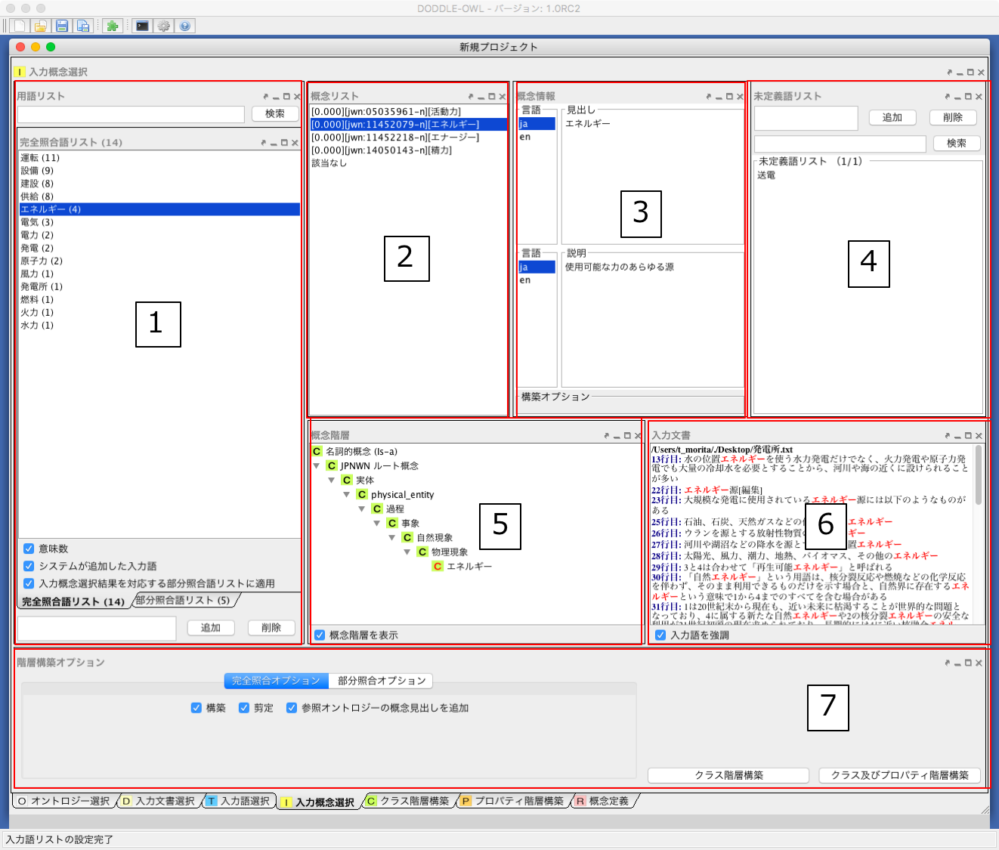

   Input Concept Selection Panel

#. **Term List**: Displays a list of terms from the input vocabulary that have matched — either exactly or partially — against concept labels in the reference ontology.
#. **Concept List**: Displays a list of concepts in the reference ontology whose labels match the term selected in (1).
#. **Concept Information**: Displays the labels and descriptions of the concept selected in (2), organized by language.
#. **Unmatched Term List**: Displays input terms (unmatched terms) that did not match any concept label in the reference ontology.
#. **Concept Hierarchy**: Displays the position of the concept selected in (2) within the concept hierarchy of the reference ontology.
#. **Input Document**: Displays the occurrences of the term selected in (1) within the input document.
#. **Hierarchy Construction Options**: Configures the conditions used during hierarchy construction.

Term List
-----------------------
:numref:`input-concept-selection-panel-term-list` is an enlarged view of the Term List (1) shown in :numref:`input-concept-selection-panel`. The following describes each part of the Term List in the Input Concept Selection Panel.

.. _input-concept-selection-panel-term-list:
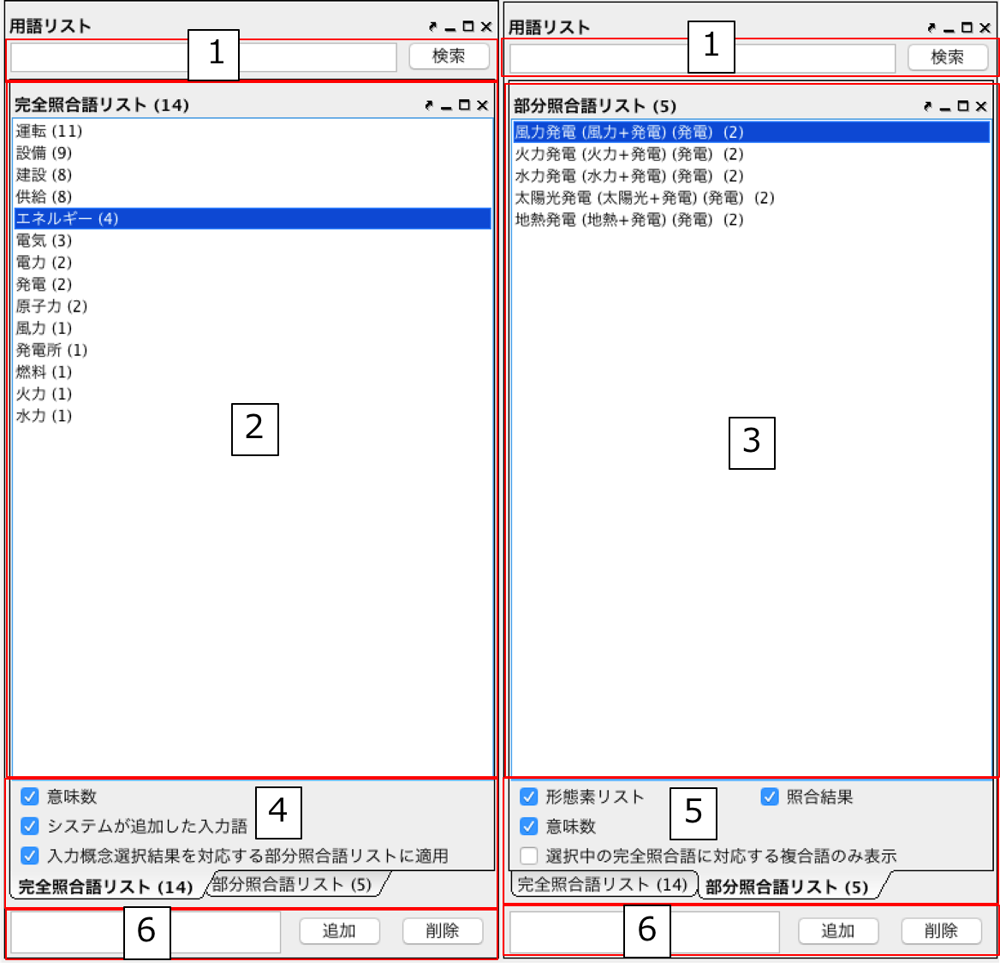

   Input Concept Selection Panel: Term List

#. Entering a search keyword in the text field and pressing the search button causes only input terms containing that keyword to be displayed in the exact-match term list (2) and partial-match term list (3).
#. Displays the exact-match term list. The first set of parentheses shows the number of concepts in the reference ontology whose label matches the input term. Input terms that were automatically added by the system are indicated by the label "Auto-added" in the second set of parentheses.
#. Displays the partial-match term list. The first set of parentheses shows the result of morphologically analyzing the partial-match term and joining each morpheme with a "+" symbol. The second set of parentheses shows the morpheme(s) within the partial-match term that matched a concept label in the reference ontology. The third set of parentheses shows the number of concepts in the reference ontology whose label matches the term shown in the second set of parentheses.
#. Allows configuration of settings related to the exact-match term list.

    #. The "Number of Senses" checkbox controls whether to display, for each term in the exact-match term list, the number of concepts in the reference ontology that have that term as their label.
    #. The "System-added Input Terms" checkbox controls whether to indicate, for each term in the exact-match term list, whether it was automatically added by the system. If a morpheme within a partial-match term matches a concept in the reference ontology but has not been explicitly selected by the user as an input term, the system automatically adds it to the exact-match term list as an exact-match term. For example, if the user selects "資格取得日" (qualification acquisition date) as an input term, the term itself does not appear as a concept label in the reference ontology and is therefore treated as a partial-match term. Suppose "日" (day) within "資格取得日" yields a partial match. If the user has already selected "日" as an input term, no action is needed. However, if "日" has not been selected by the user, it is automatically added to the exact-match term list. Terms added automatically by the system are labeled "(Auto-added)".
    #. The "Apply Input Concept Selection Results to Corresponding Partial-Match Term List" checkbox controls whether the input concept selection result for an exact-match term is propagated to the input concept selection of partial-match terms that contain that exact-match term. For example, this option determines whether the concept selected for the exact-match term "日" is also applied to partial-match terms in the list such as "資格取得日" and "研究日".

#. Allows configuration of settings related to the partial-match term list.

    #. The "Number of Senses" checkbox functions identically to the "Number of Senses" option in the exact-match term list settings described in (4).
    #. The "Morpheme List" checkbox controls whether to display how a partial-match term is segmented into morphemes by the morphological analyzer. When this option is enabled, for example, "資格取得日" is displayed as "(資格+取得+日)". The "+" symbol denotes boundaries between morphemes.
    #. The "Match Results" checkbox controls whether to display, from among the morphemes of a partial-match term, those that matched a concept in the reference ontology. When this option is enabled, for example, "資格取得日" is displayed as "(日)", since it matched via "日".
    #. The "Show Only Compound Terms Corresponding to Selected Exact-Match Term" checkbox controls whether to display only those partial-match terms whose matched morpheme is the term currently selected in the exact-match term list. When this option is enabled, for example, selecting "日" in the exact-match term list causes only partial-match terms that matched via "日" — such as "資格取得日" and "研究日" — to be shown in the partial-match term list.

#. Allows input terms to be added and removed.

Concept List
-------------------
:numref:`input-concept-selection-panel-concept-list` is an enlarged view of the Concept List (2) shown in :numref:`input-concept-selection-panel`.

.. _input-concept-selection-panel-concept-list:
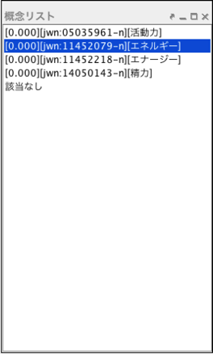

   Input Concept Selection Panel: Concept List

The Concept List displays a list of concepts in the reference ontology whose labels match the exact-match term or partial-match term selected in (2) or (3) of :numref:`input-concept-selection-panel-term-list`. :numref:`input-concept-selection-panel-concept-list` shows the concept list for concepts in the reference ontology (Japanese WordNet is used as the reference ontology in this example) that have "エネルギー" (energy) as their label. Each entry in the list consists of three parts. The left part shows the evaluation score of the concept candidate corresponding to the input term, as computed by the automatic concept selection method described in the design of the input module. Concept candidates are sorted in descending order of their evaluation score; a higher score indicates a greater likelihood of the concept being selected as the input concept. The center part shows the concept ID, which is expressed as a URI and displayed on screen in qualified name form. The namespace prefix "jwn" denotes the namespace of Japanese WordNet; the prefix displayed here corresponds to the namespace prefix configured in the namespace table of the General Ontology Selection Panel (:numref:`ontology-selection-panel` -2). The right part displays one of the concept's labels when the concept has multiple labels.

Concept Information
--------------------
:numref:`input-concept-selection-panel-concept-info` is an enlarged view of the "Concept Information" in :numref:`input-concept-selection-panel` -3.

.. _input-concept-selection-panel-concept-info:
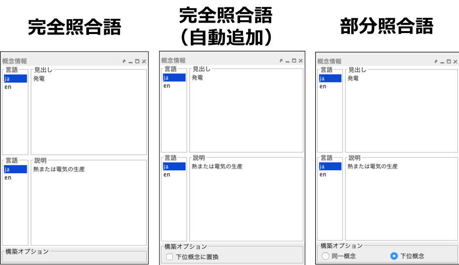

   Input Concept Selection Panel: Concept Information

"Concept Information" displays the label and description of the concept selected in the "Concept List" of :numref:`input-concept-selection-panel-concept-list`. The label and description in the language selected from the "Language" list are shown in the "Label" list and the "Description" list respectively. The "Construction Options" at the bottom of :numref:`input-concept-selection-panel-concept-info` allows the user to configure how the concept hierarchy is built. "Construction Options" has three display variations depending on the type of term selected in the "Term List" of :numref:`input-concept-selection-panel-term-list`. When an exact match term is selected at :numref:`input-concept-selection-panel-term-list`-2, nothing is displayed in "Construction Options", as shown on the left side of :numref:`input-concept-selection-panel-concept-info`. When an exact match term automatically added by the system (an exact match term labeled "Auto Added") is selected at :numref:`input-concept-selection-panel-term-list`-2, a checkbox for selecting whether to "Replace with Subordinate Concept" is displayed in "Construction Options", as shown in the center of :numref:`input-concept-selection-panel-concept-info`. When a partial match term is selected at :numref:`input-concept-selection-panel-term-list`-3, radio buttons for selecting either "Same Concept" or "Subordinate Concept" are displayed in "Construction Options", as shown on the right side of :numref:`input-concept-selection-panel-concept-info`.

.. note::
  If the matching portion of a partial match term has not been entered by the user as an input term, the system automatically adds that term as an input term. This is referred to as an exact match term (auto-added).

As an example of the "Construction Options" shown in the center of :numref:`input-concept-selection-panel-concept-info`, consider the case where "Thermal Power Generation" is the only input term. In this case, "Thermal Power Generation" becomes a partial match term and matches against "Power Generation"; as a result, "Power Generation" is automatically added to the exact match term list by the system. When performing input concept selection for "Power Generation", the "Replace with Subordinate Concept" checkbox is displayed as the "Construction Options" in the center of :numref:`input-concept-selection-panel-concept-info`. Here, since "Power Generation" was automatically added by the system, this option is provided to confirm whether the user deliberately chose not to include "Power Generation" as an input term, or simply forgot to do so. If the user deliberately chose not to include "Power Generation" as an input term, then "Power Generation" should not appear in the concept hierarchy. By checking "Replace with Subordinate Concept" in "Construction Options", "Thermal Power Generation" will not be placed as a subordinate concept of "Power Generation" and will not appear in the concept hierarchy. If the user forgot to add "Power Generation" as an input term and leaves "Replace with Subordinate Concept" unchecked, the concept hierarchy will be built with "Thermal Power Generation" as a subordinate concept of "Power Generation".

As an example of the "Construction Options" shown on the right side of :numref:`input-concept-selection-panel-concept-info`, consider the case where both "Power Generation" and "Thermal Power Generation" are input terms. As in the case above, "Thermal Power Generation" is a partial match term that matches against "Power Generation". When performing input concept selection for "Thermal Power Generation", the "Construction Options" on the right side of :numref:`input-concept-selection-panel-concept-info` is displayed. If "Same Concept" is selected, "Thermal Power Generation" is treated as the same concept as "Power Generation" during concept hierarchy construction. That is, the concept hierarchy is built with "Thermal Power Generation" as an alternative label of the concept in the reference ontology that corresponds to the "Power Generation" concept. On the other hand, if "Subordinate Concept" is selected, "Thermal Power Generation" is treated as a concept distinct from "Power Generation" — specifically, as a subordinate concept of "Power Generation" — and the concept hierarchy is built accordingly. In the initial state, whether a partial match term is treated as a "Same Concept" or a "Subordinate Concept" by default can be configured via the options dialog.

Concept Hierarchy Construction Option
--------------------------------------------------------
:numref:`input-concept-selection-panel-concept-hierarchy-construction-option` is an enlarged view of "Hierarchy Construction Options" in :numref:`input-concept-selection-panel`.

.. _input-concept-selection-panel-concept-hierarchy-construction-option:
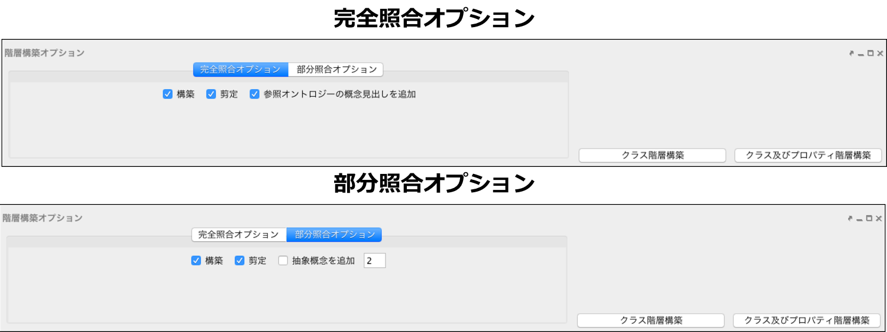

   Input Concept Selection Panel: Concept Hierarchy Construction Option

"Hierarchy Construction Options" is used to configure the parameters applied when building class and property hierarchies in the class and property hierarchy construction modules. "Hierarchy Construction Options" consists of "Exact Match Options" and "Partial Match Options".

The "Exact Match Options" in :numref:`input-concept-selection-panel-concept-hierarchy-construction-option` provides settings for building a concept hierarchy from the exact match term list. The "Build" checkbox specifies whether to build a concept hierarchy from the exact match term list. The "Pruning" checkbox specifies whether to apply pruning during concept hierarchy construction. The "Add Reference Ontology Concept Labels" checkbox specifies whether, during concept hierarchy construction, each concept's labels should be limited to only the input terms provided, or whether all labels of the corresponding concept in the reference ontology should also be used.

The "Partial Match Options" in :numref:`input-concept-selection-panel-concept-hierarchy-construction-option` provides settings for building a concept hierarchy from the partial match term list. The "Build" checkbox specifies whether to build a concept hierarchy from the partial match term list. The "Pruning" checkbox specifies whether to apply pruning during concept hierarchy construction. The "Add Abstract Concepts" checkbox specifies whether to apply prefix-based hierarchization when building a concept hierarchy from the partial match term list. The text field to the right of this checkbox sets the minimum number of terms that must be groupable under a common prefix before an abstract superordinate concept is inserted.

Clicking the "Build Class Hierarchy" button at the right end of :numref:`input-concept-selection-panel-concept-hierarchy-construction-option` builds only the class hierarchy in the class hierarchy construction panel, based on the hierarchy construction options described above. Clicking the "Build Class and Property Hierarchies" button builds both the class hierarchy and the property hierarchy in the class hierarchy construction panel and the property hierarchy construction panel respectively, based on the hierarchy construction options described above. In order to build both the class hierarchy and the property hierarchy, either the EDR General Dictionary or an OWL ontology containing a property hierarchy must be set as the reference ontology.

Class Hierarchy Construction Panel
=================================================
:numref:`class-hierarchy-construction-panel` shows the class hierarchy construction panel.

.. _class-hierarchy-construction-panel:
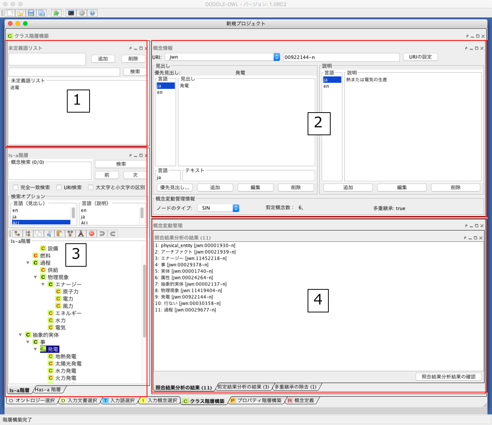

   Class Hierarchy Construction Panel

The following describes each component.

#. **Unmatched Term List**: A list of input terms that did not match any concept in the reference ontology. By selecting a term from the list and dragging and dropping it onto the "Is-a Hierarchy Panel", the unmatched term can be added as a concept to the Is-a hierarchy.
#. **Concept Information Panel**: Displays the URI, preferred label (the label shown in the hierarchy), labels, descriptions, and concept change management information for the concept selected in the concept hierarchy. Labels and descriptions can be assigned language attributes, and can be added, edited, and deleted.
#. **Concept Hierarchy Panel**: Comprises the Is-a hierarchy and the Has-a hierarchy. Concepts can be searched, added, deleted, and otherwise managed.
#. **Concept Change Management Panel**: Displays lists of matching result analysis results, pruning result analysis results, and concepts involved in multiple inheritance; selecting an item in any list highlights the corresponding candidate location for correction in the Is-a hierarchy.

The following sections describe components 2 through 4 of :numref:`class-hierarchy-construction-panel` in detail.

Concept Information Panel
-------------------------------
:numref:`class-hierarchy-construction-panel-concept-info` is an enlarged view of the Concept Information Panel, in :numref:`class-hierarchy-construction-panel`-2.

.. _class-hierarchy-construction-panel-concept-info:
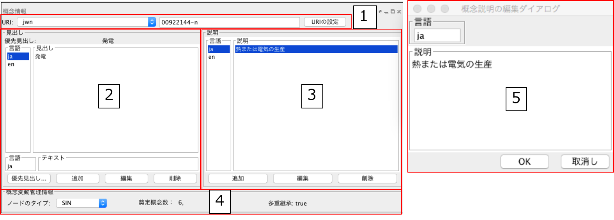

   Class Hierarchy Construction Panel: Concept Information Panel

The following describes each component of the Concept Information Panel.

#. The URI of the selected concept can be changed by selecting a namespace prefix from the combo box, entering a local name in the text field, and clicking the "Set URI" button. The namespace prefixes defined in the namespace table shown in the General Ontology Selection Panel (:numref:`ontology-selection-panel`-2) are available for selection.
#. This is the area for editing the labels of a concept. Selecting an item from the "Language" list displays the labels in the selected language in the "Label" list. In :numref:`class-hierarchy-construction-panel-concept-info`-2, "発電" is shown as the Japanese label. A new label can be added by entering the desired language and text in the "Language" and "Text" text fields at the bottom of :numref:`class-hierarchy-construction-panel-concept-info`-2 and clicking the "Add" button. To edit a selected label, click the "Edit" button; to delete it, click the "Delete" button. In addition, clicking the "Set Preferred Label" button makes the selected label the display label for concepts in the Is-a hierarchy and Has-a hierarchy panels.
#. This is the area for editing the descriptions of a concept. As with labels, selecting an item from the "Language" list displays the descriptions in the selected language in the "Description" list.
#. This is the area for displaying and editing concept change management information. "Node Type" indicates whether the node being edited is a SIN (a concept extracted from the reference ontology) or a best-match node (an input concept). For a SIN node that the user wishes to designate as a best-match node, the node type can be changed here from SIN to best-match. "Number of Pruned Concepts" indicates how many concepts between the selected concept and its superordinate concept were removed during pruning at hierarchy construction time. "Multiple Inheritance" indicates whether the node being edited is involved in multiple inheritance. It displays "true" if multiple inheritance is present, and "false" if it is not.
#. This area is displayed when the "Add" or "Edit" button in component 3 is clicked. A description can be added or edited by entering the "Language" and "Description" and clicking the "OK" button. The description of the selected concept can also be deleted using the "Delete" button.

Is-a and Has-a Class Hierarchy Panel
-------------------------------------------------------
:numref:`class-hierarchy-construction-panel-isa-hasa-tree-panel` is an enlarged view of  :numref:`class-hierarchy-construction-panel`-3. The left side of :numref:`class-hierarchy-construction-panel-isa-hasa-tree-panel` shows the Is-a Class Hierarchy Panel, and the right side shows the Has-a Class Hierarchy Panel.

.. _class-hierarchy-construction-panel-isa-hasa-tree-panel:
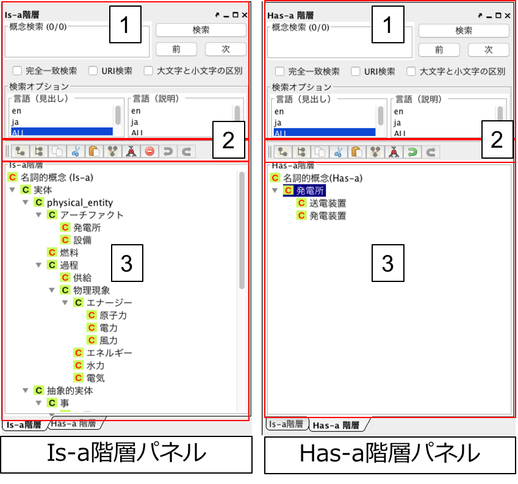
  
   Class Hierarchy Construction Panel: Is-a and Has-a Class Hierarchy Panel

#. This is the area for searching concepts in the concept hierarchy. Entering a search keyword in the text field and clicking the "Search" button selects concepts that satisfy the search options. When multiple candidates exist, the "Next" button or the "Previous" button can be used to navigate to another candidate concept. The available search options include language, concept label, and concept description. When the "Exact Match Search" checkbox is checked, only concepts whose labels or descriptions exactly match the entered search keyword are retrieved. When the "Exact Match Search" checkbox is unchecked, a partial match search is performed, retrieving concepts whose labels or descriptions contain the search keyword as a substring. When the "URI Search" checkbox is checked, concept URIs are also included as search targets. When the "Case-Sensitive" checkbox is checked, searches against English labels or descriptions are performed in a case-sensitive manner.
#. A toolbar available for editing the Is-a hierarchy and the Has-a hierarchy. The toolbar provides the same functionality as the popup menu shown in :numref:`class-hierarchy-construction-panel-popup-menu`, which is displayed when a concept in the hierarchy is right-clicked with the mouse.
#. A panel for displaying and editing the Is-a hierarchy and the Has-a hierarchy. Concepts can be added, deleted, and otherwise managed via the toolbar in component 2 or via the popup menu displayed by selecting a concept and right-clicking with the mouse.

.. _class-hierarchy-construction-panel-popup-menu:
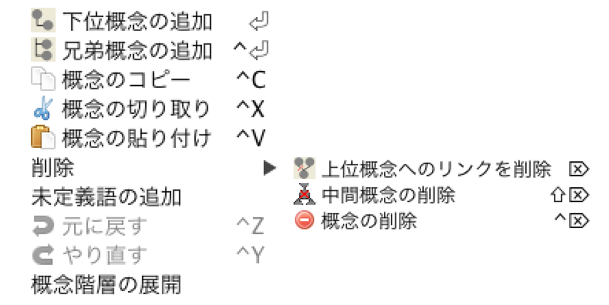

   Class Hierarchy Construction Panel: Popup menu

:numref:`class-hierarchy-construction-panel-popup-menu` shows the popup menu of the Is-a Hierarchy Panel. The main difference between the Is-a Hierarchy Panel and the Has-a Hierarchy Panel is that the Has-a Hierarchy Panel defines Has-a relationships using concepts defined in the Is-a Hierarchy Panel. In addition, the "Delete Concept" operation described below cannot be performed in the Has-a hierarchy.

DODDLE-OWL provides three types of concept deletion. "Delete Concept" deletes all nodes that share the same URI as the target node, along with all of their subordinate nodes. "Delete Link to Superordinate Concept" removes the relationship between the target node and its superordinate node when the target node is involved in multiple inheritance. "Delete Intermediate Concept" deletes the target node and redefines its subordinate nodes as subordinate nodes of the target node's superordinate node.

.. _class-hierarchy-construction-panel-node-icon:
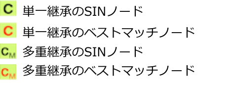

   Class Hierarchy Construction Panel: Node icon

The classes in the Is-a Hierarchy Panel and the Has-a Hierarchy Panel of the class hierarchy construction panel are of four types, as shown in :numref:`class-hierarchy-construction-panel-node-icon`.

Concept Drift Management Panel
---------------------------------
:numref:`class-hierarchy-construction-panel-concept-drift-management-panel` is an enlarged view of the Concept Change Management Panel in :numref:`class-hierarchy-construction-panel`-4, with each tab expanded.

.. _class-hierarchy-construction-panel-concept-drift-management-panel:
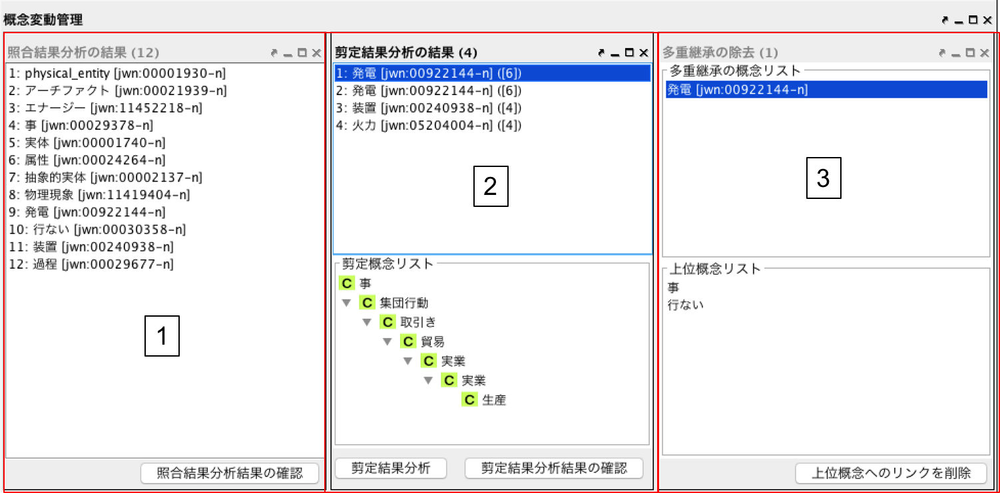

   Class Hierarchy Construction Panel: Concept Drift Management Panel

The following describes each component of the Concept Change Management Panel.

#. Displays the results of matching result analysis as a list. The items in the list are SIN nodes; selecting an item highlights the corresponding subtree in the Is-a hierarchy. When it has been confirmed that a matching result analysis result requires no correction, or after a correction has been made, clicking the "Confirm Matching Result Analysis Result" button removes the selected item from the list.
#. Displays the results of pruning result analysis as a list. The "Pruned Concept List" at the bottom of component 2 presents the concepts that were pruned during concept hierarchy construction — specifically, the concepts that lay between the selected concept and its superordinate concept. Clicking the "Pruning Result Analysis" button displays in the list those concepts from which more intermediate concepts were removed than the number specified in the text field to the left of the button. When it has been confirmed that a pruning result analysis result requires no correction, or after a correction has been made, clicking the "Confirm Pruning Result Analysis Result" button removes the selected item from the list. (The number of pruned concepts for the concept in question becomes zero.)
#. Displays a list of concepts involved in multiple inheritance. Selecting an item from the list displays at the bottom of component 3 a list of nodes that are involved in multiple inheritance. Selecting one of these nodes navigates to the corresponding concept in the Is-a Hierarchy Panel and selects the node. Clicking the "Delete Link to Superordinate Concept" button removes the relationship between the selected concept and its superordinate concept.

Property Hierarchy Construction Panel
========================================================
:numref:`property-hierarchy-construction-panel` shows the property hierarchy construction panel.

.. _property-hierarchy-construction-panel:
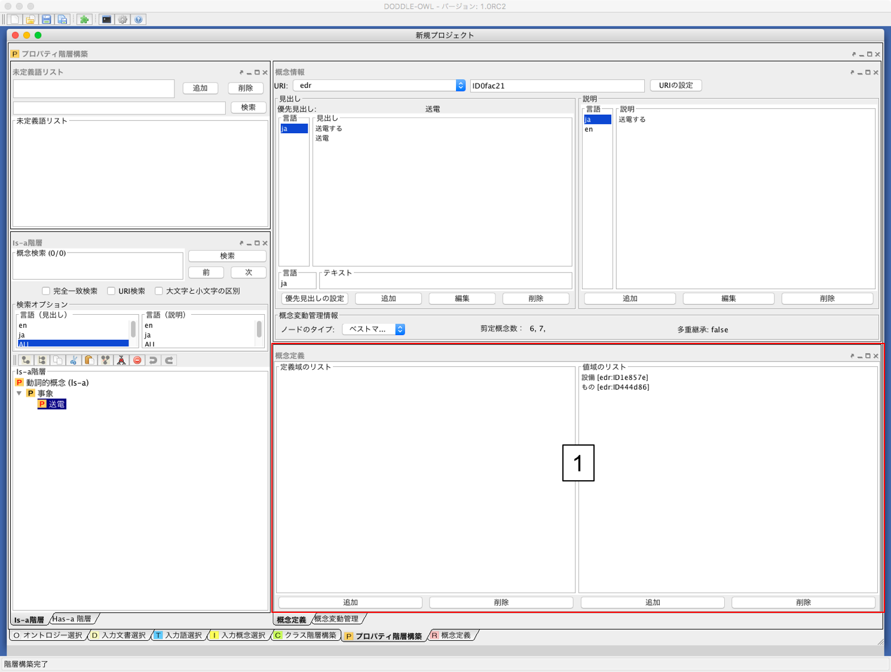

   Property Hierarchy Construction Panel

The majority of the components of the property hierarchy construction panel are the same as those of the class hierarchy construction panel. The difference is the presence of the Concept Definition Panel at  :numref:`property-hierarchy-construction-panel`-1. When the EDR General Dictionary is specified as the general ontology and a property hierarchy is built, the Concept Definition Panel automatically defines the concepts that are in an agent or object relationship in the EDR Concept Description Dictionary as the domain and range respectively. It is also possible to reference the class hierarchy to add domains and ranges manually.

.. _property-hierarchy-construction-panel-node-icon:
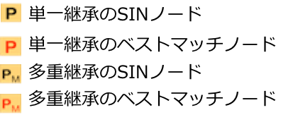

   Property Hierarchy Construction Panel: Node icon

The properties in the Is-a Hierarchy Panel and the Has-a Hierarchy Panel of the property hierarchy construction panel are of four types, as shown in :numref:`property-hierarchy-construction-panel-node-icon`.

Relationship Construction Panel
=============================================
:numref:`relationship-construction-panel` shows a screenshot of the relationship construction panel.

.. _relationship-construction-panel:
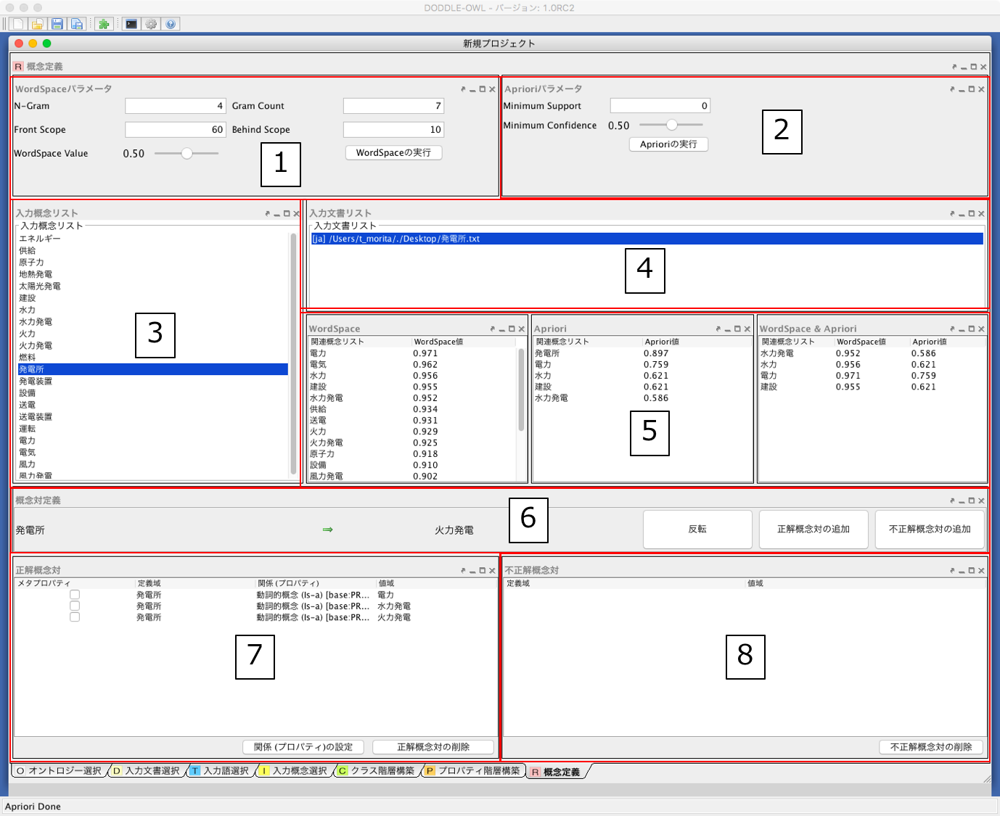

   Relationship Construction Panel

The following describes each component of the relationship construction panel.

#. Configures the WordSpace parameters. The available WordSpace parameters include N-gram, N-gram occurrence frequency, context scope (N words before and after), and context similarity threshold. Clicking the "Run WordSpace" button displays the results in component 5.
#. Configures the Apriori parameters. The available Apriori parameters include minimum support and minimum confidence. Clicking the "Run Apriori" button displays the results in component 5.
#. Displays the input terms selected in the input term selection panel.
#. Displays the input documents selected in the input document selection panel.
#. Displays input terms related to the input term selected in component 3, together with their association values, in descending order of association value. The association values produced by the WordSpace algorithm, the Apriori algorithm, and a combination of both can be switched between using tabs.
#. Displays the term selected in component 5 that is related to the input term selected in component 3, and adds the pair to component 7 as a positive concept pair or to component 8 as a negative concept pair. The direction of the arrow determines which concept serves as the domain and which serves as the range.
#. Displays the domain, property, and range. The property can be selected from the property hierarchy construction panel.
#. Displays unnecessary concept pairs. Since unnecessary concept pairs are removed from the set of candidate concept pairs for concept definition, the remaining concept definitions become easier to manage.

Option Dialog
================================
The Options dialog can be opened by selecting "Tools"  :math:`\rightarrow` "Show Options Dialog" from the menu. The Options dialog allows users to configure various settings in DODDLE-OWL. It consists of the following tabs: "General," "Folders," "Input Concept Selection," "Compound Words," and "Display." The four buttons at the bottom of the Options dialog are provided for saving settings, applying settings, deleting settings, and closing the Options dialog, respectively. The "Save" button stores the configurations made in the Options dialog to the Windows registry (on Unix systems, settings are saved in XML format or similar in a per-user directory). Settings saved in this way remain effective after restarting DODDLE-OWL. The "Delete" button removes the settings stored in the registry. Each tab is described below.

Basic Tab
---------------------
:numref:`option-dialog-basic` shows the General tab of the Options dialog. The General tab allows users to configure the following settings: "Language," "Base Prefix," and "Base URI." The "Language" setting is used to specify the display language for menus and other elements of the DODDLE-OWL user interface, as well as the default language to be used when concept labels are available in multiple languages. The "Base Prefix" setting defines the prefix for the base URI used when saving a domain ontology in OWL format. The "Base URI" setting specifies the base URI itself used when saving a domain ontology in OWL format.

.. _option-dialog-basic:
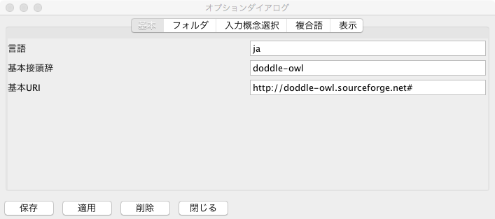

   Option Dialog: Basic Tab

Folder Tab
---------------------
:numref:`option-dialog-folder` shows the Folders tab of the Options dialog. The Folders tab is used to configure the paths to external programs and dictionary data referenced by DODDLE-OWL. The configurable items in the Folders tab are listed below.

Project Folder
   Sets the path to the folder that is opened by default when saving a DODDLE-OWL project file.
Stop Word List
   Sets the path to the file containing the stop word list. The stop word list is a file that stores a set of words that should be excluded during word extraction from input documents.
EDR Dictionary Folder
   Sets the path to the folder containing the files converted from the EDR Concept System Dictionary and EDR Concept Description Dictionary into a format referenced by DODDLE-OWL.
EDRT Dictionary Folder
   Sets the path to the folder containing the files converted from the EDR Technical Dictionary into a format referenced by DODDLE-OWL.
Japanese Morphological Analyzer
   Sets the path to the executable file of Chasen or MeCab.
Japanese Dependency Parser
   Sets the path to the executable file of CaboCha.
perl.exe
   Sets the path to the Perl executable file.
Upper Concept List
   Sets the path to the file containing the upper concept list. The upper concept list is referenced when selecting input words. An input word is displayed in the input word table if it exists as a label of a subordinate concept under one of the configured upper concepts.

.. _option-dialog-folder:
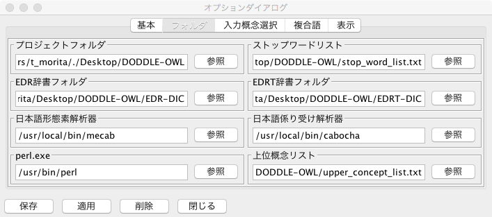

   Option Dialog: Folder Tab

Input Concept Selection Tab
--------------------------------
:numref:`option-dialog-input-concept-selection` shows the Input Concept Selection tab of the Options dialog. The Input Concept Selection tab is used to configure options for performing semi-automatic input concept selection. For details, refer to Semi-Automatic Input Concept Selection.

.. _option-dialog-input-concept-selection:
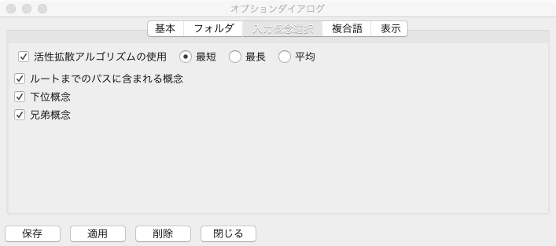

   Option Dialog: Input Concept Selection Tab

Comound Word Tab
---------------------------------
:numref:`option-dialog-compound-word` shows the Compound Words tab of the Options dialog. The Compound Words tab is used to configure options for partially matched words in the disambiguation panel. When the user has not explicitly selected an option, the default behavior can be set via radio buttons to treat a partially matched word either as a "subordinate concept" or as an "identical concept" of the concept matched during hierarchy construction.

.. _option-dialog-compound-word:
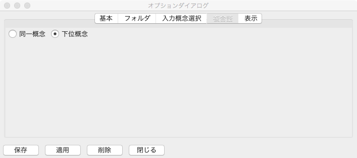

   Option Dialog: Compound Word Tab

Display Tab
-------------------------
:numref:`option-dialog-display` shows the Display tab of the Options dialog. The Display tab allows users to choose whether to show namespace prefixes when displaying class or property nodes in the Class Hierarchy Construction panel and the Property Hierarchy Construction panel. When the "Show Qualified Names" checkbox is enabled, the namespace prefix of each class or property is displayed in the respective panel.

.. _option-dialog-display:
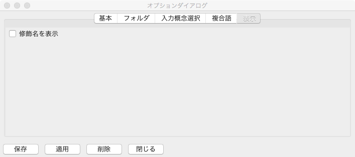

   Option Dialog: Display Tab

Menu
===================

File menu
----------------------

* New Project

  * Create a new DODDLE-OWL project

* Open Project

  * Open the project folder or project file of DODDLE-OWL

* Open recent project
* Open :math:`\rightarrow` Inut Term List
* Open :math:`\rightarrow` Input Term Information Table
* Open :math:`\rightarrow` Concept Definition
* Open :math:`\rightarrow` Input Concept Selection Results
* Open :math:`\rightarrow` Correspondence between input terms and concepts
* Open :math:`\rightarrow` OWL Ontology
* Open :math:`\rightarrow` FreeMind Ontology
* Open :math:`\rightarrow` Correspondence between concepts and priority labels
* Save Project
* Save Project As

  * Save the project of DODDLE-OWL with a name. Select the DODDLE project folder as the file format if the users want to check the intermediate result file being processed. If the users want to save it in one file, select the DODDLE project file (.ddl).

* Save :math:`\rightarrow` Input Term List
* Save :math:`\rightarrow` Input Term Information Table
* Save :math:`\rightarrow` Concept Definition
* Save :math:`\rightarrow` Input Concept Selection Results
* Save :math:`\rightarrow` Correspondence between input terms and concepts
* Save :math:`\rightarrow` OWL Ontology
* Save :math:`\rightarrow` FreeMind Ontology
* Save :math:`\rightarrow` Correspondence between concepts and priority labels

* Quit

  * Quit DODDLE-OWL

Tool menu
-----------------------
* Show all terms
* Automatically select input concepts

  * Automatically ranks the concepts in the general-purpose ontology that correspond to input words from the input word set. When an input word is selected in the Input Concept Selection panel, the corresponding concepts are displayed in ranked order.

* DODDLE-OWL Dictionary Converter

  * Displays a dialog for converting the EDR Electronic Dictionary and Japanese WordNet dictionary files into a format usable by DODDLE-OWL.

* Show Log Console

  * Displays standard output and standard error output on screen.

* XGA Layout

  * Arranges the window layout to fit a resolution of 1024x768.

* UXGA Layout

  * Arranges the window layout to fit a resolution of 1600x1200.

* Show the Option Dialog

Project menu
------------------------
* Displays the open projects as a submenu, allowing the user to switch between them.

Help Menu
----------------------------
* Version

  * Displays a dialog for checking the version number and the libraries in use.

Toolbar
==========================

.. list-table:: Icons and functions in the toolbar in DODDLE-OWL
  :name: toolbar-icons

  * - Icon
    - Function
  * - .. figure:: figures/toolbar/page_white.png
    - New Project
  * - .. figure:: figures/toolbar/folder_page_white.png
    - Open Project
  * - .. figure:: figures/toolbar/disk.png
    - Save Project
  * - .. figure:: figures/toolbar/page_save.png
    - Save Project As — Save the project with a specified name
  * - .. figure:: figures/toolbar/plugin.png
    - DODDLE-OWL Dictionary Converter
  * - .. figure:: figures/toolbar/cog.png
    - Show Option Dialog
  * - .. figure:: figures/toolbar/help.png
    - Show Version Dialog

Shortcut keys
==============================
* Ctrl-N

  * New Project
* Ctrl-O

  * Open Project

* Ctrl-S

  * Save Project

* Ctrl-Shift-S

  * Save Project As

* Ctrl-Q

  * Quit

* F1

  * Show Version Dialog
  
